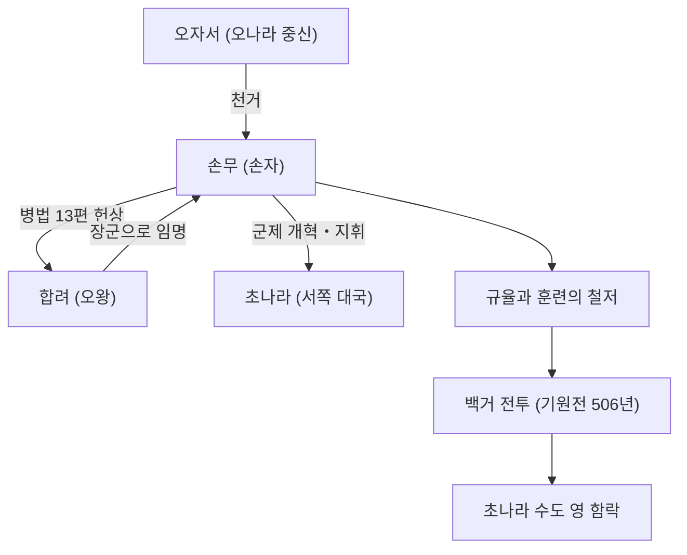

## 머리말

"적을 알고 나를 알면 백 번 싸워도 위태롭지 않다"——현대 비즈니스 현장에서도 자주 인용되는 이 명언은 지금으로부터 2500년 전 중국 춘추시대에 살았던 한 군략가가 남긴 것입니다. 그의 이름은 손무(孫武). 후세에 존칭으로 '손자'라고 불리는 이 인물은 세계 최고봉의 병법서 『손자병법』을 저술하여 동양뿐만 아니라 전 세계의 군사 및 경영 전략에 지대한 영향을 계속 미치고 있습니다. 본 기사에서는 수수께끼에 싸인 손무의 생애와 그의 혁신적인 철학, 그리고 후세에 미친 영향에 대해 깊이 파헤쳐 봅니다.

## 손무의 생애: 제나라에서의 망명과 오나라의 도약

손무의 생애에 대해서는 사마천의 『사기』 등에 기록이 남아 있으나, 그의 전반생은 수수께끼에 싸여 있습니다. 기원전 6세기 후반, 현재의 산둥성에 해당하는 제나라에서 태어난 손무는 대대로 군사를 관장하는 명문가 출신으로 알려져 있습니다. 그러나 제나라 국내의 정치적 투쟁과 혼란을 피하기 위해 그는 신흥국이었던 남방의 '오나라'로 망명했습니다.

오나라에 몸을 의탁한 손무는 중신인 오자서(伍子胥)에게 발탁됩니다. 오자서의 강력한 천거에 의해 손무는 오왕 합려(闔閭)를 알현할 기회를 얻었습니다. 이때 손무는 자신이 쓴 병법서(후의 『손자병법』 13편)를 합려에게 헌상하여 그의 비범한 재능을 보여줍니다. 합려는 그의 군사 이론에 깊은 감명을 받아 손무를 장군으로 등용했습니다.

손무가 군의 지휘를 맡게 되자, 오나라의 군대는 규율이 엄격하고 강력한 조직으로 변모합니다. 기원전 506년, 오나라는 서쪽의 초대국인 '초나라'를 향해 대규모 원정(백거 전투)을 감행합니다. 손무의 신출귀몰한 전략에 이끌린 오나라 군대는 압도적인 병력 차이를 뒤집고 초나라의 수도 영(郢)을 함락시키는 역사적 쾌거를 이루었습니다. 이 승리로 인해 오나라는 일약 춘추시대의 패권국으로 도약하게 되었습니다.

## 『손자병법』의 철학: 싸우지 않고 이긴다

손무의 가장 위대하고 불멸하는 업적은 총 13편으로 구성된 병법서 『손자병법』을 저술한 것입니다. 『손자병법』이 이전의 병법과 선을 긋는 점은 전쟁을 단순한 무력의 충돌이 아니라 국가의 존망을 건 '종합적인 국가 전략'으로 재조명했다는 데 있습니다.

### 1. 전쟁의 비정함과 신중론
손무는 "전쟁은 국가의 중대사이다. 생사와 존망이 달린 문제이므로 깊이 살피지 않으면 안 된다"고 말하며, 전쟁이 국가와 민중에게 가져다주는 막대한 희생을 직시했습니다. 그렇기 때문에 경솔하게 개전해서는 안 된다는 지극히 현실적이고 신중한 입장을 취했습니다.

### 2. '싸우지 않고 이긴다'는 궁극의 이상
『손자병법』 철학의 핵심은 "백 번 싸워 백 번 이기는 것이 최선이 아니다. 싸우지 않고 적을 굴복시키는 것이 최선이다"라는 말에 집약되어 있습니다. 무력 충돌로 인한 소모를 피하고 외교, 모략, 정보전을 구사하여 적의 의도를 봉쇄함으로써 칼을 섞지 않고 승리를 얻는 것이야말로 최상의 전략이라고 설파했습니다.

### 3. 정보와 합리성의 중시
"적을 알고 나를 알면 백 번 싸워도 위태롭지 않다". 손무는 미신이나 점에 의존하는 것을 엄격히 경계하며, 아군과 적군의 정세(전력, 지형, 날씨, 군주와 백성의 결속 등)를 객관적이고 철저하게 분석할 것을 요구했습니다. 간첩을 중시한 '용간편'이 존재하는 것도 그가 얼마나 정보를 중시했는지를 보여줍니다.

## 도해: 손무를 둘러싼 상관도와 업적

아래 그림은 손무의 주요 관계자와 그의 업적의 흐름을 보여줍니다.

## 후세에 미친 지대한 영향

손무의 사후, 그의 사상은 중국 역대 왕조의 무장과 정치가들에게 계승되었습니다. 삼국시대의 영웅 조조는 『손자병법』에 주석을 달아 현대에 전해지는 텍스트를 정비하였고, 당 태종이나 송나라 무장들도 좌우명으로 삼았습니다. 또한 일본 전국시대 무장인 다케다 신겐이 '풍림화산'(군쟁편의 한 구절)을 깃발로 내건 것도 유명합니다.

근대 이후 『손자병법』은 동양의 틀을 넘어 전 세계로 퍼져나갔습니다. 프랑스의 나폴레옹이 애독했다는 전설도 있으며, 현대에는 미국 사관학교와 국방부의 필독서로 지정되어 있습니다. 더욱 놀라운 것은 그 보편적인 전략론이 군사의 틀을 넘어 현대의 비즈니스 전략, 마케팅, 경영학 분야에서도 '궁극의 바이블'로서 널리 응용되고 있다는 점입니다.

## 맺음말

손무는 단순한 전쟁터의 지휘관이 아니라 인간의 심리, 조직의 형태, 그리고 국가의 운명을 냉철하게 바라본 대사상가였습니다. 그가 남긴 『손자병법』이 2500년이라는 어마어마한 시간을 거치고도 빛을 잃지 않는 것은, 그것이 '어떻게 적을 죽일 것인가'가 아니라 '어떻게 살아남고 목적을 달성할 것인가'라는 인간 사회의 보편적인 진리를 찌르고 있기 때문입니다. 우리가 어려운 결단을 강요받을 때, 손무의 냉철하고도 깊은 지혜는 지금도 여전히 강력한 나침반이 되어 줄 것입니다.
