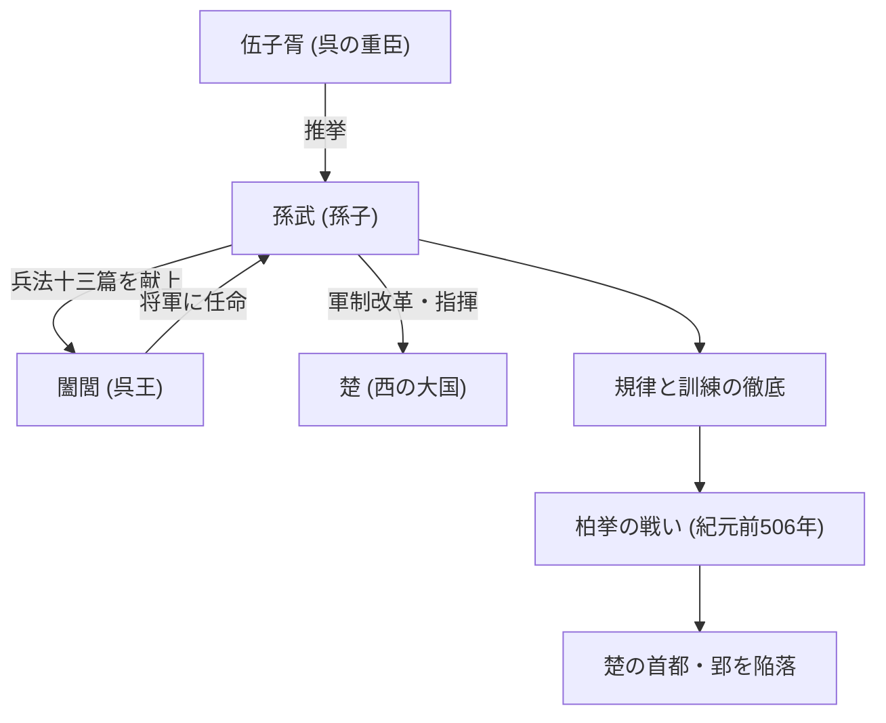

## はじめに

「彼を知り己を知れば百戦殆うからず」——現代のビジネスシーンでも頻繁に引用されるこの名言は、今から2500年以上前の中国春秋時代に生きた一人の軍略家によって残されました。彼の名は孫武（そんぶ）。後世に尊称として「孫子」と呼ばれるこの人物は、世界最高峰の兵法書『孫子』を著し、東洋のみならず世界の軍事・経営戦略に多大な影響を与え続けています。本記事では、謎に包まれた孫武の生涯とその革新的な哲学、そして後世への影響について深く掘り下げていきます。

## 孫武の生涯：斉からの亡命と呉の飛躍

孫武の生涯については、司馬遷の『史記』などに記録が残されていますが、その前半生は謎に包まれています。紀元前6世紀後半、現在の山東省にあたる斉の国に生まれた孫武は、代々軍事を司る名門の出身であったと伝えられています。しかし、斉の国内での政治的闘争や混乱を避けるため、彼は新興国であった南方の「呉」へと亡命しました。

呉に身を寄せた孫武は、重臣である伍子胥（ごししょ）に見出されます。伍子胥の強力な推挙により、孫武は呉王・闔閭（こうりょ）に拝謁する機会を得ました。この時、孫武は自身が書き上げた兵法書（後の『孫子』十三篇）を闔閭に献上し、その非凡な才能を示します。闔閭は彼の軍事理論に深く感銘を受け、孫武を将軍として登用しました。

孫武が軍の指揮を執るようになると、呉の軍隊は規律正しく強力な組織へと変貌を遂げます。紀元前506年、呉は西の超大国である「楚」への大規模な遠征（柏挙の戦い）を敢行。孫武の神算鬼謀に導かれた呉軍は、圧倒的な兵力差を覆して楚の首都・郢（えい）を陥落させるという歴史的快挙を成し遂げました。この勝利により、呉は一躍春秋時代の覇権国へと躍り出たのです。

## 『孫子』の哲学：戦わずして勝つ

孫武の最大にして不滅の功績は、全十三篇からなる兵法書『孫子』を著したことです。『孫子』がそれまでの兵法と一線を画していたのは、戦争を単なる武力のぶつかり合いではなく、国家の存亡を賭けた「総合的な国家戦略」として捉え直した点にあります。

### 1. 戦争の非情さと慎重論
孫武は「兵とは国の大事なり。死生の地、存亡の道、察せざるべからず」と述べ、戦争が国家と民衆にもたらす多大な犠牲を直視しました。だからこそ、軽々しく開戦すべきではないという極めて現実的で慎重な立場をとっています。

### 2. 「戦わずして勝つ」という究極の理想
『孫子』の哲学の核心は、「百戦百勝は善の善なる者に非ず。戦わずして人の兵を屈するは善の善なる者なり」という言葉に集約されます。武力衝突による消耗を避け、外交、謀略、情報戦を駆使して敵の意図を封じ、刃を交えることなく勝利を得ることこそが最上の戦略であると説きました。

### 3. 情報と合理性の重視
「彼を知り己を知れば百戦殆うからず」。孫武は、迷信や占いに頼ることを厳しく戒め、敵と味方の情勢（戦力、地形、天候、君主と民の結束など）を客観的かつ徹底的に分析することを求めました。間諜（スパイ）を重視した「用間篇」が存在することも、彼がいかに情報を重んじていたかを示しています。

## 図解：孫武を巡る相関図と功績

以下の図は、孫武の主要な関係者と、彼の功績のフローを示したものです。

## 後世への多大な影響

孫武の死後、彼の思想は中国の歴代王朝の武将や政治家に受け継がれました。三国時代の英雄・曹操は『孫子』に注釈を加えて現代に伝わるテキストを整備し、唐の太宗や宋の武将たちも座右の銘としました。また、日本の戦国武将である武田信玄が「風林火山」（軍争篇の一節）を旗印に掲げたことも有名です。

近代以降、『孫子』は東洋の枠を超えて世界中へと広まりました。フランスのナポレオンが愛読したという伝説もあり、現代ではアメリカの士官学校や国防総省の必読書に指定されています。さらに驚くべきことに、その普遍的な戦略論は軍事の枠を超え、現代のビジネス戦略、マーケティング、経営学の分野でも「究極のバイブル」として広く応用され続けています。

## おわりに

孫武は、単なる戦場の指揮官ではなく、人間の心理、組織のあり方、そして国家の命運を冷徹に見つめた大思想家でした。彼の遺した『孫子』が2500年という途方もない時間を経てもなお色褪せないのは、それが「いかに敵を殺すか」ではなく「いかに生き残り、目的を達成するか」という人間社会の普遍的な真理を突いているからです。私たちが困難な決断を迫られたとき、孫武の冷徹にして深い知恵は、今なお強力な羅針盤となってくれるはずです。
