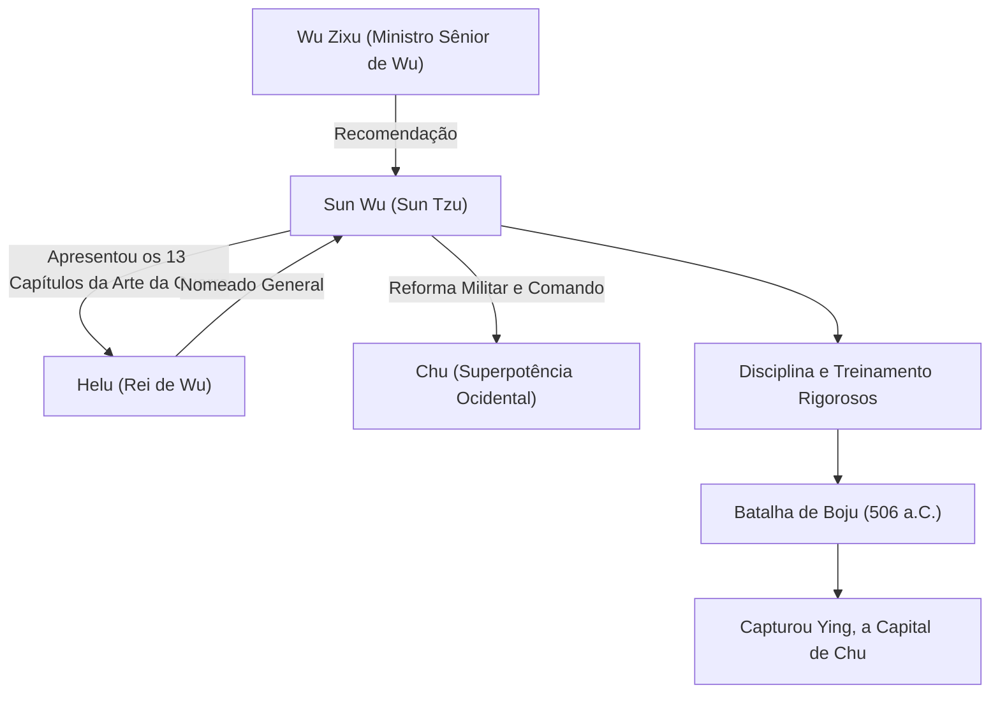

## Introdução

"Se você conhece o inimigo e conhece a si mesmo, não precisa temer o resultado de cem batalhas." Esta famosa citação, frequentemente mencionada até mesmo no mundo dos negócios moderno, foi deixada por um estrategista militar que viveu na China durante o Período de Primaveras e Outonos, há mais de 2.500 anos. Seu nome era Sun Wu. Respeitosamente chamado de "Sun Tzu" pelas gerações posteriores, ele escreveu o maior tratado militar do mundo, "A Arte da Guerra", e continua a exercer profunda influência nas estratégias militares e de gestão não apenas no Oriente, mas em todo o mundo. Neste artigo, mergulhamos profundamente na vida misteriosa de Sun Wu, em sua filosofia inovadora e em seu impacto nas gerações futuras.

## A Vida de Sun Wu: Exílio de Qi e o Salto de Wu

A vida de Sun Wu está registrada nos "Registros do Historiador" de Sima Qian, mas sua juventude está envolta em mistério. Nascido no final do século VI a.C. no estado de Qi, correspondente à atual província de Shandong, diz-se que Sun Wu veio de uma família nobre que lidava com assuntos militares há gerações. No entanto, para evitar lutas políticas e tumultos dentro de Qi, ele desertou para o sul, em direção ao emergente estado de "Wu".

Buscando refúgio em Wu, Sun Wu foi descoberto por Wu Zixu, um ministro sênior. Com a forte recomendação de Wu Zixu, Sun Wu obteve uma audiência com o Rei Helu de Wu. Nesse momento, Sun Wu apresentou a Helu o tratado militar que havia escrito (mais tarde os 13 capítulos de "A Arte da Guerra"), demonstrando seu talento extraordinário. Profundamente impressionado com sua teoria militar, Helu nomeou Sun Wu como general.

Sob o comando de Sun Wu, o exército de Wu se transformou em uma organização disciplinada e poderosa. Em 506 a.C., Wu lançou uma grande expedição (a Batalha de Boju) contra a superpotência ocidental "Chu". Guiado pelas estratégias brilhantes de Sun Wu, o exército de Wu superou uma diferença esmagadora no número de tropas e alcançou a façanha histórica de capturar Ying, a capital de Chu. Através desta vitória, Wu subitamente saltou para se tornar a potência hegemônica do Período de Primaveras e Outonos.

## A Filosofia de "A Arte da Guerra": Vencer sem Lutar

A maior e imortal conquista de Sun Wu é a autoria do tratado militar de 13 capítulos, "A Arte da Guerra". O que separou "A Arte da Guerra" das estratégias militares anteriores foi sua reconceituação da guerra não apenas como um confronto de forças armadas, mas como uma "estratégia nacional abrangente" da qual dependia a sobrevivência do estado.

### 1. A Crueldade da Guerra e Prudência
Sun Wu afirmou: "A guerra é de vital importância para o Estado. É uma questão de vida ou morte, um caminho para a segurança ou para a ruína. Portanto, é um assunto de estudo que não pode, em hipótese alguma, ser negligenciado", confrontando diretamente os enormes sacrifícios que a guerra traz ao estado e ao seu povo. Portanto, ele adotou uma postura extremamente realista e prudente de que a guerra não deve ser iniciada de ânimo leve.

### 2. O Ideal Supremo de "Vencer sem Lutar"
O cerne da filosofia em "A Arte da Guerra" resume-se nas seguintes palavras: "Lutar e conquistar em todas as suas batalhas não é a excelência suprema; a excelência suprema consiste em quebrar a resistência do inimigo sem lutar." Ele ensinou que evitar a exaustão do conflito armado e usar a diplomacia, estratagemas e guerra de informações para frustrar as intenções do inimigo, garantindo assim a vitória sem cruzar espadas, é a estratégia mais elevada.

### 3. Ênfase na Informação e Racionalidade
"Se você conhece o inimigo e conhece a si mesmo, não precisa temer o resultado de cem batalhas." Sun Wu alertou estritamente contra confiar em superstições ou adivinhações, exigindo análises objetivas e minuciosas das situações amigas e inimigas (força militar, terreno, clima, unidade entre governante e povo, etc.). A existência do capítulo "O Uso de Espiões", que enfatiza a coleta de inteligência, também demonstra o quanto ele valorizava a informação.

## Diagrama: Gráfico de Correlação e Conquistas de Sun Wu

O diagrama abaixo mostra os principais associados de Sun Wu e o fluxo de suas conquistas.

## Profundo Impacto nas Gerações Futuras

Após a morte de Sun Wu, suas ideias foram herdadas por senhores da guerra e políticos de sucessivas dinastias chinesas. Cao Cao, o herói do período dos Três Reinos, adicionou comentários à "Arte da Guerra", mantendo o texto que é transmitido hoje, e o Imperador Taizong de Tang e os generais da dinastia Song também o tornaram seu lema. Além disso, é famoso que Takeda Shingen, um senhor da guerra do período Sengoku japonês, tenha levantado a bandeira "Furinkazan" (Vento, Floresta, Fogo, Montanha - uma passagem do capítulo sobre Combate Militar).

Desde os tempos modernos, "A Arte da Guerra" se espalhou além do Oriente para o mundo inteiro. Há uma lenda de que Napoleão, da França, adorava lê-lo, e hoje é designado como leitura obrigatória nas academias militares dos Estados Unidos e no Pentágono. Ainda mais surpreendente, suas teorias estratégicas universais transcenderam o reino militar e continuam a ser amplamente aplicadas como a "bíblia definitiva" nos campos modernos de estratégia de negócios, marketing e gestão.

## Conclusão

Sun Wu não foi apenas um comandante de campo de batalha, mas um grande pensador que observou friamente a psicologia humana, as estruturas organizacionais e o destino das nações. A razão pela qual seu legado, "A Arte da Guerra", permanece intacto mesmo após a passagem de impressionantes 2.500 anos é porque atinge as verdades universais da sociedade humana: não "como matar o inimigo", mas "como sobreviver e alcançar objetivos". Quando somos forçados a tomar decisões difíceis, a sabedoria fria, mas profunda de Sun Wu, certamente continuará a servir como uma bússola poderosa.
