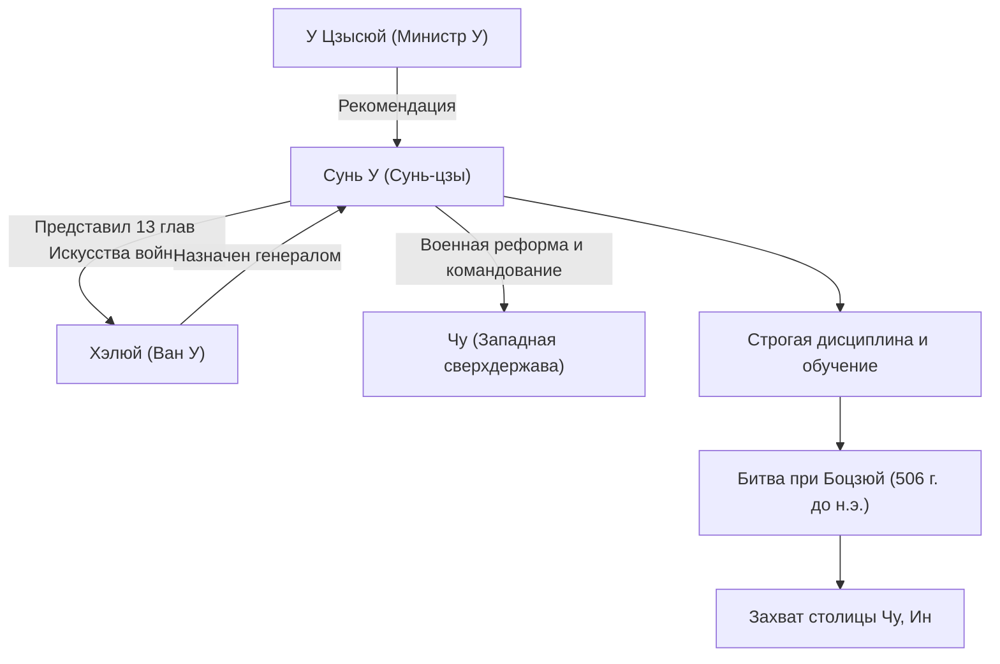

## Введение

«Если знаешь противника и знаешь себя, сражайся хоть сто раз, опасности не будет». Эта знаменитая цитата, которую часто приводят даже в современном бизнесе, была оставлена военным стратегом, жившим в Китае в период Весен и Осеней более 2500 лет назад. Его звали Сунь У. Почтительно именуемый потомками «Сунь-цзы», он написал величайший в мире военный трактат «Искусство войны» и продолжает оказывать глубокое влияние на военные и управленческие стратегии не только на Востоке, но и во всем мире. В этой статье мы глубоко погружаемся в таинственную жизнь Сунь У, его новаторскую философию и влияние на будущие поколения.

## Жизнь Сунь У: Изгнание из Ци и взлет У

Жизнь Сунь У записана в «Исторических записках» Сыма Цяня, но его ранняя жизнь окутана тайной. Родившийся в конце VI века до н.э. в царстве Ци (территория современной провинции Шаньдун), Сунь У, как говорят, происходил из знатной семьи, которая из поколения в поколение занималась военными делами. Однако, чтобы избежать политической борьбы и беспорядков внутри Ци, он бежал на юг в развивающееся государство «У».

Ища убежища в У, Сунь У был замечен У Цзысюем, высокопоставленным министром. По настоятельной рекомендации У Цзысюя Сунь У получил аудиенцию у вана У по имени Хэлюй. В это время Сунь У представил Хэлюю написанный им военный трактат (позже 13 глав «Искусства войны»), продемонстрировав свой выдающийся талант. Глубоко впечатленный его военной теорией, Хэлюй назначил Сунь У генералом.

Под командованием Сунь У армия У превратилась в дисциплинированную и мощную организацию. В 506 году до н.э. государство У начало масштабную экспедицию (битва при Боцзюй) против западной сверхдержавы «Чу». Руководимая блестящими стратегиями Сунь У, армия У преодолела подавляющую разницу в численности войск и совершила исторический подвиг, захватив Ин, столицу Чу. Благодаря этой победе У внезапно стало гегемоном периода Весен и Осеней.

## Философия «Искусства войны»: Победа без сражения

Величайшим и бессмертным достижением Сунь У является авторство военного трактата из 13 глав «Искусство войны». Что отличало «Искусство войны» от предыдущих военных стратегий, так это переосмысление войны не просто как столкновения вооруженных сил, а как «всеобъемлющей национальной стратегии», от которой зависело выживание государства.

### 1. Жестокость войны и осторожность
Сунь У утверждал: «Война — это великое дело для государства, это почва жизни и смерти, это путь существования и гибели. Это нужно понять», прямо сталкиваясь с огромными жертвами, которые война приносит государству и его народу. Поэтому он занял крайне реалистичную и осторожную позицию, считая, что войну не следует начинать легкомысленно.

### 2. Высший идеал «Победы без сражения»
Суть философии «Искусства войны» резюмируется в словах: «Сто раз сразиться и сто раз победить — это не лучшее из лучшего; лучшее из лучшего — покорить чужую армию, не сражаясь». Он учил, что избегание истощения от вооруженного конфликта и использование дипломатии, уловок и информационной войны для срыва намерений врага, обеспечивая таким образом победу без скрещивания мечей, является высшей стратегией.

### 3. Акцент на информацию и рациональность
«Если знаешь противника и знаешь себя, сражайся хоть сто раз, опасности не будет». Сунь У строго предостерегал от опоры на суеверия или гадания, требуя объективного и тщательного анализа как своей, так и вражеской ситуации (военная мощь, местность, погода, единство правителя и народа и т.д.). Существование главы «Использование шпионов», в которой подчеркивается важность сбора разведданных, также демонстрирует, насколько высоко он ценил информацию.

## Схема: Корреляционная диаграмма и достижения Сунь У

Приведенная ниже диаграмма показывает ключевых соратников Сунь У и последовательность его достижений.

## Огромное влияние на будущие поколения

После смерти Сунь У его идеи унаследовали военачальники и политики сменявших друг друга китайских династий. Цао Цао, герой эпохи Троецарствия, добавил комментарии к «Искусству войны», сохранив текст, который передается и сегодня, а император Тан Тай-цзун и генералы династии Сун сделали его своим девизом. Кроме того, известно, что Такэда Сингэн, японский полководец периода Сэнгоку, поднял знамя «Фуринкадзан» (Ветер, Лес, Огонь, Гора — отрывок из главы о военном противостоянии).

С начала Нового времени «Искусство войны» распространилось за пределы Востока на весь мир. Ходит легенда, что французский полководец Наполеон любил его читать, а сегодня он входит в список обязательной литературы в военных академиях США и Пентагоне. Еще более удивительно то, что его универсальные стратегические теории вышли за рамки военной сферы и продолжают широко применяться как «абсолютная библия» в области современной бизнес-стратегии, маркетинга и менеджмента.

## Заключение

Сунь У был не просто полководцем на поле боя, но и великим мыслителем, холодно наблюдавшим за человеческой психологией, организационными структурами и судьбами наций. Причина, по которой его наследие, «Искусство войны», остается неувядающим даже спустя ошеломляющие 2500 лет, заключается в том, что оно затрагивает универсальные истины человеческого общества: не «как убить врага», а «как выжить и достичь целей». Когда мы вынуждены принимать трудные решения, холодная, но глубокая мудрость Сунь У наверняка продолжит служить мощным компасом.
