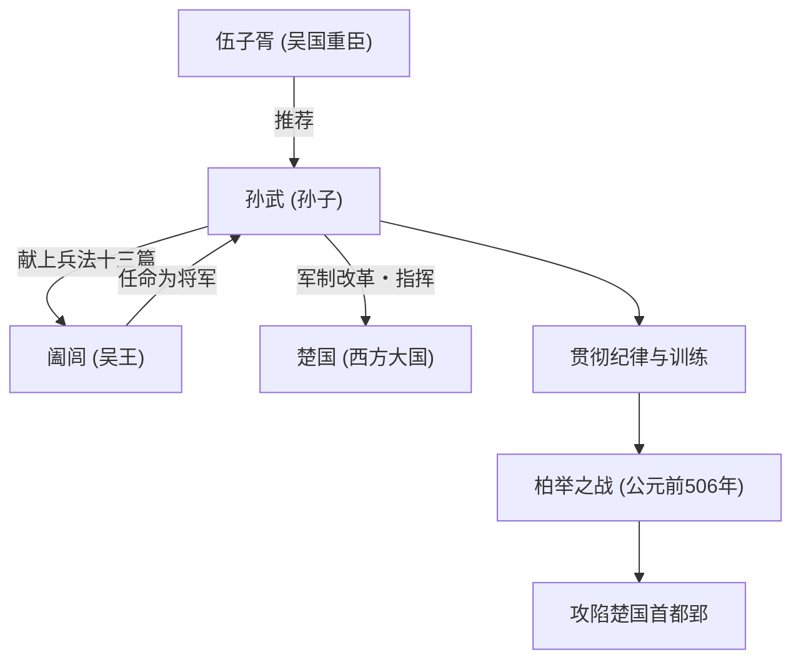

## 引言

“知己知彼，百战不殆”——这句在现代商业场景中也被频繁引用的名言，是由生活在距今2500多年前中国春秋时期的一位军事家留下的。他的名字叫孙武。后人尊称他为“孙子”，他撰写了世界最高峰的兵法书《孙子兵法》，不仅对东方，而且对世界的军事和经营战略产生了深远的影响。在本文中，我们将深入探讨孙武充满谜团的生平、其创新的哲学以及对后世的影响。

## 孙武的生平：从齐国流亡与吴国的飞跃

关于孙武的生平，司马迁的《史记》等文献中有记载，但他前半生的经历却充满了谜团。孙武出生于公元前6世纪后半叶的齐国（相当于现在的山东省），据说出身于世代掌管军事的名门望族。然而，为了躲避齐国内部的政治斗争和混乱，他流亡到了南方的新兴国家“吴国”。

在吴国安身的孙武，被重臣伍子胥所发掘。在伍子胥的大力推荐下，孙武获得了觐见吴王阖闾的机会。此时，孙武将自己写成的兵法书（后来的《孙子》十三篇）献给了阖闾，展示了他非凡的才华。阖闾对他的军事理论深感钦佩，于是任命孙武为将军。

孙武开始指挥军队后，吴国的军队蜕变成了一支纪律严明、战斗力强大的组织。公元前506年，吴国对西方的超级大国“楚国”发动了大规模远征（柏举之战）。在孙武的神机妙算引导下，吴军克服了兵力上的巨大劣势，完成了攻陷楚国首都郢的历史性壮举。凭借这场胜利，吴国一跃成为春秋时期的霸权国家。

## 《孙子》的哲学：不战而胜

孙武最大且不朽的功绩，就是撰写了全十三篇的兵法书《孙子》。《孙子》之所以与以往的兵法划清界限，在于它不再将战争仅仅视为武力的碰撞，而是重新将其定义为关乎国家存亡的“综合性国家战略”。

### 1. 战争的残酷与慎重论
孙武提出“兵者，国之大事，死生之地，存亡之道，不可不察也”，正视了战争给国家和民众带来的巨大牺牲。正因为如此，他采取了极其现实和慎重的立场，主张不应轻率开战。

### 2. “不战而胜”的终极理想
《孙子》哲学的核心，浓缩在“百战百胜，非善之善者也；不战而屈人之兵，善之善者也”这句话中。他主张避免武力冲突带来的消耗，运用外交、谋略和情报战来封锁敌人的意图，不交锋就取得胜利，这才是最上乘的战略。

### 3. 重视情报与理性
“知己知彼，百战不殆”。孙武严厉警告不要依赖迷信或占卜，要求客观且彻底地分析敌我双方的形势（兵力、地形、气候、君民的团结等）。强调间谍作用的《用间篇》的存在，也证明了他对情报的高度重视。

## 图解：关于孙武的相关图与功绩

下图展示了孙武的主要相关人物及其功绩的流程。

## 对后世的巨大影响

孙武死后，他的思想被中国历代王朝的武将和政治家所继承。三国时代的英雄曹操为《孙子》作注，整理出现传文本，唐太宗和宋代武将们也将其作为座右铭。此外，日本战国武将武田信玄以“风林火山”（《军争篇》中的一节）为旗帜，这也是非常有名的。

近代以后，《孙子》跨越东方的界限传播到了世界各地。传说法国的拿破仑也爱读此书，在现代，它更是被指定为美国军官学校和国防部的必读书目。更令人惊讶的是，其普遍的战略论超越了军事范畴，在现代的商业战略、市场营销和管理学领域，也作为“终极圣经”被广泛应用。

## 结语

孙武不仅仅是一名战场上的指挥官，更是一位冷静观察人类心理、组织形态以及国家命运的大思想家。他留下的《孙子》历经2500年的漫长岁月依然不褪色，是因为它触及了人类社会的普遍真理：不是“如何杀敌”，而是“如何生存并达成目的”。当我们面临艰难抉择时，孙武那冷峻而深刻的智慧，至今仍将是我们强大的指南针。
