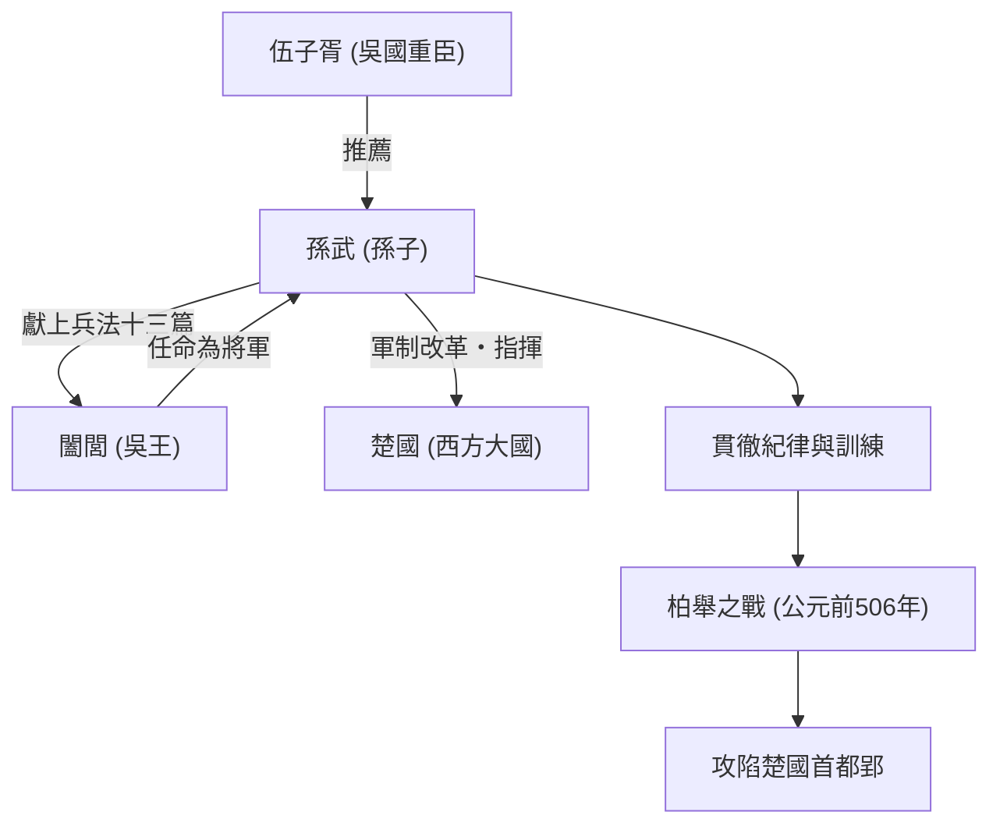

## 引言

「知己知彼，百戰不殆」——這句在現代商業場景中也被頻繁引用的名言，是由生活在距今2500多年前中國春秋時期的一位軍事家留下的。他的名字叫孫武。後人尊稱他為「孫子」，他撰寫了世界最高峰的兵法書《孫子兵法》，不僅對東方，而且對世界的軍事和經營戰略產生了深遠的影響。在本文中，我們將深入探討孫武充滿謎團的生平、其創新的哲學以及對後世的影響。

## 孫武的生平：從齊國流亡與吳國的飛躍

關於孫武的生平，司馬遷的《史記》等文獻中有記載，但他前半生的經歷卻充滿了謎團。孫武出生於公元前6世紀後半葉的齊國（相當於現在的山東省），據說出身於世代掌管軍事的名門望族。然而，為了躲避齊國內部的政治鬥爭和混亂，他流亡到了南方的新興國家「吳國」。

在吳國安身的孫武，被重臣伍子胥所發掘。在伍子胥的大力推薦下，孫武獲得了覲見吳王闔閭的機會。此時，孫武將自己寫成的兵法書（後來的《孫子》十三篇）獻給了闔閭，展示了他非凡的才華。闔閭對他的軍事理論深感欽佩，於是任命孫武為將軍。

孫武開始指揮軍隊後，吳國的軍隊蛻變成了一支紀律嚴明、戰鬥力強大的組織。公元前506年，吳國對西方的超級大國「楚國」發動了大規模遠征（柏舉之戰）。在孫武的神機妙算引導下，吳軍克服了兵力上的巨大劣勢，完成了攻陷楚國首都郢的歷史性壯舉。憑藉這場勝利，吳國一躍成為春秋時期的霸權國家。

## 《孫子》的哲學：不戰而勝

孫武最大且不朽的功績，就是撰寫了全十三篇的兵法書《孫子》。《孫子》之所以與以往的兵法劃清界線，在於它不再將戰爭僅僅視為武力的碰撞，而是重新將其定義為關乎國家存亡的「綜合性國家戰略」。

### 1. 戰爭的殘酷與慎重論
孫武提出「兵者，國之大事，死生之地，存亡之道，不可不察也」，正視了戰爭給國家和民眾帶來的巨大犧牲。正因為如此，他採取了極其現實和慎重的立場，主張不應輕率開戰。

### 2. 「不戰而勝」的終極理想
《孫子》哲學的核心，濃縮在「百戰百勝，非善之善者也；不戰而屈人之兵，善之善者也」這句話中。他主張避免武力衝突帶來的消耗，運用外交、謀略和情報戰來封鎖敵人的意圖，不交鋒就取得勝利，這才是最上乘的戰略。

### 3. 重視情報與理性
「知己知彼，百戰不殆」。孫武嚴厲警告不要依賴迷信或占卜，要求客觀且徹底地分析敵我雙方的形勢（兵力、地形、氣候、君民的團結等）。強調間諜作用的《用間篇》的存在，也證明了他對情報的高度重視。

## 圖解：關於孫武的相關圖與功績

下圖展示了孫武的主要相關人物及其功績的流程。

## 對後世的巨大影響

孫武死後，他的思想被中國歷代王朝的武將和政治家所繼承。三國時代的英雄曹操為《孫子》作注，整理出現傳文本，唐太宗和宋代武將們也將其作為座右銘。此外，日本戰國武將武田信玄以「風林火山」（《軍爭篇》中的一節）為旗幟，這也是非常有名的。

近代以後，《孫子》跨越東方的界線傳播到了世界各地。傳說法國的拿破崙也愛讀此書，在現代，它更是被指定為美國軍官學校和國防部的必讀書目。更令人驚訝的是，其普遍的戰略論超越了軍事範疇，在現代的商業戰略、市場營銷和管理學領域，也作為「終極聖經」被廣泛應用。

## 結語

孫武不僅僅是一名戰場上的指揮官，更是一位冷靜觀察人類心理、組織形態以及國家命運的大思想家。他留下的《孫子》歷經2500年的漫長歲月依然不褪色，是因為它觸及了人類社會的普遍真理：不是「如何殺敵」，而是「如何生存並達成目的」。當我們面臨艱難抉擇時，孫武那冷峻而深刻的智慧，至今仍將是我們強大的指南針。
