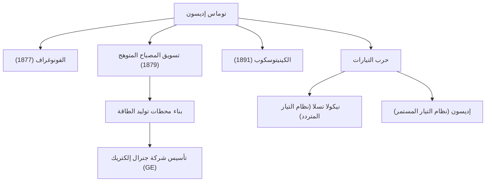

"العبقرية هي واحد بالمائة إلهام وتسعة وتسعون بالمائة عرق." توماس ألفا إديسون (1847-1931)، الذي ترك هذه الكلمات، هو واحد من أكثر المخترعين غزارة وتأثيراً في تاريخ البشرية. مع حصوله على أكثر من 1000 براءة اختراع خلال حياته، أرست إنجازات الرجل المعروف باسم "ساحر مينلو بارك" الأساس لتكنولوجيا المجتمع الحديث. في هذا المقال، نتعمق في حياة إديسون المضطربة، والفلسفة الراسخة وراءها، وتأثيره الدائم على يومنا هذا.

## طفولة مليئة بالفضول والتمرد

وُلد إديسون عام 1847 في ميلان، أوهايو، الولايات المتحدة الأمريكية. منذ سن مبكرة، كان فتى فضولياً للغاية يسأل باستمرار "لماذا؟"، لكنه لم يستطع التكيف مع التعليم المدرسي الموحد في ذلك الوقت وتم طرده بعد بضعة أشهر فقط. ومع ذلك، تحت التعليم المخلص لوالدته نانسي، المعلمة السابقة، أمضى أيامه منغمساً في التجارب العلمية في قبو منزله.

بالإضافة إلى ذلك، تسبب له مرض في الطفولة في فقدان حاد للسمع. ومع ذلك، لم ينظر إديسون إلى هذا بتشاؤم، بل بإيجابية، قائلاً: "لأنني لا أستطيع سماع الضوضاء، يمكنني التركيز بشكل أفضل." كانت هذه العقلية المتمثلة في تحويل الشدائد إلى نقطة انطلاق هي القوة الدافعة التي دفعته ليصبح مخترعاً عظيماً.

## مصنع الابتكار: مينلو بارك

بدأ إديسون العمل كعامل تلغراف في سن مبكرة، وكسب الأموال من خلال اختراعات مثل شريط أسهم البورصة وأسس مختبراً في مينلو بارك، نيو جيرسي. يمكن أن يطلق على هذا أول "مختبر أبحاث خاص شامل" في العالم، وكان رائداً في البحث والتطوير (R&D) الحديث الذي ينتج الاختراعات بشكل منهجي في فرق بدلاً من الاعتماد على العبقرية الفردية.

### الإنجازات الرئيسية وسلسلة الابتكار

يوضح الرسم البياني أدناه اختراعات إديسون التمثيلية وكيف ارتبطت بالصناعات والأحداث التاريخية.

## فلسفة لا تخشى الفشل

كانت السمة الأبرز لإديسون هي "عدد محاولاته" الهائلة. للعثور على مادة مناسبة لفتيل المصباح المتوهج، اختبر جميع أنواع المواد من جميع أنحاء العالم آلاف المرات، بما في ذلك الخيزران وخيط القطن (من المعروف أنه تم اعتماد الخيزران من كيوتو، اليابان في النهاية).

لم يكن لديه مفهوم "الفشل". عندما لا تسير التجربة بشكل جيد، يُذكر أنه قال: "أنا لم أفشل. لقد وجدت للتو 10000 طريقة لا تعمل." كان هذا الهوس بدورة متطرفة من اختبار الفرضيات هو مصدر ابتكاراته العملية.

## حرب التيارات والتأثير على الأجيال القادمة

وراء نجاحه المذهل، واجه إديسون أيضاً انتكاسات كبيرة. كانت هذه "حرب التيارات" التي دارت ضد نيكولا تسلا وجورج وستنجهاوس. روج إديسون لنظام "التيار المستمر" (DC)، مجادلاً من أجل سلامته، لكنه عانى في النهاية من الهزيمة أمام نظام "التيار المتردد" (AC)، والذي كان متفوقاً في نقل الطاقة لمسافات طويلة.

ومع ذلك، لم تقلل هذه الهزيمة من سمعته. اندمجت الشركات التي أسسها لتصبح جنرال إلكتريك (GE) اليوم، وتنمو لتصبح واحدة من أكبر التكتلات في العالم. علاوة على ذلك، أدى اختراع واحد له إلى ولادة صناعات ضخمة بأكملها، مثل إنشاء صناعة الموسيقى بواسطة الفونوغراف وفجر صناعة السينما بواسطة كاميرا الصور المتحركة (الكينيتوسكوب).

## خاتمة

لم يكن توماس إديسون مجرد مخترع، بل كان أيضاً رائد أعمال نادراً ربط الاختراع بـ "الأعمال" و "التنفيذ المجتمعي". إن موقفه المتمثل في تجميع الإخفاقات كبيانات وإجراء تحسينات مستمرة هو جوهر الروح الرشيقة (Agile) في الشركات الناشئة وتطوير البرمجيات الحديثة.

إن حقيقة أنه يمكننا الضغط على مفتاح لإضاءة غرفة في الليل، والاستماع إلى الموسيقى على هواتفنا الذكية، والاستمتاع بالأفلام، كلها بفضل ساحر مينلو بارك، الذي لم يدخر جهداً في "99% عرق".
