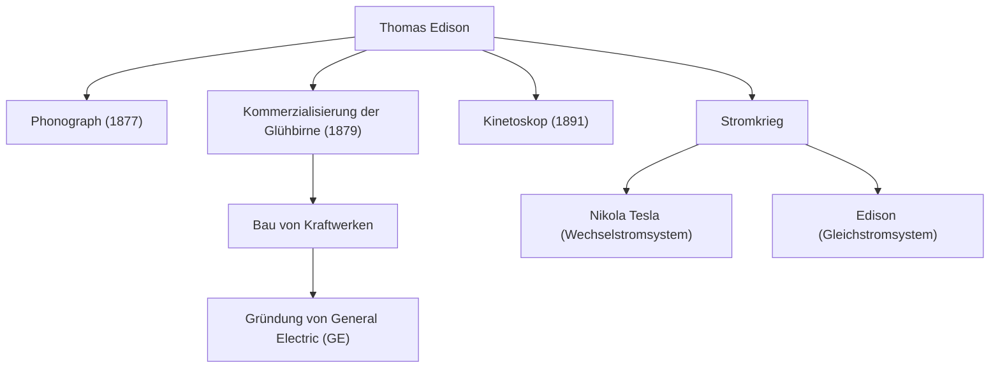

"Genie ist ein Prozent Inspiration und neunundneunzig Prozent Transpiration." Thomas Alva Edison (1847-1931), der diese Worte hinterließ, ist einer der produktivsten und einflussreichsten Erfinder der Menschheitsgeschichte. Mit über 1.000 Patenten, die er im Laufe seines Lebens erwarb, legten die Errungenschaften des Mannes, der als "Zauberer von Menlo Park" bekannt ist, den Grundstein für die Technologie der modernen Gesellschaft. In diesem Artikel tauchen wir tief in Edisons turbulentes Leben, die unerschütterliche Philosophie dahinter und seinen bis heute andauernden Einfluss ein.

## Eine Kindheit voller Neugier und Rebellion

Edison wurde 1847 in Milan, Ohio, USA, geboren. Von klein auf war er ein extrem neugieriger Junge, der ständig "Warum?" fragte, sich aber nicht an die standardisierte Schulbildung der damaligen Zeit anpassen konnte und nach nur wenigen Monaten von der Schule verwiesen wurde. Unter der hingebungsvollen Erziehung seiner Mutter Nancy, einer ehemaligen Lehrerin, verbrachte er seine Tage jedoch vertieft in wissenschaftliche Experimente im Keller seines Hauses.

Darüber hinaus führte eine Krankheit in der Kindheit zu einem schweren Hörverlust. Edison sah dies jedoch nicht pessimistisch, sondern vielmehr positiv und sagte: "Da ich den Lärm nicht hören kann, kann ich mich besser konzentrieren." Diese Denkweise, aus der Not eine Tugend zu machen, war die treibende Kraft, die ihn dazu antrieb, ein großer Erfinder zu werden.

## Die Fabrik der Innovation: Menlo Park

Edison begann schon in jungen Jahren als Telegrafist zu arbeiten, verdiente Geld durch Erfindungen wie den Börsenticker und gründete ein Labor in Menlo Park, New Jersey. Dieses könnte als das weltweit erste "umfassende private Forschungslabor" bezeichnet werden, und es war ein Vorreiter der modernen F&E (Forschung und Entwicklung), die Erfindungen systematisch in Teams hervorbringt, anstatt sich auf individuelle Genialität zu verlassen.

### Wichtige Errungenschaften und die Kette der Innovation

Das folgende Diagramm zeigt Edisons repräsentative Erfindungen und wie sie mit Industrien und historischen Ereignissen verbunden waren.

## Eine Philosophie ohne Angst vor dem Scheitern

Edisons bemerkenswerteste Eigenschaft war seine überwältigende "Anzahl an Versuchen". Um ein geeignetes Material für den Glühfaden der Glühbirne zu finden, testete er Tausende Male alle möglichen Materialien aus der ganzen Welt, darunter Bambus und Baumwollfaden (es ist bekannt, dass letztendlich Bambus aus Kyoto, Japan, verwendet wurde).

Er kannte das Konzept des "Scheiterns" nicht. Wenn ein Experiment nicht gut verlief, soll er gesagt haben: "Ich habe nicht versagt. Ich habe nur 10.000 Wege gefunden, die nicht funktionieren." Diese Besessenheit von einem extremen Zyklus von Hypothesentests war die Quelle seiner praktischen Innovationen.

## Der Stromkrieg und die Auswirkungen auf die Nachwelt

Hinter seinem spektakulären Erfolg erlebte Edison auch große Rückschläge. Dies war der "Stromkrieg", der gegen Nikola Tesla und George Westinghouse geführt wurde. Edison förderte das "Gleichstrom"-System (DC) und argumentierte mit dessen Sicherheit, erlitt jedoch letztendlich eine Niederlage gegen das "Wechselstrom"-System (AC), das für die Energieübertragung über große Entfernungen überlegen war.

Diese Niederlage schmälerte jedoch nicht seinen Ruf. Die von ihm gegründeten Unternehmen fusionierten zur heutigen General Electric (GE), die sich zu einem der größten Konglomerate der Welt entwickelte. Darüber hinaus hat eine einzige seiner Erfindungen ganze, riesige Industrien hervorgebracht, wie etwa die Entstehung der Musikindustrie durch den Phonographen und die Anfänge der Filmindustrie durch die Filmkamera (Kinetoskop).

## Fazit

Thomas Edison war nicht nur ein Erfinder, sondern auch ein seltener Unternehmer, der die Erfindung mit "Business" und "gesellschaftlicher Umsetzung" verknüpfte. Seine Einstellung, Misserfolge als Daten zu sammeln und kontinuierlich Verbesserungen vorzunehmen, ist die Essenz des agilen Geistes in modernen Start-ups und der Softwareentwicklung.

Die Tatsache, dass wir nachts einen Schalter umlegen können, um einen Raum zu erhellen, Musik auf unseren Smartphones hören und Filme genießen können, ist alles dem Zauberer von Menlo Park zu verdanken, der bei seinen "99% Transpiration" keine Mühen scheute.
