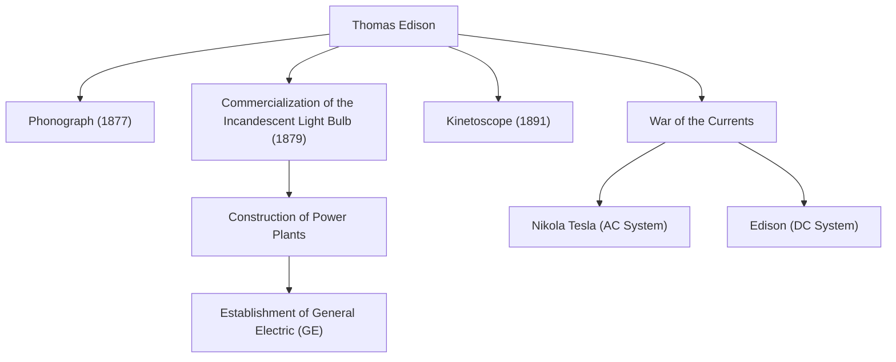

"Genius is one percent inspiration and ninety-nine percent perspiration." Thomas Alva Edison (1847-1931), who left these words, is one of the most prolific and influential inventors in human history. With over 1,000 patents acquired during his lifetime, the achievements of the man known as the "Wizard of Menlo Park" laid the foundation for modern society's technology. In this article, we delve deeply into Edison's turbulent life, the unwavering philosophy behind it, and his lasting impact on the present day.

## A Childhood of Curiosity and Rebellion

Edison was born in 1847 in Milan, Ohio, USA. From a young age, he was an extremely curious boy who constantly asked "Why?", but he could not adapt to the standardized school education of the time and was expelled after only a few months. However, under the devoted education of his mother Nancy, a former teacher, he spent his days immersed in scientific experiments in the basement of his home.

In addition, a childhood illness caused him to suffer from severe hearing loss. However, Edison did not view this pessimistically, but rather positively, saying, "Because I can't hear the noise, I can concentrate better." This mindset of turning adversity into a springboard was the driving force that pushed him to become a great inventor.

## The Factory of Innovation: Menlo Park

Starting out working as a telegrapher at a young age, Edison earned funds through inventions such as the stock ticker and established a laboratory in Menlo Park, New Jersey. This could be called the world's first "comprehensive private research laboratory," and it was a pioneer of modern R&D (research and development) that systematically produces inventions in teams rather than relying on individual genius.

### Major Achievements and the Chain of Innovation

The diagram below shows Edison's representative inventions and how they were linked to industries and historical events.

## A Philosophy Unafraid of Failure

Edison's most notable trait was his overwhelming "number of attempts." To find a suitable material for the filament of the incandescent light bulb, he tested all kinds of materials from around the world thousands of times, including bamboo and cotton thread (it is famous that bamboo from Kyoto, Japan was ultimately adopted).

He did not have the concept of "failure." When an experiment did not go well, he is reported to have said, "I have not failed. I've just found 10,000 ways that won't work." This obsession with an extreme cycle of hypothesis testing was the source of his practical innovations.

## The War of the Currents and Impact on Posterity

Behind his spectacular success, Edison also faced major setbacks. This was the "War of the Currents" fought against Nikola Tesla and George Westinghouse. Edison promoted the "direct current" (DC) system, arguing for its safety, but ultimately suffered defeat to the "alternating current" (AC) system, which was superior for long-distance power transmission.

However, this defeat did not diminish his reputation. The companies he founded merged to become today's General Electric (GE), growing into one of the world's largest conglomerates. Furthermore, a single invention of his has given birth to entire massive industries, such as the creation of the music industry by the phonograph and the dawn of the film industry by the motion picture camera (Kinetoscope).

## Conclusion

Thomas Edison was not merely an inventor, but also a rare entrepreneur who linked invention to "business" and "social implementation." His attitude of accumulating failures as data and continuously making improvements is the very essence of the agile spirit in modern startups and software development.

The fact that we can flip a switch to light up a room at night, listen to music on our smartphones, and enjoy movies is all thanks to the Wizard of Menlo Park, who spared no effort in his "99% perspiration."
