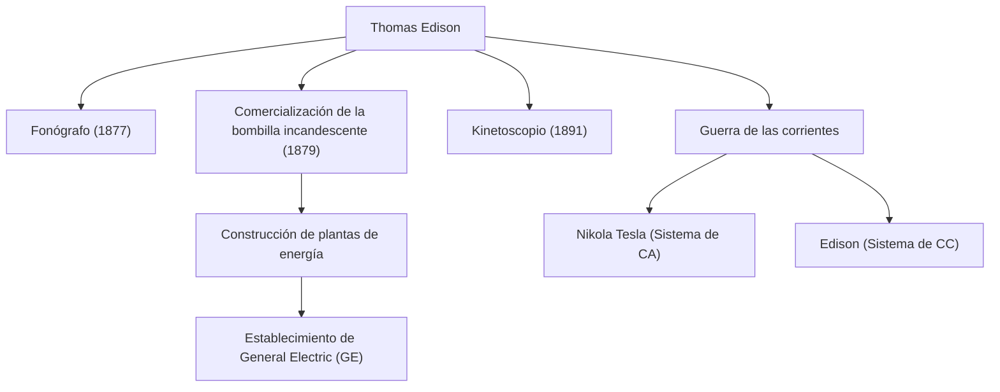

"El genio es uno por ciento de inspiración y un noventa y nueve por ciento de transpiración". Thomas Alva Edison (1847-1931), quien dejó estas palabras, es uno de los inventores más prolíficos e influyentes en la historia de la humanidad. Con más de 1.000 patentes adquiridas durante su vida, los logros del hombre conocido como el "Mago de Menlo Park" sentaron las bases de la tecnología de la sociedad moderna. En este artículo, profundizamos en la vida turbulenta de Edison, la firme filosofía que la sustenta y su impacto duradero en la actualidad.

## Una infancia de curiosidad y rebelión

Edison nació en 1847 en Milan, Ohio, EE. UU. Desde muy joven, fue un niño extremadamente curioso que constantemente preguntaba "¿Por qué?", pero no pudo adaptarse a la educación escolar estandarizada de la época y fue expulsado después de solo unos meses. Sin embargo, bajo la devota educación de su madre Nancy, una ex maestra, pasó sus días inmerso en experimentos científicos en el sótano de su casa.

Además, una enfermedad infantil le causó una grave pérdida de audición. Sin embargo, Edison no vio esto con pesimismo, sino de manera positiva, diciendo: "Como no puedo escuchar el ruido, puedo concentrarme mejor". Esta mentalidad de convertir la adversidad en un trampolín fue la fuerza impulsora que lo empujó a convertirse en un gran inventor.

## La fábrica de innovación: Menlo Park

Comenzando a trabajar como telegrafista a una edad temprana, Edison ganó fondos a través de inventos como el teletipo de cotizaciones de bolsa y estableció un laboratorio en Menlo Park, Nueva Jersey. Este podría considerarse el primer "laboratorio de investigación privado integral" del mundo, y fue pionero en la I+D (investigación y desarrollo) moderna que produce inventos sistemáticamente en equipos en lugar de depender del genio individual.

### Logros principales y la cadena de innovación

El siguiente diagrama muestra los inventos representativos de Edison y cómo se vincularon a industrias y eventos históricos.

## Una filosofía sin miedo al fracaso

El rasgo más notable de Edison fue su abrumador "número de intentos". Para encontrar un material adecuado para el filamento de la bombilla incandescente, probó todo tipo de materiales de todo el mundo miles de veces, incluyendo bambú e hilo de algodón (es famoso que finalmente se adoptó el bambú de Kioto, Japón).

Él no tenía el concepto de "fracaso". Cuando un experimento no salía bien, se dice que decía: "No he fracasado. Solo he encontrado 10.000 formas que no funcionan". Esta obsesión con un ciclo extremo de prueba de hipótesis fue la fuente de sus innovaciones prácticas.

## La guerra de las corrientes y el impacto en la posteridad

Detrás de su espectacular éxito, Edison también enfrentó grandes reveses. Esta fue la "Guerra de las corrientes" librada contra Nikola Tesla y George Westinghouse. Edison promovió el sistema de "corriente continua" (CC), argumentando su seguridad, pero finalmente sufrió la derrota ante el sistema de "corriente alterna" (CA), que era superior para la transmisión de energía a larga distancia.

Sin embargo, esta derrota no disminuyó su reputación. Las empresas que fundó se fusionaron para convertirse en la actual General Electric (GE), creciendo hasta ser uno de los conglomerados más grandes del mundo. Además, un solo invento suyo ha dado a luz a industrias masivas enteras, como la creación de la industria musical por el fonógrafo y los albores de la industria cinematográfica por la cámara de cine (Kinetoscopio).

## Conclusión

Thomas Edison no fue simplemente un inventor, sino también un raro emprendedor que vinculó la invención a los "negocios" y la "implementación social". Su actitud de acumular fracasos como datos y hacer mejoras continuas es la esencia misma del espíritu ágil en las startups modernas y el desarrollo de software.

El hecho de que podamos presionar un interruptor para iluminar una habitación por la noche, escuchar música en nuestros teléfonos inteligentes y disfrutar de películas es todo gracias al Mago de Menlo Park, que no escatimó esfuerzos en su "99% de transpiración".
