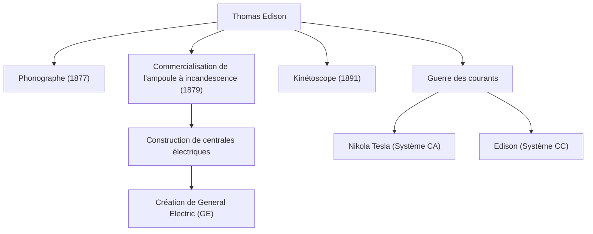

« Le génie, c'est 1 % d'inspiration et 99 % de transpiration. » Thomas Alva Edison (1847-1931), qui a laissé ces mots, est l'un des inventeurs les plus prolifiques et les plus influents de l'histoire de l'humanité. Avec plus de 1 000 brevets acquis au cours de sa vie, les réalisations de l'homme connu sous le nom de « Sorcier de Menlo Park » ont jeté les bases de la technologie de la société moderne. Dans cet article, nous plongeons profondément dans la vie turbulente d'Edison, la philosophie inébranlable qui la sous-tend, et son impact durable sur notre époque.

## Une enfance de curiosité et de rébellion

Edison est né en 1847 à Milan, dans l'Ohio, aux États-Unis. Dès son plus jeune âge, c'était un garçon extrêmement curieux qui demandait constamment « Pourquoi ? », mais il ne put s'adapter à l'enseignement scolaire standardisé de l'époque et fut renvoyé après seulement quelques mois. Cependant, sous l'éducation dévouée de sa mère Nancy, une ancienne enseignante, il passa ses journées plongé dans des expériences scientifiques dans le sous-sol de sa maison.

De plus, une maladie infantile lui a causé une grave perte d'audition. Cependant, Edison ne considérait pas cela avec pessimisme, mais plutôt de manière positive, en disant : « Comme je n'entends pas le bruit, je peux mieux me concentrer. » Cette mentalité de transformer l'adversité en tremplin a été la force motrice qui l'a poussé à devenir un grand inventeur.

## L'usine de l'innovation : Menlo Park

Commençant à travailler comme télégraphiste dès son plus jeune âge, Edison a gagné des fonds grâce à des inventions telles que le téléscripteur de bourse et a créé un laboratoire à Menlo Park, dans le New Jersey. On pourrait l'appeler le premier « laboratoire de recherche privé complet » au monde, et c'était un pionnier de la R&D (recherche et développement) moderne qui produit systématiquement des inventions en équipe plutôt que de s'appuyer sur le génie individuel.

### Réalisations majeures et chaîne de l'innovation

Le diagramme ci-dessous montre les inventions représentatives d'Edison et comment elles ont été liées aux industries et aux événements historiques.

## Une philosophie qui ne craint pas l'échec

Le trait le plus notable d'Edison était son écrasant « nombre de tentatives ». Pour trouver un matériau approprié pour le filament de l'ampoule à incandescence, il a testé toutes sortes de matériaux du monde entier des milliers de fois, y compris le bambou et le fil de coton (il est célèbre que le bambou de Kyoto, au Japon, a finalement été adopté).

Il n'avait pas le concept d'« échec ». Lorsqu'une expérience ne se passait pas bien, il aurait dit : « Je n'ai pas échoué. J'ai simplement trouvé 10 000 façons qui ne fonctionnent pas. » Cette obsession d'un cycle extrême de test d'hypothèses a été la source de ses innovations pratiques.

## La guerre des courants et l'impact sur la postérité

Derrière ses succès spectaculaires, Edison a également connu des revers majeurs. Ce fut la « Guerre des courants » menée contre Nikola Tesla et George Westinghouse. Edison a promu le système de « courant continu » (CC), plaidant pour sa sécurité, mais a finalement subi une défaite face au système de « courant alternatif » (CA), qui était supérieur pour la transmission d'énergie sur de longues distances.

Cependant, cette défaite n'a pas diminué sa réputation. Les entreprises qu'il a fondées ont fusionné pour devenir l'actuelle General Electric (GE), devenant ainsi l'un des plus grands conglomérats du monde. De plus, une seule de ses inventions a donné naissance à des industries massives entières, telles que la création de l'industrie de la musique par le phonographe et l'aube de l'industrie cinématographique par la caméra (Kinétoscope).

## Conclusion

Thomas Edison n'était pas seulement un inventeur, mais aussi un entrepreneur rare qui a lié l'invention aux « affaires » et à l'« implémentation sociale ». Son attitude consistant à accumuler les échecs comme données et à apporter des améliorations continues est l'essence même de l'esprit agile dans les startups modernes et le développement de logiciels.

Le fait que nous puissions appuyer sur un interrupteur pour éclairer une pièce la nuit, écouter de la musique sur nos smartphones et profiter de films est entièrement dû au Sorcier de Menlo Park, qui n'a ménagé aucun effort dans ses « 99 % de transpiration ».
