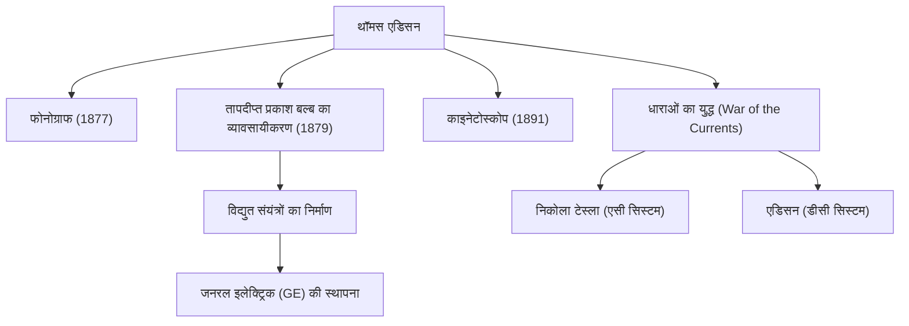

"जीनियस एक प्रतिशत प्रेरणा और निन्यानवे प्रतिशत पसीना है।" थॉमस अल्वा एडिसन (1847-1931), जिन्होंने ये शब्द कहे थे, मानव इतिहास के सबसे विपुल और प्रभावशाली आविष्कारकों में से एक हैं। अपने जीवनकाल में 1,000 से अधिक पेटेंट प्राप्त करने वाले, "मेंलो पार्क के जादूगर" के रूप में जाने जाने वाले व्यक्ति की उपलब्धियों ने आधुनिक समाज की तकनीक की नींव रखी। इस लेख में, हम एडिसन के उतार-चढ़ाव भरे जीवन, इसके पीछे के दृढ़ दर्शन और वर्तमान दिन पर उनके स्थायी प्रभाव में गहराई से गोता लगाते हैं।

## जिज्ञासा और विद्रोह का बचपन

एडिसन का जन्म 1847 में मिलान, ओहियो, अमेरिका में हुआ था। कम उम्र से ही, वह एक बेहद जिज्ञासु लड़का था जो लगातार "क्यों?" पूछता था, लेकिन वह उस समय की मानकीकृत स्कूली शिक्षा के अनुकूल नहीं हो सका और कुछ ही महीनों के बाद उसे स्कूल से निकाल दिया गया। हालांकि, एक पूर्व शिक्षिका, अपनी माँ नैन्सी की समर्पित शिक्षा के तहत, उन्होंने अपने घर के तहखाने में वैज्ञानिक प्रयोगों में डूबे हुए अपने दिन बिताए।

इसके अलावा, बचपन की एक बीमारी के कारण उन्हें गंभीर बहरापन झेलना पड़ा। हालाँकि, एडिसन ने इसे निराशावादी रूप से नहीं देखा, बल्कि सकारात्मक रूप से देखा, यह कहते हुए, "चूंकि मैं शोर नहीं सुन सकता, इसलिए मैं बेहतर ध्यान केंद्रित कर सकता हूं।" विपत्ति को स्प्रिंगबोर्ड में बदलने की यह मानसिकता वह प्रेरक शक्ति थी जिसने उन्हें एक महान आविष्कारक बनने के लिए प्रेरित किया।

## नवाचार का कारखाना: मेंलो पार्क

कम उम्र में टेलीग्राफर के रूप में काम करना शुरू करते हुए, एडिसन ने स्टॉक टिकर जैसे आविष्कारों के माध्यम से धन अर्जित किया और मेंलो पार्क, न्यू जर्सी में एक प्रयोगशाला की स्थापना की। इसे दुनिया की पहली "व्यापक निजी शोध प्रयोगशाला" कहा जा सकता है, और यह आधुनिक आर एंड डी (अनुसंधान और विकास) का प्रणेता था जो व्यक्तिगत प्रतिभा पर भरोसा करने के बजाय टीमों में व्यवस्थित रूप से आविष्कार उत्पन्न करता है।

### प्रमुख उपलब्धियां और नवाचार की श्रृंखला

नीचे दिया गया आरेख एडिसन के प्रतिनिधि आविष्कारों और वे उद्योगों और ऐतिहासिक घटनाओं से कैसे जुड़े थे, यह दर्शाता है।

## विफलता से न डरने वाला दर्शन

एडिसन की सबसे उल्लेखनीय विशेषता उनकी भारी "प्रयासों की संख्या" थी। तापदीप्त प्रकाश बल्ब के फिलामेंट के लिए उपयुक्त सामग्री खोजने के लिए, उन्होंने बांस और सूती धागे सहित दुनिया भर की सभी प्रकार की सामग्रियों का हजारों बार परीक्षण किया (यह प्रसिद्ध है कि अंततः क्योटो, जापान के बांस को अपनाया गया था)।

उनके पास "विफलता" की अवधारणा नहीं थी। जब कोई प्रयोग ठीक नहीं होता था, तो उनके बारे में कहा जाता है, "मैं विफल नहीं हुआ हूं। मैंने सिर्फ 10,000 ऐसे तरीके खोजे हैं जो काम नहीं करेंगे।" परिकल्पना परीक्षण के एक चरम चक्र के साथ यह जुनून उनके व्यावहारिक नवाचारों का स्रोत था।

## धाराओं का युद्ध और भावी पीढ़ी पर प्रभाव

अपनी शानदार सफलता के पीछे, एडिसन को बड़े झटके भी लगे। यह निकोला टेस्ला और जॉर्ज वेस्टिंगहाउस के खिलाफ लड़ी गई "धाराओं का युद्ध" था। एडिसन ने "डायरेक्ट करंट" (डीसी) प्रणाली को बढ़ावा दिया, इसकी सुरक्षा के लिए तर्क दिया, लेकिन अंततः "अल्टरनेटिंग करंट" (एसी) प्रणाली से हार का सामना करना पड़ा, जो लंबी दूरी के बिजली संचरण के लिए बेहतर था।

हालाँकि, इस हार ने उनकी प्रतिष्ठा को कम नहीं किया। उनके द्वारा स्थापित कंपनियों का विलय होकर आज की जनरल इलेक्ट्रिक (GE) बन गई, जो दुनिया के सबसे बड़े समूहों में से एक बन गई। इसके अलावा, उनके एक ही आविष्कार ने पूरे विशाल उद्योगों को जन्म दिया है, जैसे फोनोग्राफ द्वारा संगीत उद्योग का निर्माण और मोशन पिक्चर कैमरा (काइनेटोस्कोप) द्वारा फिल्म उद्योग की शुरुआत।

## निष्कर्ष

थॉमस एडिसन न केवल एक आविष्कारक थे, बल्कि एक दुर्लभ उद्यमी भी थे जिन्होंने आविष्कार को "व्यवसाय" और "सामाजिक कार्यान्वयन" से जोड़ा। विफलताओं को डेटा के रूप में जमा करने और लगातार सुधार करने का उनका रवैया आधुनिक स्टार्टअप और सॉफ्टवेयर विकास में चुस्त भावना का सार है।

यह तथ्य कि हम रात में एक कमरा रोशन करने के लिए एक स्विच फ्लिप कर सकते हैं, अपने स्मार्टफोन पर संगीत सुन सकते हैं, और फिल्मों का आनंद ले सकते हैं, यह सब मेंलो पार्क के जादूगर की बदौलत है, जिन्होंने अपने "99% पसीने" में कोई कसर नहीं छोड़ी।
