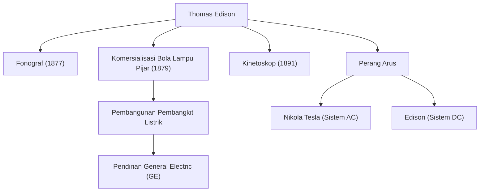

"Jenius adalah satu persen inspirasi dan sembilan puluh sembilan persen keringat." Thomas Alva Edison (1847-1931), yang meninggalkan kata-kata ini, adalah salah satu penemu paling produktif dan berpengaruh dalam sejarah manusia. Dengan lebih dari 1.000 paten yang diperoleh selama masa hidupnya, pencapaian pria yang dikenal sebagai "Penyihir Menlo Park" ini meletakkan dasar bagi teknologi masyarakat modern. Dalam artikel ini, kita akan menggali lebih dalam kehidupan Edison yang penuh gejolak, filosofi teguh di baliknya, dan dampak abadinya hingga saat ini.

## Masa Kecil yang Penuh Rasa Ingin Tahu dan Pemberontakan

Edison lahir pada tahun 1847 di Milan, Ohio, AS. Sejak usia muda, ia adalah anak yang sangat ingin tahu yang selalu bertanya "Mengapa?", tetapi ia tidak dapat beradaptasi dengan pendidikan sekolah yang standar pada saat itu dan dikeluarkan setelah hanya beberapa bulan. Namun, di bawah pendidikan penuh dedikasi dari ibunya Nancy, seorang mantan guru, ia menghabiskan hari-harinya tenggelam dalam eksperimen sains di ruang bawah tanah rumahnya.

Selain itu, penyakit di masa kecil menyebabkannya menderita gangguan pendengaran yang parah. Namun, Edison tidak memandang hal ini dengan pesimis, melainkan secara positif, dengan mengatakan, "Karena saya tidak dapat mendengar kebisingan, saya dapat berkonsentrasi lebih baik." Pola pikir mengubah 역경 menjadi batu loncatan inilah yang menjadi kekuatan pendorong yang mendorongnya menjadi penemu yang hebat.

## Pabrik Inovasi: Menlo Park

Mulai bekerja sebagai operator telegraf di usia muda, Edison mendapatkan dana melalui penemuan-penemuan seperti mesin telegraf saham (stock ticker) dan mendirikan laboratorium di Menlo Park, New Jersey. Ini bisa disebut sebagai "laboratorium penelitian swasta komprehensif" pertama di dunia, dan merupakan pelopor R&D (penelitian dan pengembangan) modern yang secara sistematis menghasilkan penemuan dalam tim daripada mengandalkan kejeniusan individu.

### Pencapaian Utama dan Rantai Inovasi

Diagram di bawah ini menunjukkan penemuan representatif Edison dan bagaimana penemuan tersebut terkait dengan industri dan peristiwa bersejarah.

## Filosofi yang Tidak Takut Gagal

Ciri khas Edison yang paling menonjol adalah "jumlah percobaan" yang luar biasa. Untuk menemukan bahan yang cocok untuk filamen bola lampu pijar, ia menguji semua jenis bahan dari seluruh dunia ribuan kali, termasuk bambu dan benang katun (sudah terkenal bahwa bambu dari Kyoto, Jepang pada akhirnya diadopsi).

Dia tidak memiliki konsep "kegagalan". Ketika sebuah eksperimen tidak berjalan dengan baik, dia dilaporkan pernah berkata, "Saya tidak gagal. Saya baru saja menemukan 10.000 cara yang tidak akan berhasil." Obsesi dengan siklus pengujian hipotesis yang ekstrem ini adalah sumber inovasi praktisnya.

## Perang Arus dan Dampak pada Anak Cucu

Di balik kesuksesannya yang spektakuler, Edison juga menghadapi kemunduran besar. Ini adalah "Perang Arus" yang diperjuangkan melawan Nikola Tesla dan George Westinghouse. Edison mempromosikan sistem "arus searah" (DC), dengan alasan keamanannya, tetapi pada akhirnya menderita kekalahan dari sistem "arus bolak-balik" (AC), yang lebih unggul untuk transmisi daya jarak jauh.

Namun, kekalahan ini tidak mengurangi reputasinya. Perusahaan-perusahaan yang didirikannya bergabung menjadi General Electric (GE) saat ini, berkembang menjadi salah satu konglomerat terbesar di dunia. Lebih jauh lagi, satu penemuannya telah melahirkan seluruh industri besar, seperti penciptaan industri musik oleh fonograf dan awal mula industri film oleh kamera gambar bergerak (Kinetoskop).

## Kesimpulan

Thomas Edison bukan sekadar seorang penemu, melainkan juga seorang pengusaha langka yang menghubungkan penemuan dengan "bisnis" dan "implementasi sosial". Sikapnya yang mengakumulasi kegagalan sebagai data dan terus melakukan perbaikan adalah esensi dari semangat tangkas (agile) dalam startup modern dan pengembangan perangkat lunak.

Fakta bahwa kita dapat menekan sakelar untuk menerangi ruangan di malam hari, mendengarkan musik di ponsel pintar kita, dan menikmati film, semuanya berkat Penyihir Menlo Park, yang tidak menyayangkan usahanya dalam "99% keringat".
