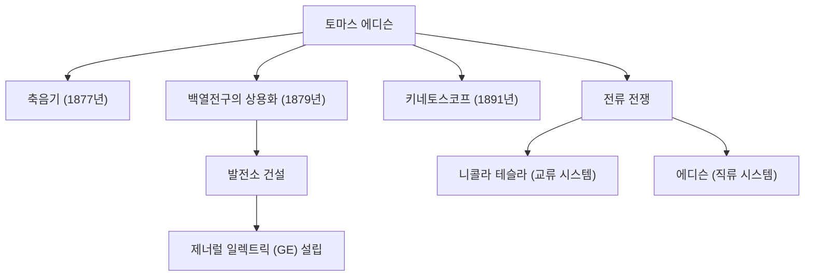

"천재는 1%의 영감과 99%의 노력으로 이루어진다." 이 말을 남긴 토마스 알바 에디슨(1847-1931)은 인류 역사상 가장 다작하고 영향력 있는 발명가 중 한 명입니다. 평생 동안 1,000개가 넘는 특허를 취득한 "멘로파크의 마법사"의 업적은 현대 사회 기술의 기반을 다졌습니다. 이 글에서는 에디슨의 파란만장한 생애와 그 이면에 있는 확고한 철학, 그리고 현대에 미치는 지속적인 영향에 대해 깊이 파헤쳐 봅니다.

## 호기심과 반항의 어린 시절

에디슨은 1847년 미국 오하이오주 밀란에서 태어났습니다. 어릴 적부터 끊임없이 "왜?"라고 묻는 호기심이 매우 강한 소년이었지만, 당시의 획일적인 학교 교육에 적응하지 못하고 불과 몇 달 만에 퇴학당하고 맙니다. 하지만 전직 교사였던 어머니 낸시의 헌신적인 교육 아래, 그는 집 지하실에서 과학 실험에 몰두하며 하루하루를 보냈습니다.

또한, 어린 시절 앓았던 질병으로 인해 그는 심각한 청력 상실을 겪게 됩니다. 그러나 에디슨은 이를 비관적으로 보지 않고 오히려 "잡음이 들리지 않아 오히려 집중할 수 있다"며 긍정적으로 받아들였습니다. 이러한 역경을 도약의 발판으로 삼는 사고방식이야말로 그를 위대한 발명가로 밀어올린 원동력이었습니다.

## 혁신의 공장: 멘로파크

젊은 나이에 전신기사로 일하기 시작한 에디슨은 주식 시세 표시기 등의 발명으로 자금을 모아 뉴저지주 멘로파크에 연구소를 설립합니다. 이는 세계 최초의 "종합 민간 연구소"라고도 할 수 있으며, 개인의 천재성에 의존하는 것이 아니라 팀 단위로 체계적으로 발명을 만들어내는 현대 R&D(연구 개발)의 선구자였습니다.

### 주요 업적과 혁신의 연쇄

아래 다이어그램은 에디슨의 대표적인 발명품과 그것들이 산업 및 역사적 사건들과 어떻게 연결되었는지 보여줍니다.

## 실패를 두려워하지 않는 철학

에디슨의 가장 두드러진 특징은 그의 압도적인 "시도 횟수"였습니다. 백열전구의 필라멘트에 적합한 재료를 찾기 위해 그는 대나무와 면사를 포함하여 전 세계의 온갖 재료를 수천 번이나 테스트했습니다(최종적으로 일본 교토의 대나무가 채택된 것은 유명한 일화입니다).

그는 "실패"라는 개념을 가지고 있지 않았습니다. 실험이 잘 풀리지 않았을 때, 그는 이렇게 말했다고 전해집니다. "나는 실패한 것이 아니다. 단지 작동하지 않는 1만 가지 방법을 발견했을 뿐이다." 이러한 극단적인 가설 검증 사이클에 대한 집념이야말로 그의 실용적인 혁신을 탄생시킨 원천이었습니다.

## 전류 전쟁과 후세에 미친 영향

눈부신 성공 이면에 에디슨도 큰 좌절을 겪었습니다. 바로 니콜라 테슬라 및 조지 웨스팅하우스와 벌였던 "전류 전쟁"입니다. 에디슨은 안전성을 주장하며 "직류"(DC) 시스템을 추진했지만, 궁극적으로 장거리 송전에 우수한 "교류"(AC) 시스템에 패배하고 맙니다.

그러나 이 패배가 그의 명성을 깎아내리지는 않았습니다. 그가 설립한 기업들은 통합을 거쳐 오늘날의 제너럴 일렉트릭(GE)이 되었고, 세계 최대 규모의 대기업 중 하나로 성장했습니다. 나아가, 축음기를 통한 음악 산업의 창출, 영화용 카메라(키네토스코프)를 통한 영화 산업의 개막 등 그의 발명품 하나가 통째로 하나의 거대한 산업을 탄생시켰습니다.

## 결론

토마스 에디슨은 단순한 발명가에 그치지 않고, 발명을 "비즈니스"와 "사회적 구현"으로 연결시킨 희대의 기업가이기도 했습니다. 실패를 데이터로 축적하고 끊임없이 개선을 거듭하는 그의 태도는 현대 스타트업과 소프트웨어 개발에 있어서 애자일 정신 그 자체입니다.

우리가 밤에 스위치 하나로 방을 밝게 하고, 스마트폰으로 음악을 듣고, 영화를 즐길 수 있는 것도 모두 "99%의 노력"을 아끼지 않았던 멘로파크의 마법사 덕분입니다.
