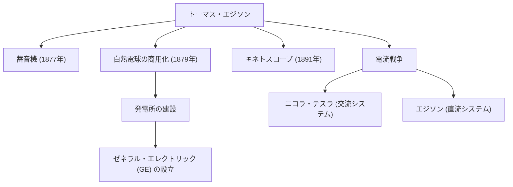

「天才とは、1%のひらめきと99%の努力である」——この言葉を残したトーマス・アルバ・エジソン（1847-1931）は、人類の歴史において最も多作で影響力のある発明家の一人です。生涯に取得した特許数は1,000を超え、「メンロパークの魔術師」と称された彼の功績は、現代社会のテクノロジーの基盤を築きました。本記事では、エジソンの波乱万丈な生涯と、その裏にある確固たる哲学、そして現代に続く影響について深く掘り下げます。

## 好奇心と反逆の幼少期

エジソンは1847年、アメリカのオハイオ州マイランで生まれました。幼い頃から「なぜ？」と問い続ける極めて好奇心旺盛な少年でしたが、当時の画一的な学校教育には馴染めず、わずか数ヶ月で退学させられてしまいます。しかし、元教師であった母ナンシーの献身的な教育のもと、自宅の地下室で科学実験に没頭する日々を送りました。

また、幼少期の病気が原因で彼は深刻な難聴を患います。しかしエジソンはこれを悲観することなく、「雑音が聞こえないため、かえって集中できる」とポジティブに捉えていました。この逆境をバネにする思考こそが、彼を偉大な発明家へと押し上げる原動力となります。

## イノベーションの工場：メンロパーク

若くして電信技師として働き始めたエジソンは、株式相場表示機などの発明で資金を得ると、ニュージャージー州メンロパークに研究所を設立します。これは世界初の「民間の総合研究所」とも言えるものであり、個人の天才性に頼るのではなく、チームで組織的に発明を生み出す現代のR&D（研究開発）の先駆けでした。

### 主な功績とイノベーションの連鎖

以下の図は、エジソンの代表的な発明と、それらがどのように産業や歴史的出来事に結びついていったかを示しています。

## 失敗を恐れない哲学

エジソンの最も特筆すべき点は、その圧倒的な「試行回数」です。白熱電球のフィラメントに適した素材を見つけるため、彼は竹や綿糸など世界中のあらゆる素材を数千回もテストしました（最終的に日本の京都の竹が採用されたことは有名です）。

彼は「失敗」という概念を持っていませんでした。実験がうまくいかなかったとき、彼はこう言ったと伝えられています。「私は失敗したのではない。うまくいかない方法を1万通り発見しただけだ」。この極端なまでの仮説検証サイクルへの執念こそが、彼の実用的なイノベーションを生み出す源泉でした。

## 電流戦争と後世への影響

華々しい成功の裏で、エジソンにも大きな挫折がありました。それがニコラ・テスラやジョージ・ウェスティングハウスとの間で繰り広げられた「電流戦争」です。エジソンは安全性を主張して「直流」システムを推し進めましたが、長距離送電に優れる「交流」システムに最終的に敗北を喫します。

しかし、この敗北が彼の評価を落とすことはありませんでした。彼が創設した企業は統合を経て現在のゼネラル・エレクトリック（GE）となり、世界最大級のコングロマリットへと成長しました。さらに、蓄音機による音楽産業の創出、映画用カメラ（キネトスコープ）による映像産業の幕開けなど、彼の一つの発明が丸ごと一つの巨大産業を誕生させています。

## まとめ

トーマス・エジソンは単なる発明家にとどまらず、発明を「ビジネス」と「社会実装」に結びつけた稀代の起業家でもありました。失敗をデータとして蓄積し、絶え間なく改善を続けるその姿勢は、現代のスタートアップやソフトウェア開発におけるアジャイルな精神そのものです。

私たちが夜、スイッチ一つで部屋を明るくし、スマートフォンで音楽を聴き、映画を楽しむことができるのも、すべては「99%の努力」を惜しまなかったメンロパークの魔術師のおかげなのです。
