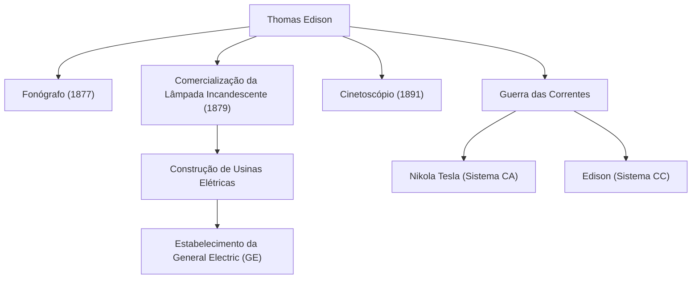

"Genialidade é 1% de inspiração e 99% de transpiração." Thomas Alva Edison (1847-1931), que deixou estas palavras, é um dos inventores mais prolíficos e influentes da história da humanidade. Com mais de 1.000 patentes adquiridas durante sua vida, as realizações do homem conhecido como o "Mago de Menlo Park" lançaram as bases para a tecnologia da sociedade moderna. Neste artigo, mergulhamos profundamente na vida turbulenta de Edison, na filosofia inabalável por trás dela e em seu impacto duradouro nos dias de hoje.

## Uma Infância de Curiosidade e Rebeldia

Edison nasceu em 1847 em Milan, Ohio, EUA. Desde muito jovem, ele era um menino extremamente curioso que constantemente perguntava "Por quê?", mas ele não conseguiu se adaptar à educação escolar padronizada da época e foi expulso após apenas alguns meses. No entanto, sob a educação dedicada de sua mãe Nancy, uma ex-professora, ele passou seus dias imerso em experimentos científicos no porão de sua casa.

Além disso, uma doença na infância fez com que ele sofresse de perda auditiva severa. No entanto, Edison não viu isso de forma pessimista, mas sim positiva, dizendo: "Como não consigo ouvir o barulho, posso me concentrar melhor." Essa mentalidade de transformar a adversidade em um trampolim foi a força motriz que o impulsionou a se tornar um grande inventor.

## A Fábrica de Inovação: Menlo Park

Começando a trabalhar como telegrafista em tenra idade, Edison ganhou fundos por meio de invenções como o teletipo de ações e estabeleceu um laboratório em Menlo Park, Nova Jersey. Este poderia ser chamado de o primeiro "laboratório de pesquisa privado abrangente" do mundo, e foi pioneiro em P&D (pesquisa e desenvolvimento) moderno que produz sistematicamente invenções em equipes em vez de depender da genialidade individual.

### Principais Realizações e a Cadeia de Inovação

O diagrama abaixo mostra as invenções representativas de Edison e como elas estavam ligadas a indústrias e eventos históricos.

## Uma Filosofia sem Medo do Fracasso

O traço mais notável de Edison foi seu esmagador "número de tentativas". Para encontrar um material adequado para o filamento da lâmpada incandescente, ele testou todos os tipos de materiais de todo o mundo milhares de vezes, incluindo bambu e fio de algodão (é famoso que o bambu de Kyoto, no Japão, foi finalmente adotado).

Ele não tinha o conceito de "fracasso". Quando um experimento não ia bem, relata-se que ele disse: "Eu não falhei. Apenas encontrei 10.000 maneiras que não funcionam." Esta obsessão com um ciclo extremo de teste de hipóteses foi a fonte de suas inovações práticas.

## A Guerra das Correntes e o Impacto na Posteridade

Atrás de seu sucesso espetacular, Edison também enfrentou grandes contratempos. Esta foi a "Guerra das Correntes" travada contra [Nikola Tesla](/pt/p/biography-nikola-tesla/) e George Westinghouse. Edison promoveu o sistema de "corrente contínua" (CC), argumentando por sua segurança, mas finalmente sofreu uma derrota para o sistema de "corrente alternada" (CA), que era superior para transmissão de energia a longa distância.

No entanto, esta derrota não diminuiu sua reputação. As empresas que ele fundou se fundiram para se tornar a atual General Electric (GE), crescendo para se tornar um dos maiores conglomerados do mundo. Além disso, uma única invenção sua deu origem a indústrias massivas inteiras, como a criação da indústria da música pelo fonógrafo e o alvorecer da indústria cinematográfica pela câmera de cinema (Cinetoscópio).

## Conclusão

Thomas Edison não foi apenas um inventor, mas também um raro empreendedor que vinculou a invenção a "negócios" e "implementação social". Sua atitude de acumular falhas como dados e fazer melhorias continuamente é a própria essência do espírito ágil nas startups modernas e no desenvolvimento de software.

O fato de podermos apertar um botão para iluminar um cômodo à noite, ouvir música em nossos smartphones e desfrutar de filmes é tudo graças ao Mago de Menlo Park, que não poupou esforços em seus "99% de transpiração".
