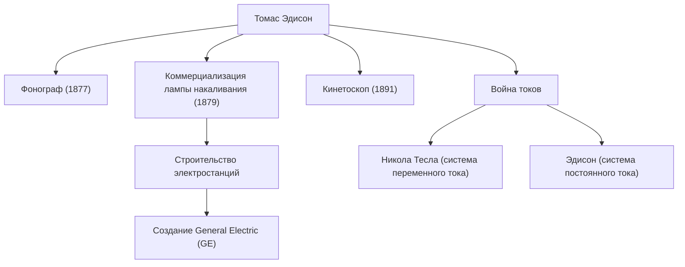

«Гений — это 1 процент вдохновения и 99 процентов пота». Томас Алва Эдисон (1847-1931), оставивший эти слова, является одним из самых плодовитых и влиятельных изобретателей в истории человечества. Приобретя за свою жизнь более 1000 патентов, достижения человека, известного как «Волшебник из Менло-Парка», заложили фундамент технологий современного общества. В этой статье мы глубоко погружаемся в бурную жизнь Эдисона, твердую философию, стоящую за ней, и его неизгладимое влияние на сегодняшний день.

## Детство любознательности и бунтарства

Эдисон родился в 1847 году в Милане, штат Огайо, США. С юных лет он был чрезвычайно любопытным мальчиком, который постоянно спрашивал «Почему?», но он не смог адаптироваться к стандартизированному школьному образованию того времени и был исключен всего через несколько месяцев. Однако под преданным обучением своей матери Нэнси, бывшей учительницы, он проводил свои дни, погруженный в научные эксперименты в подвале своего дома.

Кроме того, детская болезнь привела к тяжелой потере слуха. Однако Эдисон смотрел на это не пессимистично, а скорее позитивно, говоря: «Поскольку я не слышу шума, я могу лучше сосредоточиться». Это мышление, превращающее невзгоды в трамплин, стало той движущей силой, которая подтолкнула его стать великим изобретателем.

## Фабрика инноваций: Менло-Парк

Начав работать телеграфистом в юном возрасте, Эдисон заработал средства благодаря таким изобретениям, как биржевой тикер, и основал лабораторию в Менло-Парке, штат Нью-Джерси. Это можно назвать первой в мире «комплексной частной исследовательской лабораторией», и это было пионером современных НИОКР (исследований и разработок), которые систематически производят изобретения в командах, а не полагаются на индивидуальную гениальность.

### Основные достижения и цепь инноваций

На диаграмме ниже показаны репрезентативные изобретения Эдисона и то, как они были связаны с отраслями и историческими событиями.

## Философия без страха перед неудачами

Самой примечательной чертой Эдисона было его ошеломляющее «количество попыток». Чтобы найти подходящий материал для нити накаливания лампочки, он тысячи раз тестировал все виды материалов со всего мира, включая бамбук и хлопчатобумажную нить (известно, что в конечном итоге был принят бамбук из Киото, Япония).

У него не было понятия «неудача». Сообщается, что когда эксперимент шел не очень хорошо, он говорил: «Я не терпел неудач. Я просто нашел 10 000 способов, которые не работают». Эта одержимость экстремальным циклом проверки гипотез была источником его практических инноваций.

## Война токов и влияние на потомков

За его впечатляющим успехом стояли и крупные неудачи. Это была «Война токов», которая велась против Николы Теслы и Джорджа Вестингауза. Эдисон продвигал систему «постоянного тока» (DC), аргументируя это ее безопасностью, но в конечном итоге потерпел поражение от системы «переменного тока» (AC), которая превосходила ее по передаче энергии на большие расстояния.

Однако это поражение не умалило его репутации. Компании, которые он основал, объединились в сегодняшнюю General Electric (GE), превратившись в один из крупнейших конгломератов в мире. Кроме того, одно-единственное его изобретение породило целые огромные отрасли, такие как создание музыкальной индустрии с помощью фонографа и зарождение киноиндустрии с помощью кинокамеры (кинетоскопа).

## Заключение

Томас Эдисон был не просто изобретателем, но и редким предпринимателем, который связал изобретение с «бизнесом» и «социальным внедрением». Его отношение к накоплению неудач в виде данных и постоянному внесению улучшений является самой сутью гибкой методологии (agile) в современных стартапах и разработке программного обеспечения.

Тот факт, что мы можем щелкнуть выключателем, чтобы осветить комнату ночью, слушать музыку на наших смартфонах и наслаждаться фильмами — все это благодаря Волшебнику из Менло-Парка, который не жалел сил в своих «99 процентах пота».
