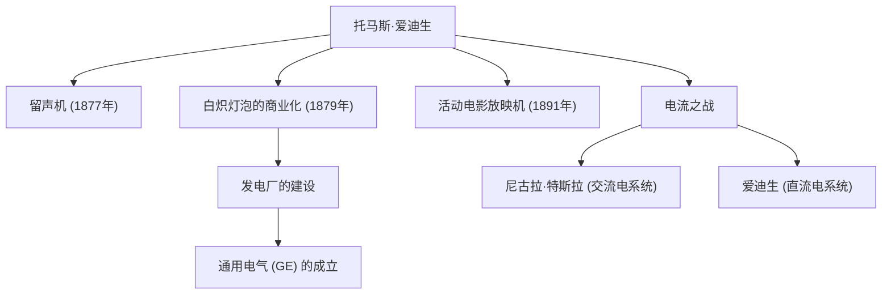

“天才是1%的灵感加上99%的汗水”——留下这句名言的托马斯·阿尔瓦·爱迪生（1847-1931）是人类历史上最多产、最具影响力的发明家之一。他一生获得了超过1000项专利，被誉为“门洛帕克的魔术师”，他的成就奠定了现代社会技术的基础。在本文中，我们将深入探讨爱迪生波澜壮阔的一生、其背后的坚定哲学，以及对现代产生的深远影响。

## 好奇与反叛的童年

爱迪生1847年出生于美国俄亥俄州米兰。从小他就是一个极具好奇心、不断问“为什么”的男孩，但他无法适应当时千篇一律的学校教育，仅仅几个月后就被勒令退学。然而，在曾是教师的母亲南希的悉心教导下，他每天都在家里的地下室里沉浸于科学实验。

此外，由于童年时期的疾病，他患上了严重的听力障碍。但爱迪生并未因此悲观，反而积极地认为：“听不到杂音，反而能让我更集中注意力。”这种将逆境化为动力的思维方式，正是推动他成为伟大发明家的原动力。

## 创新工厂：门洛帕克

爱迪生年轻时开始担任电报员，通过发明股票行情自动收报机等获得了资金，随后在新泽西州门洛帕克建立了一个实验室。这可以说是世界上第一个“综合性私人研究实验室”，它开创了现代研发（R&D）的先河，即依靠团队有组织地产生发明，而不是依赖个人的天才。

### 主要成就与创新的连锁反应

下图展示了爱迪生的代表性发明，以及它们如何与产业和历史事件联系在一起。

## 无惧失败的哲学

爱迪生最引人注目的特点是他惊人的“尝试次数”。为了找到适合白炽灯泡灯丝的材料，他对包括竹子和棉线在内的世界各地数以千计的材料进行了测试（最终采用了日本京都的竹子，这已成为著名的故事）。

他的字典里没有“失败”这个概念。当实验不顺利时，据说他曾这样说：“我没有失败。我只是找到了一万种行不通的方法。”这种对假设检验循环的极端执着，正是他产生实用创新的源泉。

## 电流之战与对后世的影响

在辉煌成功的背后，爱迪生也遭遇过重大挫折。那就是他与尼古拉·特斯拉及乔治·威斯汀豪斯之间展开的“电流之战”。爱迪生主张安全性，大力推行“直流电”系统，但最终败给了在长距离输电方面更具优势的“交流电”系统。

然而，这次失败并没有降低他的声誉。他创立的公司经过合并，成为了今天的通用电气（GE），发展成为全球最大的企业集团之一。此外，他的单项发明孕育了整个庞大的产业，例如留声机开创了音乐产业，电影摄影机（活动电影放映机）拉开了电影产业的序幕。

## 总结

托马斯·爱迪生不仅是一位发明家，也是一位将发明与“商业”和“社会应用”结合起来的罕见企业家。他将失败作为数据积累并不断改进的态度，正是现代初创企业和软件开发中敏捷精神的体现。

我们在夜晚只需按下一个开关就能让房间亮起，在智能手机上听音乐、看电影，这一切都归功于那位毫不吝惜“99%汗水”的门洛帕克魔术师。
