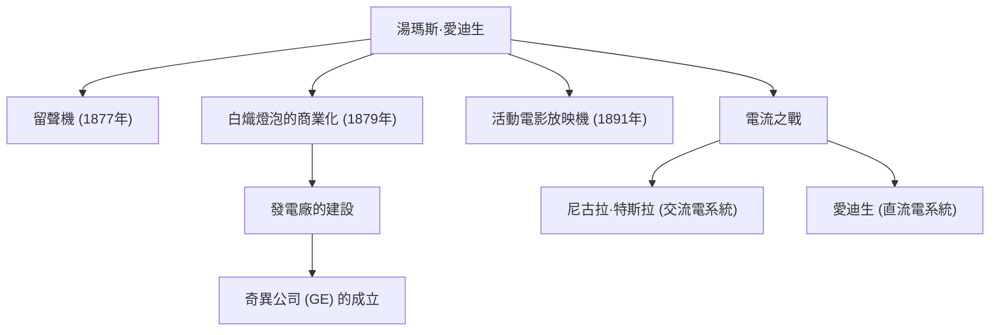

「天才是1%的靈感加上99%的汗水」——留下這句名言的湯瑪斯·阿爾瓦·愛迪生（1847-1931）是人類歷史上最多產、最具影響力的發明家之一。他一生獲得了超過1000項專利，被譽為「門洛帕克的魔術師」，他的成就奠定了現代社會技術的基礎。在本文中，我們將深入探討愛迪生波瀾壯闊的一生、其背後的堅定哲學，以及對現代產生的深遠影響。

## 好奇與反叛的童年

愛迪生1847年出生於美國俄亥俄州米蘭。從小他就是一個極具好奇心、不斷問「為什麼」的男孩，但他無法適應當時千篇一律的學校教育，僅僅幾個月後就被勒令退學。然而，在曾是教師的母親南希的悉心教導下，他每天都在家裡的地下室裡沉浸於科學實驗。

此外，由於童年時期的疾病，他患上了嚴重的聽力障礙。但愛迪生並未因此悲觀，反而積極地認為：「聽不到雜音，反而能讓我更集中注意力。」這種將逆境化為動力的思維方式，正是推動他成為偉大發明家的原動力。

## 創新工廠：門洛帕克

愛迪生年輕時開始擔任電報員，透過發明股票行情自動收報機等獲得了資金，隨後在新澤西州門洛帕克建立了一個實驗室。這可以說是世界上第一個「綜合性私人研究實驗室」，它開創了現代研發（R&D）的先河，即依靠團隊有組織地產生發明，而不是依賴個人的天才。

### 主要成就與創新的連鎖反應

下圖展示了愛迪生的代表性發明，以及它們如何與產業和歷史事件聯繫在一起。

## 無懼失敗的哲學

愛迪生最引人注目的特點是他驚人的「嘗試次數」。為了找到適合白熾燈泡燈絲的材料，他對包括竹子和棉線在內的世界各地數以千計的材料進行了測試（最終採用了日本京都的竹子，這已成為著名的故事）。

他的字典裡沒有「失敗」這個概念。當實驗不順利時，據說他曾這樣說：「我沒有失敗。我只是找到了一萬種行不通的方法。」這種對假設檢驗循環的極端執著，正是他產生實用創新的泉源。

## 電流之戰與對後世的影響

在輝煌成功的背後，愛迪生也遭遇過重大挫折。那就是他與尼古拉·特斯拉及喬治·威斯汀豪斯之間展開的「電流之戰」。愛迪生主張安全性，大力推行「直流電」系統，但最終敗給了在長距離輸電方面更具優勢的「交流電」系統。

然而，這次失敗並沒有降低他的聲譽。他創立的公司經過合併，成為了今天的奇異公司（GE），發展成為全球最大的企業集團之一。此外，他的單項發明孕育了整個龐大的產業，例如留聲機開創了音樂產業，電影攝影機（活動電影放映機）拉開了電影產業的序幕。

## 總結

湯瑪斯·愛迪生不僅是一位發明家，也是一位將發明與「商業」和「社會應用」結合起來的罕見企業家。他將失敗作為數據積累並不斷改進的態度，正是現代新創企業和軟體開發中敏捷精神的體現。

我們在夜晚只需按下一個開關就能讓房間亮起，在智慧型手機上聽音樂、看電影，這一切都歸功於那位毫不吝惜「99%汗水」的門洛帕克魔術師。
