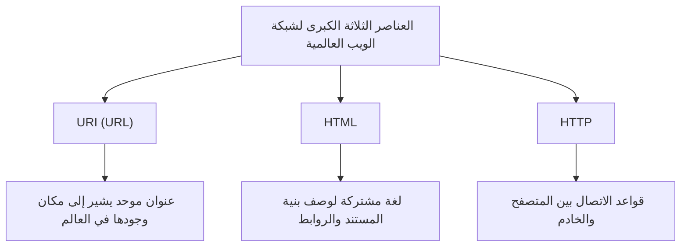

## مقدمة: الحلم بعالم متصل بالكامل

في المجتمع الحديث، نستخدم "الويب" كأمر مسلم به. نفتح هواتفنا الذكية، نقرأ الأخبار، نشاهد مقاطع الفيديو، ونتبادل الرسائل فوراً مع أصدقاء بعيدين. شبكة سحرية تربط جميع المعارف والمعلومات على هذا الكوكب بسلاسة، ويمكن لأي شخص الوصول إليها بحرية. هذه هي "شبكة الويب العالمية" (World Wide Web).

لكن كم شخصاً يدرك بعمق حقيقة أن هذا الاختراع الهائل الذي غيّر العالم، وُلد من عقل مبرمج عبقري واحد، وأنه علاوة على ذلك **"تم إتاحته للعالم بالكامل مجاناً دون الحصول على أي براءات اختراع"**؟

اسم هذا الرجل هو تيم بيرنرز لي (Tim Berners-Lee).

لم يقتصر الأمر على اختراعه لتقنية فقط. ما اخترعه حقاً هو **فكرة الويب المفتوح** ذاتها، والتي تنص على أن "المعلومات لا ينبغي أن تحتكرها شركات أو دول معينة، بل يجب أن تكون مفتوحة لجميع البشر". لو كان قد حصل على براءة اختراع للويب وطالب برسوم ترخيص، لكان شكل الإنترنت اليوم مختلفاً تماماً. ربما كانت ستصبح مساحة شبكية مغلقة وخانقة، حيث تحتكر الشركات الكبرى فقط المعلومات، ونضطر للدفع في كل مرة نحصل فيها على معلومة.

في هذا المقال، سنتعمق في كيفية اختراع تيم بيرنرز لي للويب. سنناقش التحديات القاسية في المنظمة الأوروبية للأبحاث النووية (CERN)، ومفهومه الأولي في مشروع "Enquire"، والابتكارات التقنية الثلاثة (HTTP، HTML، URI) التي قلبت العالم رأساً على عقب. وعلاوة على ذلك، سنتتبع بالتفصيل خطواته العظيمة والفريدة، ولماذا تخلى عن براءات الاختراع وأسس رابطة الشبكة العالمية (W3C) من أجل حماية مثالية الويب المفتوح.

---

## الفصل الأول: بحر المعلومات الفوضوي وتحديات CERN

تبدأ القصة في عام 1980 في ضواحي جنيف، سويسرا. نعود إلى المنظمة الأوروبية للأبحاث النووية، المعروفة باسم **CERN**، والتي تمتلك منشأة أبحاث ضخمة تحت الأرض تمتد عبر الحدود مع فرنسا.

CERN هي قلعة للمعرفة، يتجمع فيها آلاف من كبار الفيزيائيين والمهندسين من جميع أنحاء العالم، ليعملوا ليلاً ونهاراً على مشاريع ضخمة لكشف أصول الكون وألغاز الجسيمات الأولية. ومع ذلك، في ذلك الوقت، كانت CERN تواجه "أزمة إدارة معلومات" خطيرة وقاتلة.

### مختبر تحول إلى برج بابل

استخدم الباحثون الذين تجمعوا من جميع أنحاء العالم أجهزة كمبيوتر من جهات تصنيع مختلفة جلبوها من بلدانهم، وأنظمة تشغيل (OS) مختلفة، ومعايير شبكات مختلفة، وحتى تنسيقات بيانات مختلفة.
في أحد المختبرات كان يعمل جهاز IBM، وفي غرفة أخرى يعمل نظام DEC VAX، وفي مكان آخر يعمل نظام مستقل. إذا سجل فريق ما بيانات تجريبية رائعة، ولكي يتمكن فريق آخر من قراءة تلك البيانات، كان عليهم نسخها فعلياً على شريط مغناطيسي، وتحويل التنسيق، وجعل الأنظمة غير المتوافقة تقرأها بطريقة أو بأخرى.

كانت CERN في ذلك الوقت مثل "برج بابل" الذي توقف بناؤه بسبب عدم القدرة على التواصل اللغوي.

"من يشارك في أي مشروع؟" "أين يتم حفظ تلك البيانات التجريبية وعلى أي كمبيوتر؟" "من لديه أحدث إصدار من البرنامج؟"

لمجرد البحث عن هذه المعلومات الأساسية، أهدر الباحثون الكثير من الوقت. يجرون المكالمات الهاتفية، يتجولون في الممرات، ويبحثون عن الملاحظات على السبورات البيضاء. على الرغم من كونها منشأة لأبحاث الفيزياء المتطورة، إلا أن وسيلة تبادل المعلومات كانت قديمة الطراز وغير فعالة للغاية.

### ولادة "Enquire": محاكاة شبكة الدماغ

في عام 1980، عندما جاء الشاب تيم بيرنرز لي إلى CERN كمهندس برمجيات، واجه هذا الانقسام اليائس في المعلومات وشعر باستياء شديد. لقد كان بطبيعته مهتماً جداً بالروابط والعلاقات بين الأشياء.

"العقل البشري لا يتذكر الأشياء في بنية مجلدات هرمية. فهو يتذكر ويسترجع المعلومات من خلال 'روابط' عشوائية وشبيهة بالشبكة، من مفهوم إلى آخر. ألا يمكن ربط المعلومات الموجودة على الكمبيوتر بمرونة بنفس الطريقة؟"

انطلاقاً من هذه الفكرة، طور كبرنامج شخصي برنامجاً يسمى **"Enquire"**. يشتق الاسم من موسوعة منزلية من العصر الفيكتوري كان مألوفاً لديه في طفولته، تسمى "Enquire Within Upon Everything" (استفسر عن كل شيء في الداخل).

كان Enquire يشبه نظام Wiki الحالي. كان نظاماً ثورياً يسمح بربط أي كلمة أو مفهوم داخل النظام بمستند آخر، مما يتيح حفظ صلات المعلومات على شكل شبكة. ومع ذلك، كان Enquire في ذلك الوقت مقتصراً على نظام واحد فقط، ولم يكن قادراً على ربط أجهزة الكمبيوتر المختلفة في جميع أنحاء CERN. مع انتهاء فترة عمل تيم، نُسي هذا البرنامج تدريجياً.

ومع ذلك، كان هذا الـ "Enquire" يحمل في طياته الحمض النووي المهم الذي أصبح فيما بعد أساساً لشبكة الويب العالمية.

---

## الفصل الثاني: السحر الثلاثي الذي يربط العالم — HTTP، HTML، URI

في عام 1984، عاد تيم إلى CERN مرة أخرى. كان الوضع أسوأ من ذي قبل، ومع انتشار الإنترنت، بدأت شبكة CERN في الاتصال بالعالم، لكن أنظمة المعلومات ظلت مشتتة كما كانت.

في مارس 1989، قدم وثيقة تخطيط تاريخية تقترح حلاً جذرياً لإدارة المعلومات إلى رئيسه مايك سيندال. كان عنوانها **"Information Management: A Proposal" (إدارة المعلومات: مقترح)**.

على هذا المقترح، كتب رئيسه سيندال في الهامش:
**"Vague but exciting..." (غامض ولكنه مثير للغاية...)**

كان هذا التعليق القصير نقطة تحول في التاريخ. على الرغم من عدم تخصيص ميزانية كمشروع واضح على الفور، سُمح لتيم باستخدام وقت فراغه لبناء هذا النظام. حصل على "NeXTcube" من شركة NeXT بقيادة ستيف جوبز، والتي كانت أحدث محطة عمل في ذلك الوقت، وانغمس في التطوير.

كان التحدي الأكبر الذي واجهه تيم هو إنشاء "نظام عالمي يمكن من خلاله الوصول إلى المعلومات بطريقة متسقة من أي كمبيوتر، وأي نظام تشغيل، وأي شبكة في العالم". لتحقيق ذلك، لم يقم بإنشاء برنامج واحد، بل صمم "ثلاث قواعد عالمية (بروتوكولات ومعايير)" لتبادل المعلومات. هذا هو الاختراع العظيم الذي يشكل أساس الويب حتى يومنا هذا.

### 1. URI (Uniform Resource Identifier)
كان الابتكار الأول هو توحيد "عناوين" المعلومات. في أي كمبيوتر في العالم، وفي أي دليل، وأي ملف هو. اصطلاح التسمية العالمي لتحديد هذا بشكل فريد هو URI (المعروف عمومًا الآن باسم URL).
من خلال اختراع هذه السلسلة التي تبدأ بـ "`http://...`"، أصبح من الممكن إعطاء "عنوان فريد من نوعه" لكل معلومة في العالم.

### 2. HTML (HyperText Markup Language)
والثاني هو HTML، وهي لغة لوصف بنية المستندات وتضمين الروابط لمستندات أخرى.
قام تيم بتبسيط لغة الترميز الحالية (SGML) بشكل كبير بحيث يمكن لعلماء الفيزياء في CERN إنشاء المستندات بسهولة. يكمن أعظم اختراع في HTML في أنه سمح بإنشاء "ارتباطات تشعبية" إلى المستندات الموجودة على أي خادم في العالم باستخدام الوسم `<a href="...">`. هذا الرابط بالذات هو الذي طور الويب من مجرد مجموعة من المستندات إلى شبكة معلومات متسعة بلا حدود (Web).

### 3. HTTP (Hypertext Transfer Protocol)
والثالث هو قواعد تبادل المعلومات، HTTP.
في ذلك الوقت، كانت بروتوكولات مثل FTP (بروتوكول نقل الملفات) موجودة بالفعل، لكنها كانت معقدة وتستغرق وقتًا طويلاً. كان بروتوكول HTTP الذي صممه تيم بروتوكولًا بسيطًا للغاية وعديم الحالة (لا يحفظ الحالة) يتمثل في "الطلب (أعطني المعلومات)" و"الاستجابة (تفضل)". بفضل هذه البساطة، كان العبء على الخادم قليلًا، مما أتاح تصفحًا مريحًا ينتقل من رابط إلى رابط في لمح البصر.

في أواخر عام 1990، أكمل تيم أول خادم ويب في العالم (info.cern.ch) وأول متصفح ويب في العالم "WorldWideWeb" (أعيد تسميته لاحقاً إلى Nexus).
لأول مرة في تاريخ البشرية، تم ربط المعلومات بسلاسة عبر الروابط التشعبية متجاوزة الحدود وأنواع أجهزة الكمبيوتر.

---

## الفصل الثالث: القرار الأعظم — فلسفة "عدم امتلاك براءات اختراع"

مع اكتمال التقنيات الأساسية للويب وانتشار استخدامها داخل CERN وبعض المؤسسات الأكاديمية، أصبحت فائدتها الهائلة واضحة. بدأ تيم يتلقى سيلاً من الاستفسارات من جميع أنحاء العالم تفيد بأنهم "يريدون استخدام هذا النظام".

هنا، يتخذ تيم بيرنرز لي **القرار الأعظم في التاريخ** والذي حدد مسار العالم لاحقاً.

لو كان قد حصل في تلك المرحلة على براءات اختراع لتقنيات HTML و HTTP و URI، وأنشأ نموذج عمل لجمع رسوم الترخيص من الشركات المستخدمة، لكان بالتأكيد أصبح أغنى ملياردير في العالم. في صناعة تكنولوجيا المعلومات في ذلك الوقت، كانت تسجيل براءات اختراع البرمجيات واحتكارها استراتيجية عمل طبيعية. كانت الشركات العملاقة مثل Microsoft و IBM و Apple تدفع جميعها نحو معايير شبكاتها الخاصة وتحاول حصر المستخدمين في أنظمتها البيئية.

ومع ذلك، كان تيم مختلفاً. أقنع رؤساءه وإدارة CERN، وفي **30 أبريل 1993، أصدرت CERN إعلاناً تاريخياً ينص على أن "تكنولوجيا شبكة الويب العالمية ستوضع في الملكية العامة (Public Domain)، ويمكن لأي شخص استخدامها بحرية دون رسوم براءات اختراع".**

لماذا تخلى عن براءات الاختراع؟
وراء ذلك كان يكمن إيمان تيم الراسخ و "فلسفة الويب المفتوح".

1. **الشرط الأساسي للانتشار العالمي**
   رأى تيم أنه "إذا كان هناك أدنى قيد من حيث رسوم الاستخدام أو التراخيص على الويب، فلن تتمكن الشركات الصغيرة والمتوسطة والأفراد في جميع أنحاء العالم، وشعوب البلدان النامية من استخدامه، وسوف تنقسم الشبكة". كان يعتقد أن القيمة الحقيقية للويب تكمن في "قدرة الجميع على المشاركة"، ولتحقيق ذلك، يجب أن يكون مجانياً ومفتوحاً بالكامل.

2. **رفض المركزية**
   امتلاك براءة اختراع يعني منح شخص ما سلطة السماح أو عدم السماح بالاستخدام (التحكم). أراد تيم للويب أن يكون "نظاماً لامركزياً" حيث يمكن لأي شخص إعداد خادم بحرية ونشر المعلومات، وليس نظاماً مركزياً يمكن لحكومة أو شركة معينة التحكم فيه.

بفضل هذا القرار، حقق الويب نمواً هائلاً. مع عدم وجود مخاوف بشأن براءات الاختراع، تنافس المبرمجون في جميع أنحاء العالم لتطوير المتصفحات (مثل Mosaic و Netscape) وبرامج الخوادم (مثل Apache)، وأطلقت الشركات مواقع الويب واحداً تلو الآخر. لو تمسك تيم ببراءات الاختراع، لكان الويب قد دُفن كواحد من العشرات من "خدمات الشبكة الخاصة بالشركات"، ولما جاء مجتمع الإنترنت العالمي الحالي.

---

## الفصل الرابع: إنشاء W3C ومعركة حماية مستقبل الويب

عندما أصبح الويب طفرة عالمية، ظهرت أزمة جديدة. اندلعت حرب المتصفحات بين شركات مثل Netscape و Microsoft (Internet Explorer)، وبدأوا في إضافة "علامات HTML بملحقات خاصة" لا يمكن عرضها إلا على متصفحاتهم الخاصة تباعاً.
إذا استمر هذا الوضع، سينقسم الويب مرة أخرى مثل "برج بابل"، وسينتشر وضع يقول "لا يمكن عرض هذه الصفحة إلا على متصفح معين" (في الواقع، كادت الأمور أن تصل إلى هذا الحد في أواخر التسعينيات).

لمنع انقسام الويب، انتقل تيم بيرنرز لي في عام 1994 إلى معهد ماساتشوستس للتكنولوجيا (MIT) وأسس **رابطة الشبكة العالمية (W3C)**.

W3C هو اتحاد دولي غير ربحي يضع المعايير التقنية للويب. بصفته مديراً لـ W3C، عمل تيم كحَكَم في النزاعات الشرسة بين الشركات، ودافع بشدة عن مبدأ أن "معايير الويب يجب ألا تفضل شركة معينة، بل يجب أن تكون مفتوحة وخالية من حقوق الملكية".
لولا جهود W3C، لربما كنا اليوم مجبرين على استخدام إنترنت منقسم وكابوسي، حيث لا يمكن عرض مواقع Microsoft من أجهزة Apple، ولا يمكن الوصول إلى Amazon من متصفح Google.

### الشغف المستمر بالويب المفتوح

اليوم، يدق تيم بيرنرز لي ناقوس الخطر بشدة بشأن الجوانب السلبية للويب الحالي، مثل احتكار البيانات من قبل شركات تكنولوجيا المعلومات العملاقة، وانتهاك الخصوصية، وانتشار الأخبار المزيفة.
يؤكد أن "الويب كان يهدف في الأصل إلى تمكين الناس، وليس للشركات لاستغلال بيانات المستخدمين"، ويواصل النضال من أجل تحسين الويب، مثل العمل حالياً على تطوير "Solid"، وهي منصة لامركزية تسمح للمستخدمين بالتحكم في بياناتهم الخاصة.

---

## الخاتمة: العصا التي استلمناها

قصة تيم بيرنرز لي ليست مجرد تاريخ لاختراع تقني. إنها قصة عن مثال نبيل وجميل مفاده أن "البنية التحتية لمشاركة المعرفة البشرية وربط الناس يجب ألا تحتكرها الأرباح أو السلطة".

حقيقة أننا نكتب روابط URL كل يوم بشكل غير رسمي، وننقر على الروابط، وننشر المعلومات بحرية، ترجع إلى أنه في أوائل التسعينيات في CERN، اتخذ رجل واحد قراراً لا يصدق ونكراناً للذات بـ "عدم امتلاك براءات اختراع".

نحن نقف الآن على ساحة اللعب الضخمة التي فتحها لنا مجاناً. لكي لا نحبس هذه الملكية المشتركة للبشرية المسماة "الويب المفتوح" داخل جدران ضخمة لقلة (الحدائق المسورة)، بل لربطها بمستقبل أكثر حرية وثراءً. ربما تكون هذه هي المهمة الملقاة على عاتقنا جميعاً نحن الذين استلمنا العصا من تيم بيرنرز لي.
