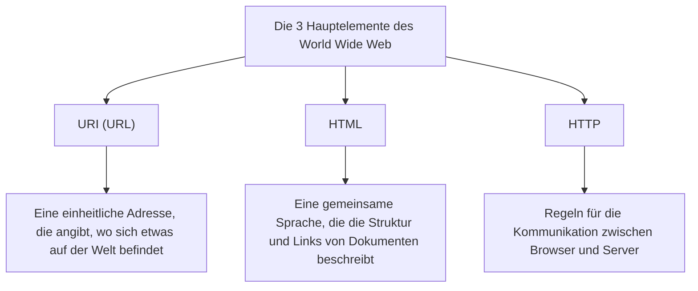

## Prolog: Der Traum von einer Welt, in der alles miteinander verbunden ist

In der modernen Gesellschaft nutzen wir das "Web" als wäre es selbstverständlich. Wir öffnen unsere Smartphones, lesen Nachrichten, schauen Videos und tauschen sofort Nachrichten mit weit entfernten Freunden aus. Es ist ein magisches Netzwerk, in dem das gesamte Wissen und alle Informationen dieses Planeten nahtlos miteinander verbunden sind und auf das jeder frei zugreifen kann. Das ist das "World Wide Web".

Aber wie viele Menschen verstehen wirklich die Tatsache, dass diese riesige Erfindung, die die Welt verändert hat, dem Verstand eines einzigen brillanten Programmierers entsprang und **"ohne ein einziges Patent zu erwerben, der Welt völlig kostenlos zur Verfügung gestellt wurde"**?

Der Name dieses Mannes ist Tim Berners-Lee.

Er hat nicht nur eine Technologie erfunden. Was er wirklich erfand, war die **Philosophie des offenen Webs** – die Idee, dass Informationen nicht von bestimmten Unternehmen oder Regierungen monopolisiert, sondern für die gesamte Menschheit offen sein sollten. Wenn er ein Patent auf das Web angemeldet und Lizenzgebühren verlangt hätte, sähe das heutige Internet völlig anders aus. Es wäre vielleicht ein geschlossener, restriktiver Netzwerkraum geworden, in dem nur Großunternehmen Informationen monopolisieren und wir jedes Mal bezahlen müssten, wenn wir Informationen abrufen.

In diesem Artikel werden wir tief in die Frage eintauchen, wie Tim Berners-Lee das Web erfand. Wir beleuchten die gewaltigen Herausforderungen an der Europäischen Organisation für Kernforschung (CERN), das frühe Konzeptprojekt "Enquire" und die drei technologischen Innovationen (HTTP, HTML, URI), die die Welt von Grund auf veränderten. Darüber hinaus werden wir seine bemerkenswerten und großartigen Fußstapfen im Detail nachverfolgen und ergründen, warum er auf Patente verzichtete und sogar das W3C (World Wide Web Consortium) gründete, um das Ideal des offenen Webs zu verteidigen.

---

## Kapitel 1: Das chaotische Meer an Informationen und die Herausforderungen am CERN

Die Geschichte beginnt im Jahr 1980 in einem Vorort von Genf in der Schweiz. Sie führt uns zurück zur Europäischen Organisation für Kernforschung, bekannt als **CERN**, einer riesigen unterirdischen Forschungseinrichtung an der Grenze zu Frankreich.

Das CERN ist eine Festung des Wissens, in der Tausende von Spitzenphysikern und Ingenieuren aus der ganzen Welt zusammenkommen, um Tag und Nacht an gewaltigen Projekten zu arbeiten, die den Ursprung des Universums und die Geheimnisse der Elementarteilchen entschlüsseln sollen. Das damalige CERN stand jedoch vor einer ernsthaften und fatalen "Informationsmanagement-Krise".

### Ein Forschungsinstitut, das zum Turm zu Babel wurde

Forscher aus der ganzen Welt nutzten Computer verschiedener Hersteller, unterschiedliche Betriebssysteme (OS), unterschiedliche Netzwerkstandards und sogar unterschiedliche Datenformate, die sie jeweils aus ihren Heimatländern mitgebracht hatten.
In einem Labor lief eine IBM-Maschine, in einem anderen Raum eine DEC VAX, und an einem wieder anderen Ort ein proprietäres System. Wenn ein Team großartige experimentelle Daten aufzeichnete, musste ein anderes Team, um diese Daten lesen zu können, sie physisch auf Magnetband kopieren, das Format konvertieren und irgendwie einen Weg finden, sie auf inkompatiblen Systemen einzulesen.

Das CERN glich damals dem "Turm zu Babel", dessen Bau scheiterte, weil die Menschen sich nicht mehr verständigen konnten.

"Wer ist an welchem Projekt beteiligt?" "Auf welchem Computer und wo sind diese Experimentaldaten gespeichert?" "Wer hat die neueste Version der Software?"

Die Forscher verschwendeten enorm viel Zeit, nur um diese grundlegenden Informationen zu finden. Sie telefonierten, liefen durch die Flure und suchten nach Notizen auf Whiteboards. Obwohl es sich um eine Einrichtung handelte, die Spitzenforschung in der Physik betrieb, waren die Methoden des Informationsaustauschs viel zu veraltet und ineffizient.

### Die Geburt von "Enquire": Nachahmung des Netzwerks des Gehirns

Als der junge Tim Berners-Lee 1980 als Software-Ingenieur ans CERN kam, war er mit dieser aussichtslosen Fragmentierung von Informationen konfrontiert und äußerst frustriert. Er hatte von Natur aus ein starkes Interesse an den Verbindungen und Beziehungen zwischen den Dingen.

"Das menschliche Gehirn merkt sich Dinge nicht in einer hierarchischen Ordnerstruktur. Es speichert Informationen ab und ruft sie ab, indem es von einem Konzept zum anderen durch zufällige, netzartige 'Verbindungen (Links)' springt. Könnten Informationen auf Computern nicht genauso flexibel miteinander verlinkt werden?"

Aus dieser Idee heraus entwickelte er als persönliches Projekt ein Programm namens **"Enquire"**. Der Name stammte von einem viktorianischen Haushaltslexikon, das er in seiner Kindheit gerne gelesen hatte: *Enquire Within Upon Everything* (Untersuche alles im Inneren).

Enquire war so etwas wie ein heutiges Wiki-System. Es war ein bahnbrechendes System, das es ermöglichte, jedes Wort oder Konzept innerhalb des Systems mit einem anderen Dokument zu verknüpfen und die Beziehungen zwischen Informationen netzwerkartig zu speichern. Das damalige Enquire war jedoch streng auf ein einziges System beschränkt und konnte keine unterschiedlichen Computer im gesamten CERN miteinander verbinden. Mit dem Ende von Tims Amtszeit geriet dieses Programm allmählich in Vergessenheit.

Aber genau dieses "Enquire" enthielt die entscheidende DNA, die die Grundlage für das spätere World Wide Web bilden sollte.

---

## Kapitel 2: Drei Magien, die die Welt verbinden——HTTP, HTML, URI

1984 kehrte Tim ans CERN zurück. Die Situation hatte sich weiter verschlechtert. Mit der Verbreitung des Internets begann sich das CERN-Netzwerk mit dem Rest der Welt zu verbinden, aber die Informationssysteme blieben weiterhin fragmentiert.

Im März 1989 legte er seinem Vorgesetzten Mike Sendall einen historischen Vorschlag vor, der eine radikale Lösung für das Informationsmanagement bot. Der Titel lautete **"Information Management: A Proposal" (Informationsmanagement: Ein Vorschlag)**.

Sein Vorgesetzter Sendall notierte am Rand dieses Vorschlags:
**"Vague but exciting..." (Vage, aber aufregend...)**

Dieser kurze Kommentar wurde zu einem Wendepunkt in der Geschichte. Zwar wurde nicht sofort ein Budget für ein formelles Projekt bereitgestellt, aber Tim durfte seine Freizeit nutzen, um dieses System aufzubauen. Er besorgte sich einen "NeXTcube" von NeXT (einem von Steve Jobs geführten Unternehmen), die damals fortschrittlichste Workstation, und vertiefte sich in die Entwicklung.

Die größte Herausforderung, vor der Tim stand, war die Schaffung eines "universellen Systems, mit dem von jedem Computer, jedem Betriebssystem und jedem Netzwerk der Welt auf konsistente Weise auf Informationen zugegriffen werden konnte". Um dies zu erreichen, entwickelte er keine einzelne Software, sondern entwarf "drei universelle Regeln (Protokolle und Standards)" für den Informationsaustausch. Das ist die große Erfindung, die bis heute das Fundament des Webs bildet.

### 1. URI (Uniform Resource Identifier)
Die erste Innovation war die Vereinheitlichung der "Adressen" von Informationen. Welcher Computer auf der Welt, in welchem Verzeichnis, welche Datei. Die universelle Namenskonvention zur eindeutigen Identifizierung ist die URI (heute allgemein als URL bezeichnet).
Mit der Erfindung dieser Zeichenfolge, die mit "`http://...`" beginnt, wurde es möglich, allen Informationen auf der Welt eine "einzigartige Adresse" zu geben.

### 2. HTML (HyperText Markup Language)
Das zweite ist HTML, eine Sprache zur Beschreibung der Struktur von Dokumenten und zum Einbetten von Links zu anderen Dokumenten.
Tim hat eine bestehende Auszeichnungssprache (SGML) drastisch vereinfacht, damit Physiker am CERN ganz leicht Dokumente erstellen konnten. Die größte Erfindung von HTML liegt darin, dass es das Tag `<a href="...">` ermöglichte, "Hyperlinks" zu Dokumenten auf jedem beliebigen Server der Welt zu setzen. Genau dieser Link hat das Web von einer bloßen Ansammlung von Dokumenten zu einem unendlich wachsenden Informationsnetz (Web) weiterentwickelt.

### 3. HTTP (Hypertext Transfer Protocol)
Das dritte ist HTTP, die Regel für den Informationsaustausch.
Zu dieser Zeit gab es bereits Protokolle wie FTP (File Transfer Protocol), aber diese waren kompliziert und zeitaufwändig. Das von Tim entworfene HTTP war ein extrem einfaches, zustandsloses (stateless) Protokoll nach dem Prinzip "Anfrage (Bitte gib mir die Information)" und "Antwort (Ja, hier bitte)". Dank dieser Einfachheit war die Belastung der Server gering, und ein komfortables Browsen durch sofortiges Springen von Link zu Link wurde möglich.

Ende 1990 stellte Tim den ersten Webserver der Welt (info.cern.ch) und den ersten Webbrowser der Welt "WorldWideWeb" (später in Nexus umbenannt) fertig.
Es war der Moment in der Geschichte der Menschheit, in dem Informationen zum ersten Mal nahtlos durch Hyperlinks miteinander verbunden wurden, unabhängig von nationalen Grenzen und Computermodellen.

---

## Kapitel 3: Die größte Entscheidung——Die Philosophie, "keine Patente zu besitzen"

Als die Grundtechnologie des Webs vollendet war und sich die Nutzung innerhalb des CERN und einiger akademischer Einrichtungen ausbreitete, wurde seine überwältigende Bequemlichkeit deutlich. Anfragen aus der ganzen Welt begannen bei Tim einzugehen, die sagten: "Wir wollen dieses System nutzen".

Hier traf Tim Berners-Lee die **größte historische Entscheidung**, die die Zukunft der Welt bestimmen sollte.

Hätte er zu diesem Zeitpunkt Patente für die HTML-, HTTP- und URI-Technologien angemeldet und ein Geschäftsmodell aufgebaut, um Lizenzgebühren von Nutzerunternehmen zu kassieren, wäre er zweifellos der reichste Milliardär der Welt geworden. In der damaligen IT-Branche war es eine selbstverständliche Geschäftsstrategie, Software zu patentieren und zu monopolisieren. Giganten wie Microsoft, IBM und Apple trieben allesamt ihre eigenen Netzwerkstandards voran und versuchten, die Nutzer in ihre eigenen Ökosysteme einzusperren.

Aber Tim war anders. Er überzeugte seinen Vorgesetzten und das Management des CERN, und am **30. April 1993 veröffentlichte das CERN eine historische Erklärung, in der es hieß, dass "die Technologie des World Wide Web gemeinfrei (Public Domain) wird und von jedem frei und ohne Patentgebühren genutzt werden kann".**

Warum hat er auf Patente verzichtet?
Dahinter standen Tims unerschütterlicher Glaube und die "Philosophie des offenen Webs".

1. **Eine absolute Voraussetzung für universelle Verbreitung**
   Tim dachte: "Wenn es auch nur die geringsten Nutzungsgebühren oder Lizenzbeschränkungen für das Web gäbe, könnten kleine und mittlere Unternehmen, Einzelpersonen und Menschen in Entwicklungsländern auf der ganzen Welt es nicht nutzen, und das Netzwerk würde fragmentiert werden." Er war davon überzeugt, dass der wahre Wert des Webs darin lag, "dass jeder teilnehmen kann", und dafür musste es völlig kostenlos und offen sein.

2. **Die Ablehnung der Zentralisierung**
   Ein Patent zu besitzen bedeutet, jemandem die Macht (Kontrolle) zu geben, die Nutzung zu erlauben oder zu verbieten. Tim wollte, dass das Web kein zentralisiertes System ist, das von einer bestimmten Regierung oder einem Unternehmen kontrolliert wird, sondern ein "dezentrales System", in dem jeder frei einen Server aufbauen und Informationen verbreiten kann.

Dank dieser Entscheidung erlebte das Web ein explosives Wachstum. Ohne die Sorge um Patente wetteiferten Programmierer auf der ganzen Welt darum, Browser (wie Mosaic und Netscape) und Server-Software (wie Apache) zu entwickeln, und Unternehmen richteten eine Website nach der anderen ein. Hätte Tim an Patenten festgehalten, wäre das Web als einer von Dutzenden "firmeneigenen Netzwerkdiensten" begraben worden, und die heutige globale Internetgesellschaft wäre nicht entstanden.

---

## Kapitel 4: Die Gründung des W3C und der Kampf um die Zukunft des Webs

Als das Web zu einem weltweiten Boom wurde, kam es zu einer neuen Krise. Unternehmen wie Netscape und Microsoft (Internet Explorer) lösten Browserkriege aus und begannen nach und nach "proprietär erweiterte HTML-Tags" hinzuzufügen, die nur in ihren eigenen Browsern betrachtet werden konnten.
Wenn dies so weitergegangen wäre, wäre das Web erneut wie der "Turm zu Babel" zersplittert worden, und die Situation, dass "diese Seite nur in einem bestimmten Browser betrachtet werden kann", hätte überhandgenommen (tatsächlich geriet das Web in den späten 90er Jahren fast in diesen Zustand).

Um die Spaltung des Webs zu verhindern, wechselte Tim Berners-Lee 1994 an das Massachusetts Institute of Technology (MIT) und gründete das **W3C (World Wide Web Consortium)**.

Das W3C ist ein internationales, gemeinnütziges Konsortium, das technische Standards für das Web entwickelt. Als Direktor des W3C vermittelte Tim bei den erbitterten Konflikten zwischen den Unternehmen und hielt strikt an dem Prinzip fest, dass "Webstandards kein bestimmtes Unternehmen bevorteilen dürfen, sondern offen und lizenzgebührenfrei sein müssen".
Ohne die Arbeit des W3C wären wir heute vielleicht gezwungen, ein albtraumhaftes, fragmentiertes Internet zu nutzen, bei dem Microsoft-Websites von Apple-Geräten aus nicht zugänglich sind und Amazon von einem Google-Browser aus nicht aufgerufen werden kann.

### Die unendliche Leidenschaft für das offene Web

Heute schlägt Tim Berners-Lee weiterhin vehement Alarm wegen der negativen Aspekte des aktuellen Webs, wie z. B. der Monopolisierung von Daten durch riesige IT-Unternehmen, Datenschutzverletzungen und der Verbreitung von Fake News.
Er argumentiert, dass "das Web ursprünglich dazu gedacht war, den Menschen Macht zu geben, und nicht, damit Unternehmen die Daten der Nutzer ausbeuten". Auch heute noch kämpft er für die Verbesserung des Webs und arbeitet derzeit an der Entwicklung von "Solid", einer dezentralen Plattform, auf der die Nutzer ihre eigenen Daten selbst kontrollieren können.

---

## Epilog: Der Staffelstab, den wir erhalten haben

Die Geschichte von Tim Berners-Lee ist nicht einfach nur die Geschichte einer technischen Erfindung. Es ist eine Geschichte über das edle und wunderschöne Ideal, dass "die Infrastruktur zum Teilen des Wissens der Menschheit und zur Verbindung von Menschen nicht durch Profit oder Macht monopolisiert werden darf".

Dass wir heute ganz beiläufig URLs eintippen, auf Links klicken und frei Informationen verbreiten können, liegt daran, dass Anfang der 1990er Jahre am CERN ein einziger Mann die unglaubliche, selbstlose Entscheidung traf, "keine Patente zu besitzen".

Wir stehen jetzt auf dem riesigen Spielplatz, den er kostenlos für uns geöffnet hat. Dieses "offene Web" – unser gemeinsames menschliches Erbe – nicht in einige wenige riesige Mauern (Walled Gardens) einzusperren, sondern es an eine noch freiere und reichere Zukunft weiterzugeben. Genau das könnte die Mission sein, die uns allen auferlegt ist, die wir den Staffelstab von Tim Berners-Lee übernommen haben.
