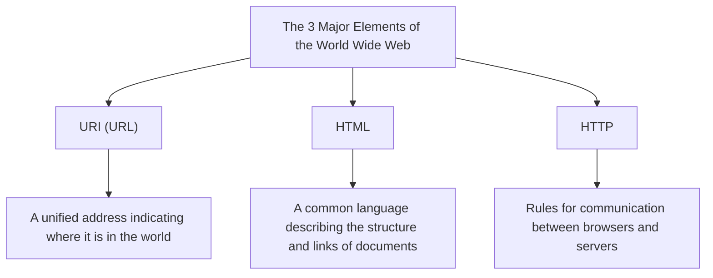

## Prologue: Dreaming of a World Where Everything is Connected

In modern society, we use the "Web" as a matter of course. We open our smartphones, read the news, watch videos, and instantly exchange messages with friends far away. It's a magical network where all the knowledge and information on this planet is seamlessly connected and freely accessible to anyone. That is the "World Wide Web."

However, how many people deeply understand the fact that this world-changing massive invention was born from the mind of a single genius programmer, and moreover, was **"released to the world completely free of charge, without acquiring any patents whatsoever"**?

That man's name is Tim Berners-Lee.

He didn't simply invent a technology. What he truly invented was the very **philosophy of the open Web**: the idea that "information should not be monopolized by specific corporations or nations, but should be open to all of humanity." If he had patented the Web and demanded licensing fees, today's internet would have taken a completely different shape. It might have become a closed and suffocating network space where only large corporations monopolized information, and we would be charged every time we obtained it.

In this article, we delve deeply into how Tim Berners-Lee invented the Web. We will explore his grueling challenges at the European Organization for Nuclear Research (CERN), his early conceptual "Enquire" project, and the three technological innovations (HTTP, HTML, URI) that fundamentally overturned the world. Furthermore, we will carefully trace his extraordinary and great footsteps, examining why he abandoned patents and went as far as establishing the W3C (World Wide Web Consortium) to protect the ideal of the open Web.

---

## Chapter 1: The Chaotic Sea of Information and the Challenges at CERN

The story begins in 1980 in the suburbs of Geneva, Switzerland. We trace back to the European Organization for Nuclear Research, commonly known as **CERN**, which possesses a massive underground experimental facility straddling the border with France.

CERN is a fortress of knowledge where thousands of top-class physicists and engineers from around the world gather to work day and night on giant projects aimed at unraveling the origins of the universe and the mysteries of elementary particles. However, at the time, CERN was facing a serious and fatal "crisis of information management."

### A Laboratory Turned Tower of Babel

Researchers gathering from all over the world used different brands of computers brought from their home countries, different operating systems (OS), different network standards, and even different data formats.
In one laboratory, IBM machines were running; in another room, DEC's VAX was operating; and somewhere else, a proprietary system was in use. Even if one team recorded brilliant experimental data, for another team to read it, they had to physically copy it onto magnetic tape, convert the format, and somehow load it between incompatible systems.

The CERN of that era was like the "Tower of Babel," whose construction stalled because they couldn't speak each other's language.

"Who is involved in which project?" "Where and on which computer is that experimental data stored?" "Who has the latest version of the software?"

Researchers wasted enormous amounts of time just searching for such basic information. They made phone calls, walked the corridors, and searched for notes on whiteboards. Despite being a facility researching cutting-edge physics, their means of sharing information were overly outdated and inefficient.

### The Birth of "Enquire": Mimicking the Network of the Brain

In 1980, the young Tim Berners-Lee, who had been assigned to CERN as a software engineer, faced this desperate fragmentation of information and felt strong dissatisfaction. He naturally had a keen interest in the connections and relationships between things.

"The human brain doesn't remember things in a hierarchical folder structure. It stores and retrieves information through random, web-like 'connections (links)' from one concept to another. Couldn't we flexibly link information on computers in the same way?"

From this idea, he developed a program called **"Enquire"** as a personal project. The name originated from "Enquire Within Upon Everything," a Victorian-era household encyclopedia he was familiar with in his childhood.

Enquire was similar to today's Wiki systems. It was a groundbreaking tool that could link any word or concept within the system to another document, allowing the relationships between information to be saved in a network-like fashion. However, the Enquire of that time was complete only within a single system; it could not connect different computers across all of CERN. As Tim's tenure ended, this program was gradually forgotten.

Yet, this very "Enquire" contained the crucial DNA that would later become the foundation of the World Wide Web.

---

## Chapter 2: The Three Magics Connecting the World — HTTP, HTML, URI

In 1984, Tim returned to CERN. The situation had worsened; with the spread of the internet, CERN's network had begun to connect with the rest of the world, but the information systems remained disjointed.

In March 1989, he submitted a historical proposal for a radical solution to information management to his boss, Mike Sendall. Its title was **"Information Management: A Proposal"**.

On the margin of this proposal, his boss Sendall wrote:
**"Vague but exciting..."**

This short comment became a turning point in history. Although it didn't immediately receive a budget as an explicit project, Tim was permitted to build this system in his spare time. He acquired a "NeXTcube" from Steve Jobs' NeXT company, the most advanced workstation at the time, and immersed himself in development.

The biggest challenge Tim faced was creating a "universal system that allows access to information in a consistent manner from any computer, any OS, and any network in the world." To achieve this, rather than making a single piece of software, he designed "three universal rules (protocols and standards)" regarding the exchange of information. This is the great invention that forms the foundation of the Web to this day.

### 1. URI (Uniform Resource Identifier)
The first innovation was unifying the "addresses" of information. In which directory, on which computer in the world, is which file? The universal naming convention to uniquely identify this is the URI (now commonly called a URL).
By inventing this string starting with `http://...`, it became possible to give a "unique address" to any piece of information in the world.

### 2. HTML (HyperText Markup Language)
The second is HTML, a language for describing the structure of documents and embedding links to other documents.
Tim greatly simplified an existing markup language (SGML) so that physicists at CERN could easily create documents. The greatest invention of HTML is that it made it possible to place a "hyperlink" to a document on any server in the world using the `<a href="...">` tag. This very link evolved the Web from a mere collection of documents into an infinitely expanding web of information.

### 3. HTTP (Hypertext Transfer Protocol)
The third is the rule for exchanging information: HTTP.
At the time, FTP (File Transfer Protocol) already existed, but it was complex and time-consuming. The HTTP designed by Tim was an extremely simple, stateless protocol of "requests (please give me information)" and "responses (here you go)." Because of this simplicity, the load on servers was low, enabling comfortable browsing by jumping from link to link instantaneously.

At the end of 1990, Tim completed the world's first Web server (info.cern.ch) and the world's first Web browser, "WorldWideWeb" (later renamed Nexus).
For the first time in human history, it was the moment when information crossed borders and computer models, seamlessly tied together by hyperlinks.

---

## Chapter 3: The Greatest Decision — The Philosophy of "No Patents"

As the basic technology of the Web was completed and its use spread within CERN and some academic institutions, its overwhelming convenience became clear. Inquiries from all over the world saying, "We want to use this system," began flooding into Tim's office.

Here, Tim Berners-Lee made **the greatest decision in history** that would define the subsequent world.

If he had patented the HTML, HTTP, and URI technologies at this point and launched a business model collecting licensing fees from using companies, he would undoubtedly have become the wealthiest billionaire in the world. In the IT industry at the time, patenting and enclosing software was a natural business strategy. Giant corporations like Microsoft, IBM, and Apple were all promoting their own network standards, trying to lock users into their own ecosystems.

However, Tim was different. He convinced his boss and CERN's management, and on **April 30, 1993, CERN issued a historic declaration that the technology of the World Wide Web would be placed in the public domain, allowing anyone to use it freely without patent fees.**

Why did he abandon the patents?
There lay Tim's robust conviction and the "philosophy of the open Web."

1. **Absolute Condition for Universal Spread**
   Tim thought, "If the Web has even the slightest usage fee or licensing restriction, small and medium-sized enterprises, individuals, and people in developing countries won't be able to use it, and the network will be fragmented." He was convinced that the true value of the Web lay in "allowing anyone to participate," and for that to happen, it had to be completely free and open.

2. **Rejection of Centralization**
   Holding a patent means granting someone the authority (control) to permit or deny usage. Tim hoped the Web would not be a centralized system dominated by specific governments or corporations, but a "decentralized system" where anyone could freely set up a server and broadcast information.

With this decision, the Web achieved explosive growth. Because there were no patent worries, programmers around the world competed to develop browsers (like Mosaic and Netscape) and server software (like Apache), and companies launched websites one after another. If Tim had clung to patents, the Web would have been buried as just one of dozens of "corporate proprietary network services," and today's global internet society would not have arrived.

---

## Chapter 4: The Foundation of W3C and the Fight to Protect the Web's Future

When the Web became a global boom, a new crisis arrived. Companies like Netscape and Microsoft (Internet Explorer) sparked the browser wars, successively adding "proprietary extended HTML tags" that could only be seen on their own browsers.
At this rate, the Web would be divided again like the "Tower of Babel," and situations saying "This page can only be viewed in a specific browser" would become rampant (indeed, things almost fell into such a state in the late 1990s).

To prevent the splitting of the Web, Tim Berners-Lee moved to the Massachusetts Institute of Technology (MIT) in 1994 and established the **W3C (World Wide Web Consortium)**.

The W3C is an international non-profit consortium that sets the technical standards for the Web. As the director of the W3C, Tim mediated fierce conflicts between companies and thoroughly defended the principle that "Web standards must not favor any specific corporation, but must be open and royalty-free."
Without the activities of the W3C, today we might have been forced to use a nightmarishly fragmented internet where we couldn't access Microsoft's sites from Apple devices, or Amazon from Google's browser.

### The Unending Passion for the Open Web

Today, Tim Berners-Lee continues to sound strong alarm bells regarding the negative aspects of the current Web, such as data monopolization by giant IT corporations, privacy violations, and the spread of fake news.
He insists that "The Web was originally meant to empower people, not for corporations to exploit users' data," and he continues to fight for the improvement of the Web, currently working on the development of a decentralized platform called "Solid," where users themselves can control their own data.

---

## Epilogue: The Baton We Received

Tim Berners-Lee's story is not merely a history of technological invention. It is a noble and beautiful story of the ideal that "the infrastructure for sharing humanity's knowledge and connecting people should not be monopolized by profit or power."

The reason we can casually type in a URL, click a link, and broadcast information freely every day is that in the early 1990s at CERN, one man made the unbelievable, selfless decision to "hold no patents."

We now stand on the massive playground he opened up for free. It may be the mission imposed on all of us who have received the baton from Tim Berners-Lee to connect this common property of humanity, the "open Web," to a freer and richer future, without locking it away inside the walled gardens of a few.
