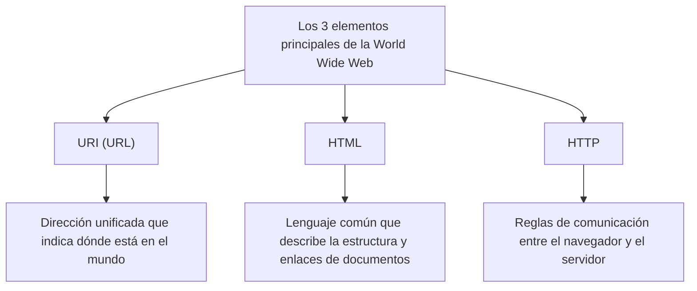

## Prólogo: Soñando con un mundo donde todo está conectado

En la sociedad actual, damos por sentado el uso de la "Web". Abrimos nuestros smartphones, leemos noticias, vemos vídeos e intercambiamos mensajes instantáneos con amigos lejanos. Una red mágica donde todo el conocimiento y la información del planeta están conectados de forma fluida y cualquier persona puede acceder libremente. Eso es la "World Wide Web".

Sin embargo, ¿cuántas personas comprenden profundamente el hecho de que esta enorme invención que cambió el mundo nació de la mente de un solo genio de la programación y, además, **"se publicó al mundo de forma completamente gratuita, sin adquirir ninguna patente"**?

El nombre de ese hombre es Tim Berners-Lee.

No solo inventó una tecnología. Lo que realmente inventó fue la propia **filosofía de la Web Abierta**: la idea de que "la información no debe ser monopolizada por empresas o naciones específicas, sino que debe estar abierta a toda la humanidad". Si él hubiera patentado la Web y exigido tarifas de licencia, el Internet de hoy sería completamente diferente. Podría haberse convertido en un espacio de red cerrado y asfixiante, donde solo las grandes empresas monopolizarían la información y a nosotros se nos cobraría cada vez que quisiéramos obtenerla.

En este artículo, profundizaremos en cómo Tim Berners-Lee inventó la Web. Exploraremos los difíciles desafíos en la Organización Europea para la Investigación Nuclear (CERN), el concepto inicial del proyecto "Enquire" y las tres innovaciones tecnológicas (HTTP, HTML y URI) que sacudieron el mundo desde sus cimientos. Además, trazaremos en detalle sus extraordinarios y grandes pasos, analizando por qué renunció a las patentes e incluso fundó el W3C (World Wide Web Consortium) para proteger el ideal de la Web Abierta.

---

## Capítulo 1: El caótico océano de información y el desafío del CERN

El comienzo de la historia se remonta a 1980 en las afueras de Ginebra, Suiza. Nos ubicamos en la Organización Europea para la Investigación Nuclear, conocida comúnmente como **CERN**, que cuenta con una inmensa instalación experimental subterránea que cruza la frontera con Francia.

El CERN es una fortaleza del conocimiento donde miles de físicos e ingenieros de primera clase de todo el mundo se reúnen para llevar a cabo, día y noche, enormes proyectos destinados a desentrañar los orígenes del universo y los misterios de las partículas elementales. Sin embargo, en aquel entonces, el CERN se enfrentaba a una "crisis de gestión de la información" grave y fatal.

### Un instituto de investigación convertido en la Torre de Babel

Los investigadores de todo el mundo utilizaban ordenadores de distintos fabricantes traídos de sus propios países, sistemas operativos (OS) diferentes, diferentes estándares de red e incluso diferentes formatos de datos.
En un laboratorio funcionaba una máquina IBM, en otra habitación operaba un DEC VAX, y en otro lugar se utilizaba un sistema propio. Si un equipo registraba datos experimentales maravillosos, para que otro equipo pudiera leerlos, tenían que copiarlos físicamente en una cinta magnética, convertir el formato y de alguna manera cargarlos entre sistemas incompatibles.

El CERN de entonces se parecía a la "Torre de Babel", cuya construcción fracasó porque nadie hablaba el mismo idioma.

"¿Quién está trabajando en qué proyecto?" "¿En qué ordenador y dónde están guardados esos datos experimentales?" "¿Quién tiene la última versión del software?"

Solo para buscar esta información básica, los investigadores desperdiciaban enormes cantidades de tiempo. Hacían llamadas, caminaban por los pasillos y buscaban notas en las pizarras. A pesar de ser una instalación de investigación de la física más avanzada, los medios para compartir información eran demasiado anticuados e ineficientes.

### El nacimiento de "Enquire": Imitando la red del cerebro

En 1980, el joven Tim Berners-Lee, que había llegado al CERN como ingeniero de software, se enfrentó a esta desesperante fragmentación de la información y sintió una fuerte frustración. Por naturaleza, tenía un gran interés en las conexiones y relaciones entre las cosas.

"El cerebro humano no recuerda las cosas en una estructura de carpetas jerárquica. Almacena y recupera información de un concepto a otro de manera aleatoria, a través de 'conexiones (enlaces)' que forman una red. ¿No podríamos enlazar la información en los ordenadores de manera igualmente flexible?"

A partir de esta idea, desarrolló un programa llamado **"Enquire"** como proyecto personal. El nombre proviene de una enciclopedia familiar de la época victoriana que leía en su infancia, "Enquire Within Upon Everything" (Investiga dentro sobre todo).

Enquire era algo similar al sistema Wiki actual. Era una herramienta revolucionaria que permitía vincular cualquier palabra o concepto dentro del sistema a otro documento, guardando las relaciones de la información en forma de red. Sin embargo, el Enquire de entonces se limitaba a un solo sistema y no podía conectar diferentes ordenadores a lo largo de todo el CERN. Con el fin del mandato de Tim, este programa fue cayendo gradualmente en el olvido.

Sin embargo, este "Enquire" fue el que albergó el importante ADN que más tarde se convertiría en la base de la World Wide Web.

---

## Capítulo 2: Las tres magias que conectaron el mundo: HTTP, HTML y URI

En 1984, Tim regresó nuevamente al CERN. La situación había empeorado aún más en comparación con antes. Con la propagación de Internet, la red del CERN comenzaba a conectarse con el resto del mundo, pero los sistemas de información seguían estando fragmentados.

En marzo de 1989, presentó un documento histórico a su jefe, Mike Sendall, proponiendo una solución radical para la gestión de la información. El título era **"Information Management: A Proposal"** (Gestión de la Información: Una propuesta).

Ante esta propuesta, su jefe Sendall escribió en el margen:
**"Vague but exciting..."** (Vago, pero emocionante...)

Este breve comentario marcó un punto de inflexión en la historia. Aunque no obtuvo presupuesto inmediato como proyecto oficial, a Tim se le permitió usar su tiempo libre para construir este sistema. Adquirió una "NeXTcube" de la empresa NeXT, liderada por Steve Jobs, que era la estación de trabajo más avanzada de la época, y se sumergió en el desarrollo.

El mayor desafío al que se enfrentó Tim fue crear "un sistema universal que permitiera acceder a la información de manera coherente desde cualquier ordenador, cualquier sistema operativo y cualquier red en el mundo". Para lograrlo, en lugar de crear un único software, diseñó "tres reglas universales (protocolos y estándares)" relacionadas con el intercambio de información. Esta es la gran invención que constituye la base de la Web hasta el día de hoy.

### 1. URI (Uniform Resource Identifier)
La primera innovación fue unificar las "direcciones" de la información. ¿De qué ordenador en el mundo, en qué directorio y qué archivo se trata? La regla de nomenclatura universal para identificar esto de manera única es la URI (lo que hoy en día llamamos comúnmente URL).
Al inventar esta cadena de texto que comienza con "`http://...`", hizo posible asignar una "dirección única" a cada pieza de información en el mundo.

### 2. HTML (HyperText Markup Language)
La segunda fue el HTML, un lenguaje para describir la estructura de los documentos e incrustar enlaces a otros documentos.
Tim simplificó extremadamente un lenguaje de marcado existente (SGML) para que los físicos del CERN pudieran crear documentos fácilmente. La mayor invención del HTML radica en el hecho de que, mediante la etiqueta `<a href="...">`, se puede crear un "hipervínculo" a un documento en cualquier servidor del mundo. Estos enlaces fueron los que hicieron evolucionar la Web, pasando de ser una simple colección de documentos a una red de información infinitamente expansible (Web).

### 3. HTTP (Hypertext Transfer Protocol)
La tercera fue la regla para el intercambio de información: el HTTP.
Aunque en ese entonces ya existían protocolos como FTP (Protocolo de Transferencia de Archivos), eran complejos y lentos. El HTTP que diseñó Tim era un protocolo extremadamente simple y sin estado, basado en "solicitud (dame información)" y "respuesta (aquí tienes)". Gracias a esta simplicidad, la carga en los servidores era mínima, permitiendo una navegación fluida, saltando instantáneamente de enlace en enlace.

A finales de 1990, Tim completó el primer servidor web del mundo (info.cern.ch) y el primer navegador web del mundo, "WorldWideWeb" (más tarde renombrado como Nexus).
Por primera vez en la historia de la humanidad, fue el momento en que la información superó las fronteras nacionales y los modelos de ordenadores, uniéndose perfectamente a través de hipervínculos.

---

## Capítulo 3: La mayor decisión: la filosofía de "no tener patentes"

A medida que se completaba la tecnología fundamental de la Web y su uso se extendía dentro del CERN y algunas instituciones académicas, su abrumadora conveniencia se hizo evidente. Tim comenzó a recibir una avalancha de consultas de todo el mundo de personas que querían utilizar este sistema.

Aquí es donde Tim Berners-Lee tomó la **decisión más grande de la historia** que definiría el futuro del mundo.

Si en ese momento él hubiera patentado las tecnologías de HTML, HTTP y URI y establecido un modelo de negocio para cobrar tarifas de licencia a las empresas que las utilizaran, sin duda se habría convertido en el mayor multimillonario del mundo. En la industria de TI de entonces, patentar software y crear monopolios era una estrategia comercial natural. Gigantes como Microsoft, IBM y Apple impulsaban estándares de red propios para encerrar a los usuarios en sus propios ecosistemas.

Sin embargo, Tim fue diferente. Persuadió a su jefe y a la dirección del CERN, y el **30 de abril de 1993, el CERN emitió una declaración histórica de que "la tecnología de la World Wide Web pasaba al dominio público y cualquier persona podía usarla libremente sin pagar derechos de patente".**

¿Por qué renunció a la patente?
Ahí residía la inquebrantable convicción de Tim y su "filosofía de la Web Abierta".

1. **Condición absoluta para la adopción universal**
   Tim pensaba que "si la Web tuviera incluso una pequeña tarifa de uso o restricción de licencia, las pequeñas y medianas empresas, los particulares y las personas de los países en desarrollo en todo el mundo no podrían usarla, y la red se fragmentaría". Estaba convencido de que el verdadero valor de la Web residía en que "cualquiera pudiera participar", y para ello tenía que ser completamente gratuita y abierta.

2. **Rechazo a la centralización**
   Tener una patente significa otorgarle a alguien el poder de permitir o denegar el uso (control). Tim deseaba que la Web no fuera un sistema centralizado que gobiernos o empresas específicas pudieran dominar, sino un "sistema descentralizado" donde cualquiera pudiera configurar libremente un servidor y publicar información.

Gracias a esta decisión, la Web experimentó un crecimiento explosivo. Al no haber preocupaciones por patentes, programadores de todo el mundo compitieron para desarrollar navegadores (como Mosaic y Netscape) y software de servidores (como Apache), y las empresas lanzaron sitios web uno tras otro. Si Tim se hubiera aferrado a las patentes, la Web podría haber quedado enterrada como uno más de los docenas de "servicios de red corporativos propietarios", y la sociedad global de Internet de hoy no habría llegado.

---

## Capítulo 4: La fundación del W3C y la batalla por proteger el futuro de la Web

Cuando la Web se convirtió en un auge mundial, llegó una nueva crisis. Empresas como Netscape y Microsoft (Internet Explorer) desencadenaron la guerra de los navegadores, comenzando a agregar una tras otra "etiquetas HTML de extensión propietaria" que solo se podían ver en sus propios navegadores.
A este ritmo, la Web se habría dividido de nuevo como la "Torre de Babel", y se habría generalizado la situación de "esta página solo se puede ver con un navegador específico" (de hecho, a finales de los años 90 casi se llega a esa situación).

Para evitar la división de la Web, Tim Berners-Lee se trasladó al Instituto de Tecnología de Massachusetts (MIT) en 1994 y fundó el **W3C (World Wide Web Consortium)**.

El W3C es un consorcio internacional sin fines de lucro que establece los estándares técnicos de la Web. Como director del W3C, Tim medió en los feroces conflictos entre empresas y defendió tenazmente el principio de que "los estándares de la Web no deben favorecer a empresas específicas, sino que deben ser abiertos y libres de regalías".
Sin las actividades del W3C, hoy podríamos estar obligados a usar una Internet fragmentada de pesadilla, donde no podríamos ver sitios de Microsoft desde dispositivos Apple o acceder a Amazon desde el navegador de Google.

### Una pasión interminable por la Web Abierta

Hoy en día, Tim Berners-Lee sigue emitiendo fuertes advertencias sobre los aspectos negativos a los que se enfrenta la Web actual, como el monopolio de los datos por parte de los gigantes tecnológicos, la invasión de la privacidad y la difusión de noticias falsas.
Él argumenta que "la Web fue originalmente concebida para empoderar a las personas, no para que las empresas exploten los datos de los usuarios". En la actualidad, continúa luchando por la mejora de la Web, trabajando en el desarrollo de "Solid", una plataforma descentralizada que permite a los propios usuarios controlar sus propios datos.

---

## Epílogo: El testigo que hemos recibido

La historia de Tim Berners-Lee no es simplemente la historia de una invención tecnológica. Es la historia de un ideal noble y hermoso: "la infraestructura para compartir el conocimiento de la humanidad y conectar a las personas no debe ser monopolizada por las ganancias o el poder".

El hecho de que todos los días podamos escribir casualmente una URL, hacer clic en un enlace y publicar información libremente, se debe a que, a principios de la década de 1990 en el CERN, un hombre tomó la increíble y altruista decisión de "no tener patentes".

Ahora nos encontramos sobre este enorme patio de recreo que él nos abrió de forma gratuita. Nuestro deber es conectar este patrimonio común de la humanidad, la "Web Abierta", con un futuro aún más libre y próspero, sin encerrarlo dentro de algunos muros gigantes (jardines vallados). Quizás esa sea la misión impuesta a todos nosotros, quienes hemos recibido el testigo de Tim Berners-Lee.
