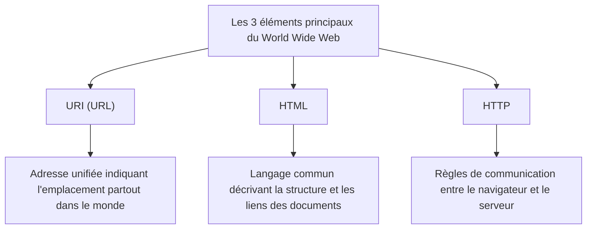

## Prologue : Rêver d'un monde où tout est connecté

Dans la société moderne, nous utilisons le « Web » comme si c'était une évidence. Nous ouvrons nos smartphones, lisons les actualités, regardons des vidéos et échangeons instantanément des messages avec des amis éloignés. Un réseau magique où toutes les connaissances et informations de cette planète sont connectées de manière transparente et librement accessibles à tous. C'est le « World Wide Web ».

Cependant, combien de personnes comprennent profondément le fait que cette invention colossale qui a changé le monde est née de l'esprit d'un seul programmeur de génie, et surtout, qu'elle a été **« dévoilée au monde de manière totalement gratuite, sans qu'aucun brevet ne soit déposé »** ?

Le nom de cet homme est Tim Berners-Lee.

Il n'a pas seulement inventé une technologie. Ce qu'il a véritablement inventé, c'est la **philosophie du Web ouvert** elle-même : l'idée que « l'information ne doit pas être monopolisée par des entreprises ou des États spécifiques, mais doit être ouverte à toute l'humanité ». S'il avait breveté le Web et exigé des droits de licence, l'Internet d'aujourd'hui aurait pris une forme complètement différente. Il serait peut-être devenu un espace réseau fermé et étouffant, où seules de grandes entreprises monopoliseraient l'information, et où nous serions facturés à chaque fois que nous obtiendrions une information.

Dans cet article, nous explorerons en profondeur comment Tim Berners-Lee a inventé le Web. Nous nous pencherons sur les défis redoutables du Conseil Européen pour la Recherche Nucléaire (CERN), son projet initial appelé « Enquire », et les trois innovations techniques qui ont bouleversé le monde (HTTP, HTML, URI). De plus, nous retracerons en détail son parcours exceptionnel et formidable : pourquoi a-il renoncé aux brevets et est-il allé jusqu'à fonder le W3C (World Wide Web Consortium) pour défendre l'idéal d'un Web ouvert.

---

## Chapitre 1 : La mer chaotique de l'information et les défis du CERN

L'histoire commence en 1980, en banlieue de Genève, en Suisse. Elle remonte au Conseil Européen pour la Recherche Nucléaire, communément appelé **CERN**, qui possède une gigantesque installation expérimentale souterraine s'étendant sur la frontière française.

Le CERN est une forteresse du savoir où des milliers de physiciens et d'ingénieurs de haut niveau du monde entier se rassemblent, travaillant jour et nuit sur des projets colossaux pour percer les mystères de l'origine de l'univers et des particules élémentaires. Cependant, à cette époque, le CERN était confronté à une « crise de la gestion de l'information » sérieuse et fatale.

### Un laboratoire transformé en tour de Babel

Les chercheurs venant du monde entier utilisaient des ordinateurs de différents fabricants, des systèmes d'exploitation (OS) différents, des normes de réseau différentes, et même des formats de données différents, tous apportés de leurs pays respectifs.
Dans un laboratoire, une machine IBM fonctionnait, dans une autre pièce, un VAX de DEC tournait, et ailleurs, un système propriétaire était en marche. Lorsqu'une équipe enregistrait d'excellentes données expérimentales, pour qu'une autre équipe puisse les lire, il fallait délibérément les copier physiquement sur une bande magnétique, convertir le format, et s'arranger pour les faire lire d'une manière ou d'une autre entre des systèmes incompatibles.

À l'époque, le CERN ressemblait à la « tour de Babel » dont la construction avait échoué à cause de l'incompréhension des langues.

« Qui travaille sur quel projet ? » « Sur quel ordinateur et où ces données expérimentales sont-elles stockées ? » « Qui possède la dernière version du logiciel ? »

Les chercheurs gaspillaient un temps énorme rien que pour chercher ces informations de base. Ils passaient des appels téléphoniques, arpentaient les couloirs, cherchaient des notes sur des tableaux blancs. Bien qu'il s'agît d'une installation dédiée à la recherche en physique de pointe, les moyens de partage de l'information étaient bien trop archaïques et inefficaces.

### La naissance d'« Enquire » : Imiter le réseau du cerveau

En 1980, le jeune Tim Berners-Lee, fraîchement arrivé au CERN en tant qu'ingénieur logiciel, fut confronté à cette fragmentation désespérante de l'information et en ressentit une forte frustration. De nature, il portait un vif intérêt aux connexions et aux relations entre les choses.

« Le cerveau humain ne mémorise pas les choses dans une structure de dossiers hiérarchique. Il mémorise et récupère les informations par des "connexions (liens)" aléatoires et en forme de toile, passant d'un concept à un autre. Ne pourrions-nous pas lier les informations sur un ordinateur de manière tout aussi flexible ? »

De cette idée, il a développé un programme appelé **« Enquire »** comme projet personnel. Le nom provenait de l'encyclopédie domestique de l'ère victorienne, *Enquire Within Upon Everything* (« Renseignez-vous à l'intérieur sur tout »), qu'il appréciait dans son enfance.

Enquire ressemblait aux systèmes Wiki actuels. C'était un système révolutionnaire capable de lier n'importe quel mot ou concept à un autre document au sein du système, stockant ainsi les relations de l'information sous forme de réseau. Cependant, l'Enquire de l'époque était confiné à un système unique et ne pouvait pas connecter des ordinateurs distincts à travers tout le CERN. Avec la fin du mandat de Tim, ce programme fut peu à peu oublié.

Pourtant, c'est ce même « Enquire » qui portait l'ADN crucial qui allait devenir la base du futur World Wide Web.

---

## Chapitre 2 : Les trois magies qui relient le monde —— HTTP, HTML, URI

En 1984, Tim est retourné au CERN. La situation s'était encore détériorée. Avec la diffusion d'Internet, le réseau du CERN commençait à se connecter avec le monde entier, mais les systèmes d'information restaient tout aussi fragmentés.

En mars 1989, il a soumis à son supérieur, Mike Sendall, un document historique proposant une solution radicale à la gestion de l'information. Son titre : **« Information Management: A Proposal »** (Gestion de l'information : une proposition).

Sur ce document, son supérieur Sendall a écrit dans la marge :
**"Vague but exciting..." (Vague, mais passionnant...)**

Ce court commentaire a marqué un tournant dans l'histoire. Bien qu'aucun budget n'ait été immédiatement alloué pour un projet formel, Tim a été autorisé à construire ce système pendant son temps libre. Il a acquis un « NeXTcube » de la société NeXT dirigée par Steve Jobs, qui était alors la station de travail la plus moderne, et s'est plongé dans le développement.

Le plus grand défi auquel Tim a dû faire face était de créer « un système universel permettant d'accéder à l'information de manière cohérente depuis n'importe quel ordinateur, n'importe quel OS et n'importe quel réseau dans le monde ». Pour réaliser cela, au lieu de créer un logiciel unique, il a conçu « trois règles universelles (protocoles et standards) » concernant l'échange d'informations. C'est la grande invention qui forme encore aujourd'hui la base du Web.

### 1. URI (Uniform Resource Identifier)
La première innovation a consisté à unifier l'« adresse » de l'information. Quel fichier, dans quel répertoire, sur quel ordinateur dans le monde ? La convention de nommage universelle pour identifier cela de manière unique est l'URI (communément appelé URL aujourd'hui).
En inventant cette chaîne de caractères commençant par « `http://...` », il est devenu possible de donner une « adresse unique au monde » à toute information sur la planète.

### 2. HTML (HyperText Markup Language)
La deuxième innovation est le HTML, un langage permettant de décrire la structure d'un document et d'y intégrer des liens vers d'autres documents.
Tim a radicalement simplifié un langage de balisage existant (SGML) pour que les physiciens du CERN puissent facilement créer des documents. La plus grande invention du HTML réside dans la balise `<a href="...">`, qui a permis de créer un « hyperlien » vers un document situé sur n'importe quel serveur dans le monde. C'est précisément ce lien qui a fait évoluer le Web, d'une simple collection de documents à une toile (Web) d'informations s'étendant à l'infini.

### 3. HTTP (Hypertext Transfer Protocol)
La troisième innovation est le HTTP, la règle pour l'échange d'informations.
À l'époque, des protocoles comme le FTP (protocole de transfert de fichiers) existaient déjà, mais ils étaient complexes et prenaient du temps. Le HTTP conçu par Tim était un protocole extrêmement simple et sans état (stateless) fonctionnant sur un modèle de « requête (donnez-moi l'information) » et « réponse (voici) ». Grâce à cette simplicité, la charge sur le serveur était faible, permettant une navigation fluide où l'on pouvait passer instantanément de lien en lien.

Fin 1990, Tim a achevé le premier serveur Web au monde (info.cern.ch) et le premier navigateur Web, « WorldWideWeb » (plus tard rebaptisé Nexus).
Pour la première fois dans l'histoire de l'humanité, l'information était connectée de manière transparente via des hyperliens, transcendant les frontières nationales et les modèles d'ordinateurs.

---

## Chapitre 3 : La plus grande décision —— La philosophie de ne pas avoir de brevets

Au fur et à mesure que les technologies de base du Web ont été achevées et que leur utilisation s'est répandue au sein du CERN et de certaines institutions universitaires, leur commodité écrasante est devenue évidente. Tim a commencé à être inondé de demandes du monde entier disant : « Nous voulons utiliser ce système ».

À ce stade, Tim Berners-Lee a pris **la décision la plus importante de l'histoire**, celle qui définirait le monde de demain.

S'il avait, à ce moment-là, breveté les technologies HTML, HTTP et URI et lancé un modèle commercial pour percevoir des droits de licence auprès des entreprises utilisatrices, il serait sans aucun doute devenu le premier milliardaire du monde. À l'époque, dans l'industrie informatique, faire breveter et verrouiller des logiciels était une stratégie commerciale évidente. De grandes entreprises comme Microsoft, IBM et Apple promouvaient toutes leurs propres normes de réseau exclusives, essayant d'enfermer les utilisateurs dans leurs propres écosystèmes.

Mais Tim était différent. Il a convaincu ses supérieurs et la direction du CERN, et **le 30 avril 1993, le CERN a fait une déclaration historique annonçant que « la technologie du World Wide Web serait placée dans le domaine public et que quiconque pourrait l'utiliser librement sans payer de droits de brevet ».**

Pourquoi a-t-il renoncé aux brevets ?
C'était dû aux fortes convictions de Tim et à la « philosophie du Web ouvert ».

1. **Condition absolue pour une diffusion universelle**
   Tim pensait : « S'il y a la moindre restriction sous forme de frais d'utilisation ou de licences sur le Web, les petites entreprises, les particuliers du monde entier, et les habitants des pays en développement ne pourront pas l'utiliser, et le réseau sera fragmenté. » Il était convaincu que la véritable valeur du Web résidait dans le fait que « n'importe qui puisse y participer », et pour cela, il devait être complètement gratuit et ouvert.

2. **Le refus de la centralisation**
   Posséder un brevet signifie donner à quelqu'un le pouvoir (le contrôle) d'autoriser ou de refuser l'utilisation. Tim souhaitait que le Web ne soit pas un système centralisé que des gouvernements ou des entreprises spécifiques pourraient contrôler, mais un « système décentralisé » où quiconque pourrait librement mettre en place un serveur et diffuser des informations.

Grâce à cette décision, le Web a connu une croissance explosive. N'ayant plus à se soucier des brevets, les programmeurs du monde entier ont concouru pour développer des navigateurs (comme Mosaic et Netscape) et des logiciels serveurs (comme Apache), et les entreprises ont lancé des sites Web les uns après les autres. Si Tim s'était accroché à ses brevets, le Web aurait été relégué au rang de l'un des nombreux « services réseau exclusifs d'entreprises », et la société Internet mondiale d'aujourd'hui n'aurait jamais vu le jour.

---

## Chapitre 4 : La création du W3C et la lutte pour protéger l'avenir du Web

Lorsque le Web est devenu un phénomène mondial, une nouvelle crise est survenue. Des entreprises comme Netscape et Microsoft (Internet Explorer) ont déclenché une guerre des navigateurs, ajoutant l'une après l'autre des « balises HTML d'extension propriétaires » qui ne pouvaient être vues que sur leurs propres navigateurs.
Si la situation avait continué ainsi, le Web se serait à nouveau fragmenté comme la « tour de Babel », et on aurait vu proliférer la situation où « cette page n'est visible que sur certains navigateurs » (en fait, c'est ce qui a failli se produire à la fin des années 90).

Pour empêcher la fragmentation du Web, Tim Berners-Lee a rejoint le Massachusetts Institute of Technology (MIT) en 1994 et a fondé le **W3C (World Wide Web Consortium)**.

Le W3C est un consortium international à but non lucratif qui élabore les standards techniques du Web. En tant que directeur du W3C, Tim a médiatisé les intenses conflits entre les entreprises et a farouchement défendu le principe selon lequel « les normes du Web ne doivent pas favoriser une entreprise spécifique, mais doivent être ouvertes et libres de redevances ».
Sans l'action du W3C, nous pourrions aujourd'hui utiliser un Internet fragmenté cauchemardesque, où les sites de Microsoft seraient inaccessibles depuis un appareil Apple, et où Amazon serait inaccessible depuis le navigateur de Google.

### Une passion sans fin pour le Web ouvert

Aujourd'hui, Tim Berners-Lee tire également la sonnette d'alarme sur les aspects négatifs du Web actuel, tels que le monopole des données par les géants de l'informatique, les atteintes à la vie privée et la diffusion de fausses nouvelles (fake news).
Il soutient que « le Web est à l'origine destiné à donner du pouvoir aux gens, et non à être exploité par des entreprises pour soutirer les données des utilisateurs ». Aujourd'hui encore, il continue de lutter pour l'amélioration du Web, notamment en travaillant sur le développement de « Solid », une plateforme décentralisée permettant aux utilisateurs de contrôler leurs propres données.

---

## Épilogue : Le relais que nous avons reçu

L'histoire de Tim Berners-Lee n'est pas seulement l'histoire d'une invention technique. C'est l'histoire d'un idéal noble et magnifique : « l'infrastructure pour partager les connaissances de l'humanité et connecter les gens ne doit pas être monopolisée par le profit ou le pouvoir ».

Si aujourd'hui nous pouvons taper une URL avec désinvolture tous les jours, cliquer sur des liens et diffuser librement des informations, c'est parce qu'au début des années 1990, au CERN, un homme a pris la décision altruiste et incroyable de « ne pas détenir de brevets ».

Nous nous tenons maintenant sur le gigantesque terrain de jeu qu'il a ouvert gratuitement. Ce bien commun de l'humanité qu'est le « Web ouvert », il ne faut pas l'enfermer dans quelques murs gigantesques (jardins clos), mais le relier à un avenir encore plus libre et plus riche. C'est peut-être là la mission confiée à nous tous qui avons pris le relais de Tim Berners-Lee.
