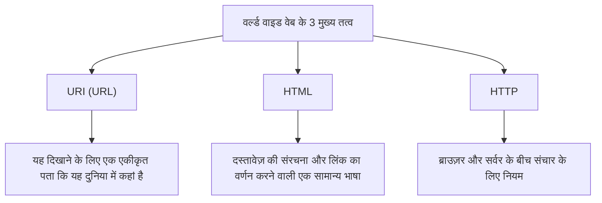

## प्रस्तावना: एक ऐसी दुनिया का सपना जहां सब कुछ जुड़ा हो

आधुनिक समाज में, हम "वेब" का उपयोग ऐसे करते हैं जैसे यह एक सामान्य बात हो। स्मार्टफोन खोलना, समाचार पढ़ना, वीडियो देखना, और दूर बैठे दोस्तों के साथ तुरंत संदेशों का आदान-प्रदान करना। एक जादुई नेटवर्क जहां इस ग्रह का सारा ज्ञान और जानकारी सहज रूप से जुड़ी हुई है, और जिस तक कोई भी स्वतंत्र रूप से पहुंच सकता है। यही "वर्ल्ड वाइड वेब" (World Wide Web) है।

लेकिन कितने लोग गहराई से समझते हैं कि दुनिया को बदलने वाला यह विशाल आविष्कार केवल एक प्रतिभाशाली प्रोग्रामर के दिमाग से पैदा हुआ था, और इसके अलावा, **"बिना कोई पेटेंट प्राप्त किए, इसे दुनिया के लिए पूरी तरह से मुफ्त में जारी किया गया था"**?

उस व्यक्ति का नाम टिम बर्नर्स-ली (Tim Berners-Lee) है।

उन्होंने केवल एक तकनीक का आविष्कार नहीं किया। उन्होंने वास्तव में जो आविष्कार किया, वह "जानकारी पर किसी विशिष्ट निगम या राष्ट्र का एकाधिकार नहीं होना चाहिए, बल्कि यह सभी मानवता के लिए खुली होनी चाहिए" का **ओपन वेब का विचार** था। यदि उन्होंने वेब का पेटेंट कराया होता और लाइसेंस शुल्क की मांग की होती, तो आज का इंटरनेट बिल्कुल अलग होता। यह शायद एक बंद और दमघोंटू नेटवर्क स्पेस बन गया होता जहां केवल बड़े निगमों का सूचना पर एकाधिकार होता, और हर बार जब हम जानकारी प्राप्त करते तो हमसे शुल्क लिया जाता।

इस लेख में, हम गहराई से जानेंगे कि टिम बर्नर्स-ली ने वेब का आविष्कार कैसे किया। यूरोपीय परमाणु अनुसंधान संगठन (CERN) में उनके चुनौतीपूर्ण कार्य, "Enquire" प्रोजेक्ट की प्रारंभिक अवधारणा, और 3 तकनीकी नवाचारों (HTTP, HTML, URI) के बारे में जिन्होंने दुनिया को मौलिक रूप से बदल दिया। इसके अलावा, हम उनके महान और अनोखे पदचिन्हों का भी विस्तार से पता लगाएंगे, और जानेंगे कि उन्होंने पेटेंट क्यों छोड़ दिया और ओपन वेब के आदर्शों की रक्षा के लिए W3C (वर्ल्ड वाइड वेब कंसोर्टियम) की स्थापना क्यों की।

---

## अध्याय 1: सूचनाओं का अराजक सागर और CERN की चुनौती

कहानी की शुरुआत 1980 में जिनेवा, स्विट्जरलैंड के उपनगरों में होती है। यह यूरोपीय परमाणु अनुसंधान संगठन, जिसे आमतौर पर **CERN** (सर्न) के रूप में जाना जाता है, में वापस ले जाता है, जिसमें फ्रांस की सीमा पर फैले विशाल भूमिगत प्रयोगात्मक सुविधा है।

CERN ज्ञान का एक गढ़ है जहां दुनिया भर से हजारों शीर्ष भौतिक विज्ञानी और इंजीनियर दिन-रात एक विशाल परियोजना पर काम करते हैं ताकि ब्रह्मांड की उत्पत्ति और मौलिक कणों के रहस्यों को उजागर किया जा सके। हालाँकि, उस समय CERN एक गंभीर और घातक "सूचना प्रबंधन संकट" का सामना कर रहा था।

### एक प्रयोगशाला जो बेबीलोन की मीनार में बदल गई

दुनिया भर से इकट्ठा हुए शोधकर्ता अलग-अलग निर्माताओं के कंप्यूटरों, अलग-अलग ऑपरेटिंग सिस्टम (OS), अलग-अलग नेटवर्क मानकों और यहां तक कि अलग-अलग डेटा प्रारूपों का उपयोग कर रहे थे जो वे अपने देशों से लाए थे।
एक प्रयोगशाला में IBM की मशीनें चल रही थीं, दूसरे कमरे में DEC का VAX चल रहा था, और किसी अन्य स्थान पर एक मालिकाना प्रणाली चल रही थी। यदि एक टीम ने शानदार प्रयोगात्मक डेटा रिकॉर्ड किया है, तो दूसरी टीम को उस डेटा को पढ़ने के लिए, उन्हें इसे भौतिक रूप से चुंबकीय टेप पर कॉपी करना होगा, प्रारूप को बदलना होगा, और किसी तरह इसे असंगत सिस्टम के बीच पढ़ना होगा।

उस समय का CERN "बेबीलोन की मीनार" जैसा था, जिसका निर्माण इसलिए रोक दिया गया था क्योंकि वे एक-दूसरे की भाषा नहीं समझ सकते थे।

"कौन किस प्रोजेक्ट में शामिल है?", "वह प्रयोग डेटा किस कंप्यूटर पर और कहाँ सहेजा गया है?", "सॉफ़्टवेयर का नवीनतम संस्करण किसके पास है?"

शोधकर्ताओं ने केवल इस तरह की बुनियादी जानकारी खोजने में भारी मात्रा में समय बर्बाद किया। फोन कॉल करना, हॉलवे में घूमना, व्हाइटबोर्ड नोट्स की तलाश करना। अत्याधुनिक भौतिकी पर शोध करने वाली एक सुविधा होने के बावजूद, जानकारी साझा करने के साधन बहुत पुराने और अक्षम थे।

### "Enquire" का जन्म: मस्तिष्क के नेटवर्क की नकल करना

1980 में, टिम बर्नर्स-ली, जो एक सॉफ्टवेयर इंजीनियर के रूप में CERN में आए थे, सूचनाओं के इस निराशाजनक विभाजन से रूबरू हुए और बहुत असंतुष्ट हुए। स्वाभाविक रूप से, उन्हें चीजों के बीच संबंध और जुड़ाव में गहरी रुचि थी।

"मानव मस्तिष्क पदानुक्रमित फ़ोल्डर संरचना में चीजों को याद नहीं रखता है। यह एक अवधारणा से दूसरी अवधारणा में यादृच्छिक, वेब-जैसे 'लिंक' के माध्यम से जानकारी को याद रखता है और पुनः प्राप्त करता है। क्या कंप्यूटर पर भी सूचनाओं को इसी तरह लचीले ढंग से लिंक नहीं किया जा सकता है?"

इस विचार से, उन्होंने एक व्यक्तिगत प्रोजेक्ट के रूप में **"Enquire"** (एन्क्वायर) नामक एक प्रोग्राम विकसित किया। इसका नाम विक्टोरियन युग के घरेलू विश्वकोश "Enquire Within Upon Everything" से लिया गया था जिससे वे बचपन से परिचित थे।

Enquire एक आधुनिक विकी सिस्टम की तरह था। यह एक क्रांतिकारी प्रणाली थी जो सिस्टम के भीतर किसी भी शब्द या अवधारणा को किसी अन्य दस्तावेज़ से जोड़ने की अनुमति देती थी, और सूचना संबंधों को एक नेटवर्क में सहेजा जा सकता था। हालाँकि, उस समय Enquire केवल एक ही सिस्टम के भीतर तक सीमित था, और यह पूरे CERN में विभिन्न कंप्यूटरों को एक साथ नहीं जोड़ सकता था। टिम का कार्यकाल समाप्त होने के साथ ही यह प्रोग्राम धीरे-धीरे भुला दिया गया।

हालाँकि, इस "Enquire" में ही वह महत्वपूर्ण DNA छिपा था जो बाद में वर्ल्ड वाइड वेब की नींव बना।

---

## अध्याय 2: दुनिया को जोड़ने वाले 3 जादू——HTTP, HTML, URI

1984 में, टिम फिर से CERN लौट आए। स्थिति पहले से भी बदतर हो गई थी, और इंटरनेट के प्रसार के साथ, CERN का नेटवर्क दुनिया भर में जुड़ने लगा था, लेकिन सूचना प्रणाली अभी भी खंडित थी।

मार्च 1989 में, उन्होंने अपने बॉस माइक सेंडल को एक ऐतिहासिक प्रस्ताव प्रस्तुत किया जिसमें सूचना प्रबंधन के लिए एक क्रांतिकारी समाधान प्रस्तावित किया गया था। इसका शीर्षक था **『Information Management: A Proposal』** (सूचना प्रबंधन: एक प्रस्ताव)।

इस प्रस्ताव के बारे में, उनके बॉस सेंडल ने मार्जिन में लिखा:
**"Vague but exciting..." (अस्पष्ट है लेकिन बहुत ही रोमांचक...)**

यह छोटी सी टिप्पणी इतिहास का एक महत्वपूर्ण मोड़ बन गई। यद्यपि इसे एक स्पष्ट परियोजना के रूप में तुरंत बजट नहीं मिला, लेकिन टिम को अपने खाली समय में इस प्रणाली को बनाने की अनुमति दी गई। उन्होंने उस समय के अत्याधुनिक वर्कस्टेशन, स्टीव जॉब्स के नेतृत्व वाली NeXT कंपनी का "NeXTcube" प्राप्त किया, और इसके विकास में डूब गए।

टिम के सामने सबसे बड़ी चुनौती एक "सार्वभौमिक प्रणाली बनाना था जो दुनिया में किसी भी कंप्यूटर, किसी भी OS, किसी भी नेटवर्क से सुसंगत तरीके से जानकारी तक पहुंच सके।" इसे प्राप्त करने के लिए, उन्होंने केवल एक सॉफ्टवेयर बनाने के बजाय सूचनाओं के आदान-प्रदान के लिए "3 सार्वभौमिक नियम (प्रोटोकॉल और मानक)" डिज़ाइन किए। यह वह महान आविष्कार है जो आज तक वेब की नींव बनाता है।

### 1. URI (Uniform Resource Identifier)
पहला नवाचार सूचना के "पते" को एकीकृत करना था। दुनिया में किस कंप्यूटर पर, किस निर्देशिका में, कौन सी फाइल है। इसे विशिष्ट रूप से पहचानने के लिए सार्वभौमिक नामकरण सम्मेलन URI है (जिसे अब आमतौर पर URL कहा जाता है)।
"`http://...`" से शुरू होने वाली इस स्ट्रिंग का आविष्कार करके, दुनिया भर की सभी सूचनाओं को "एकमात्र और अद्वितीय पता" देना संभव हो गया।

### 2. HTML (HyperText Markup Language)
दूसरा HTML है, जो दस्तावेज़ की संरचना का वर्णन करने और अन्य दस्तावेज़ों के लिंक एम्बेड करने की एक भाषा है।
टिम ने मौजूदा मार्कअप भाषा (SGML) को काफी सरल बना दिया ताकि CERN के भौतिक विज्ञानी आसानी से दस्तावेज़ बना सकें। HTML का सबसे बड़ा आविष्कार यह था कि इसने `<a href="...">` टैग के माध्यम से दुनिया भर के किसी भी सर्वर पर मौजूद दस्तावेज़ के लिए "हाइपरलिंक" बनाना संभव बना दिया। यह लिंक ही था जिसने वेब को मात्र दस्तावेजों के संग्रह से सूचनाओं के अनंत रूप से फैलने वाले जाल (वेब) में बदल दिया।

### 3. HTTP (Hypertext Transfer Protocol)
तीसरा सूचना विनिमय नियम है, HTTP।
उस समय, FTP (फ़ाइल स्थानांतरण प्रोटोकॉल) और अन्य पहले से ही मौजूद थे, लेकिन वे जटिल और समय लेने वाले थे। टिम द्वारा डिज़ाइन किया गया HTTP एक अत्यंत सरल और स्टेटलेस (बिना किसी स्थिति के) प्रोटोकॉल था जो "रिक्वेस्ट (कृपया जानकारी दें)" और "रिस्पॉन्स (हाँ, यह लीजिये)" पर आधारित था। इस सादगी के कारण, सर्वर पर भार कम था, और लिंक से लिंक पर तुरंत कूदना और आराम से ब्राउज़ करना संभव हो गया।

1990 के अंत में, टिम ने दुनिया का पहला वेब सर्वर (info.cern.ch) और दुनिया का पहला वेब ब्राउज़र "WorldWideWeb" (बाद में इसका नाम बदलकर Nexus रखा गया) पूरा किया।
मानव इतिहास में यह पहली बार था कि हाइपरलिंक के माध्यम से राष्ट्रीय सीमाओं और कंप्यूटर मॉडल के पार सूचनाओं को मूल रूप से जोड़ा गया था।

---

## अध्याय 3: सबसे बड़ा निर्णय——"पेटेंट न रखने" का दर्शन

जैसे-जैसे वेब की मूलभूत तकनीक पूरी हुई और इसका उपयोग CERN और कुछ शैक्षणिक संस्थानों में फैलने लगा, इसकी अत्यधिक सुविधा स्पष्ट हो गई। टिम के पास दुनिया भर से "हम इस प्रणाली का उपयोग करना चाहते हैं" के लिए पूछताछ आनी शुरू हो गई।

यहाँ, टिम बर्नर्स-ली ने **इतिहास का सबसे महान निर्णय** लिया जिसने भविष्य की दुनिया को तय किया।

यदि उन्होंने उस बिंदु पर HTML, HTTP और URI प्रौद्योगिकियों के लिए पेटेंट प्राप्त कर लिया होता और कंपनियों का उपयोग करने से लाइसेंस शुल्क एकत्र करने वाला एक व्यवसाय मॉडल स्थापित किया होता, तो वे निस्संदेह दुनिया के सबसे अमीर अरबपति बन जाते। उस समय IT उद्योग में सॉफ्टवेयर का पेटेंट कराना और उसे अपने अधिकार में रखना एक स्वाभाविक व्यावसायिक रणनीति थी। Microsoft, IBM और Apple जैसी विशाल कंपनियां एक साथ अपने स्वयं के नेटवर्क मानकों को बढ़ावा दे रही थीं और उपयोगकर्ताओं को अपने इकोसिस्टम में समेटने की कोशिश कर रही थीं।

लेकिन टिम अलग थे। उन्होंने अपने बॉस और CERN के प्रबंधन को राजी किया, और **30 अप्रैल 1993 को, CERN ने एक ऐतिहासिक घोषणा की कि "वर्ल्ड वाइड वेब की तकनीक सार्वजनिक डोमेन में होगी और कोई भी इसे पेटेंट शुल्क के बिना स्वतंत्र रूप से उपयोग कर सकता है।"**

उन्होंने पेटेंट क्यों छोड़ दिया?
वहाँ, टिम का दृढ़ विश्वास और "ओपन वेब का दर्शन" था।

1. **सार्वभौमिक प्रसार के लिए एक पूर्ण शर्त**
   टिम का मानना था कि "यदि वेब पर कोई भी उपयोग शुल्क या लाइसेंस प्रतिबंध है, तो दुनिया भर में छोटे और मध्यम आकार के उद्यम, व्यक्ति और विकासशील देशों के लोग इसका उपयोग नहीं कर पाएंगे, और नेटवर्क खंडित हो जाएगा।" उन्हें विश्वास था कि वेब का वास्तविक मूल्य यह था कि "हर कोई भाग ले सकता है," और इसके लिए, इसे पूरी तरह से स्वतंत्र और खुला होना चाहिए।

2. **केंद्रीकरण की अस्वीकृति**
   पेटेंट रखने का मतलब है किसी को इसके उपयोग की अनुमति देने या न देने का अधिकार (नियंत्रण) देना। टिम चाहते थे कि वेब एक केंद्रीकृत प्रणाली न बने जिसे कोई विशिष्ट सरकार या कंपनी नियंत्रित कर सके, बल्कि यह एक "विकेंद्रीकृत प्रणाली" बने जहां कोई भी स्वतंत्र रूप से सर्वर स्थापित कर सके और जानकारी प्रसारित कर सके।

इस निर्णय के कारण, वेब ने विस्फोटक रूप से विकास किया। पेटेंट की कोई चिंता नहीं होने के कारण, दुनिया भर के प्रोग्रामरों ने ब्राउज़र (जैसे Mosaic और Netscape) और सर्वर सॉफ्टवेयर (जैसे Apache) विकसित करने के लिए प्रतिस्पर्धा की, और कंपनियों ने एक के बाद एक वेबसाइटें शुरू कीं। यदि टिम पेटेंट से चिपके रहते, तो वेब दर्जनों "कंपनी-विशिष्ट नेटवर्क सेवाओं" में से एक बनकर रह जाता, और वर्तमान वैश्विक इंटरनेट समाज नहीं आया होता।

---

## अध्याय 4: W3C की स्थापना और वेब के भविष्य की रक्षा के लिए लड़ाई

जैसे ही वेब एक वैश्विक बूम बन गया, एक नया संकट आ गया। Netscape और Microsoft (Internet Explorer) जैसी कंपनियों ने एक ब्राउज़र युद्ध शुरू किया, और एक के बाद एक "मालिकाना HTML टैग" जोड़ना शुरू कर दिया जिसे केवल उनके अपने ब्राउज़र में देखा जा सकता था।
यदि ऐसा ही चलता रहा, तो वेब फिर से "बेबीलोन की मीनार" की तरह विभाजित हो जाएगा, और यह स्थिति फैल जाएगी कि "यह पृष्ठ केवल एक विशिष्ट ब्राउज़र में देखा जा सकता है" (वास्तव में, 1990 के दशक के उत्तरार्ध में हम ऐसी स्थिति में लगभग पहुँच गए थे)।

वेब के विभाजन को रोकने के लिए, टिम बर्नर्स-ली 1994 में मैसाचुसेट्स इंस्टीट्यूट ऑफ टेक्नोलॉजी (MIT) चले गए, और **W3C (वर्ल्ड वाइड वेब कंसोर्टियम)** की स्थापना की।

W3C एक अंतर्राष्ट्रीय गैर-लाभकारी संघ है जो वेब के लिए तकनीकी मानक विकसित करता है। W3C के निदेशक के रूप में, टिम ने कंपनियों के बीच भयंकर संघर्षों में मध्यस्थता की, और इस सिद्धांत की पूरी तरह से रक्षा की कि "वेब मानक किसी विशिष्ट कंपनी के पक्ष में नहीं होने चाहिए, बल्कि खुले और रॉयल्टी-मुक्त होने चाहिए।"
यदि W3C की गतिविधियाँ नहीं होतीं, तो आज हम एक ऐसे दुःस्वप्न की तरह विभाजित इंटरनेट का उपयोग करने के लिए मजबूर हो सकते थे जहाँ हम Apple उपकरणों से Microsoft साइटों को नहीं देख सकते, और Google ब्राउज़र से Amazon तक नहीं पहुँच सकते।

### ओपन वेब के लिए न खत्म होने वाला जुनून

आज, टिम बर्नर्स-ली विशाल IT कंपनियों द्वारा डेटा के एकाधिकार, गोपनीयता के उल्लंघन और फर्जी खबरों के प्रसार जैसे वर्तमान वेब के नकारात्मक पहलुओं के खिलाफ भी कड़ी चेतावनी दे रहे हैं।
उनका तर्क है कि "वेब मूल रूप से लोगों को सशक्त बनाने के लिए था, न कि कंपनियों द्वारा उपयोगकर्ताओं के डेटा का शोषण करने के लिए," और अब भी वे वेब को बेहतर बनाने के लिए लड़ना जारी रखे हुए हैं, जैसे "Solid" विकसित करना, एक विकेंद्रीकृत मंच जहां उपयोगकर्ता स्वयं अपने डेटा को नियंत्रित कर सकते हैं।

---

## अंतिम अध्याय: वह बैटन जो हमें मिला

टिम बर्नर्स-ली की कहानी केवल तकनीकी आविष्कार का इतिहास नहीं है। यह एक महान और सुंदर आदर्श की कहानी है कि "मानव ज्ञान को साझा करने और लोगों को जोड़ने के बुनियादी ढांचे पर लाभ या शक्ति द्वारा एकाधिकार नहीं होना चाहिए।"

आज हम अनजाने में URL टाइप कर सकते हैं, लिंक পুনরায় क्लिक कर सकते हैं, और स्वतंत्र रूप से जानकारी भेज सकते हैं, क्योंकि 1990 के दशक की शुरुआत में CERN में एक व्यक्ति ने "पेटेंट न रखने" का अविश्वसनीय रूप से निस्वार्थ निर्णय लिया था।

हम अब उस विशाल खेल के मैदान पर खड़े हैं जिसे उन्होंने हमारे लिए मुफ्त में खोला था। यह सुनिश्चित करना कि यह "ओपन वेब," जो पूरी मानवता की एक आम संपत्ति है, एक निश्चित विशाल दीवार (दीवारों वाले बगीचे) के भीतर कैद न हो, और इसे एक अधिक स्वतंत्र और समृद्ध भविष्य से जोड़ना। शायद यही हम सभी का मिशन है जिन्होंने टिम बर्नर्स-ली से बैटन प्राप्त किया है।
