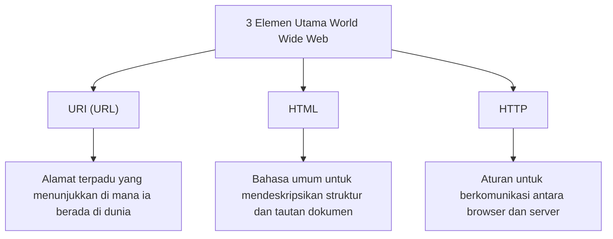

## Prolog: Bermimpi tentang Dunia yang Saling Terhubung

Dalam masyarakat modern, kita menggunakan "Web" seolah-olah itu adalah hal yang biasa. Membuka smartphone, membaca berita, menonton video, dan bertukar pesan secara instan dengan teman yang jauh. Sebuah jaringan ajaib di mana semua pengetahuan dan informasi di bumi ini terhubung tanpa batas dan dapat diakses secara bebas oleh siapa saja. Itulah "World Wide Web".

Namun, seberapa banyak orang yang benar-benar mengerti fakta bahwa penemuan besar yang mengubah dunia ini lahir dari pikiran satu programmer jenius, dan bahwa itu **"dibagikan ke seluruh dunia secara gratis, tanpa mengambil hak paten apa pun"**?

Nama pria itu adalah Tim Berners-Lee.

Dia tidak sekadar menemukan teknologi. Apa yang benar-benar dia temukan adalah **ide tentang Web terbuka**, yang berarti "informasi tidak boleh dimonopoli oleh perusahaan atau negara tertentu, tetapi harus terbuka untuk seluruh umat manusia". Jika dia telah mematenkan Web dan menuntut biaya lisensi, internet saat ini akan menjadi sesuatu yang sama sekali berbeda. Itu mungkin akan menjadi ruang jaringan yang tertutup dan menyesakkan, di mana hanya perusahaan besar yang memonopoli informasi dan kita akan dikenakan biaya setiap kali kita mendapatkan informasi.

Dalam artikel ini, kita akan menggali lebih dalam tentang bagaimana Tim Berners-Lee menemukan Web. Mulai dari tantangan berat di Organisasi Eropa untuk Riset Nuklir (CERN), konsep awal proyek "Enquire", hingga tiga inovasi teknologi yang mengguncang dunia dari akarnya (HTTP, HTML, URI). Selanjutnya, kita akan menelusuri secara detail jejak langkahnya yang luar biasa dan hebat: mengapa ia melepaskan hak patennya dan berjuang untuk melindungi idealisme Web terbuka bahkan dengan mendirikan W3C (World Wide Web Consortium).

---

## Bab 1: Lautan Informasi yang Kacau dan Tantangan CERN

Kisah ini dimulai pada tahun 1980 di pinggiran Jenewa, Swiss. Kembali ke Organisasi Eropa untuk Riset Nuklir, yang biasa dikenal sebagai **CERN**, yang memiliki fasilitas eksperimen bawah tanah raksasa yang melintasi perbatasan Prancis.

CERN adalah benteng pengetahuan di mana ribuan fisikawan dan insinyur kelas atas dari seluruh dunia berkumpul, menjalankan proyek besar siang dan malam untuk memecahkan misteri asal usul alam semesta dan partikel elementer. Namun, CERN pada saat itu menghadapi "krisis manajemen informasi" yang sangat serius dan fatal.

### Laboratorium yang Berubah Menjadi Menara Babel

Para peneliti dari seluruh dunia menggunakan komputer dari produsen yang berbeda, sistem operasi (OS) yang berbeda, standar jaringan yang berbeda, dan bahkan format data yang berbeda yang mereka bawa dari negara asal mereka masing-masing.
Mesin IBM berjalan di satu laboratorium, VAX dari DEC berjalan di ruangan lain, dan sistem berpemilik beroperasi di tempat lain. Bahkan jika satu tim merekam data eksperimen yang luar biasa, agar tim lain dapat membaca data tersebut, mereka harus bersusah payah menyalinnya secara fisik ke pita magnetik, mengonversi format, dan entah bagaimana membuatnya dapat dibaca antara sistem yang tidak kompatibel.

CERN pada masa itu bagaikan "Menara Babel" di mana pembangunannya terhenti karena mereka tidak dapat memahami bahasa satu sama lain.

"Siapa yang terlibat dalam proyek mana?" "Di komputer mana dan di mana data eksperimen itu disimpan?" "Siapa yang memiliki versi perangkat lunak terbaru?"

Hanya untuk mencari informasi dasar seperti itu, para peneliti membuang banyak waktu. Menelepon, berjalan di lorong, mencari catatan di papan tulis. Meskipun merupakan fasilitas penelitian untuk fisika mutakhir, cara berbagi informasi terlalu kuno dan tidak efisien.

### Kelahiran "Enquire": Meniru Jaringan Otak

Pada tahun 1980, Tim Berners-Lee muda, yang baru saja ditugaskan ke CERN sebagai insinyur perangkat lunak, menghadapi fragmentasi informasi yang menyedihkan ini dan merasa sangat tidak puas. Secara alami, dia memiliki minat yang kuat pada hubungan dan keterkaitan antara berbagai hal.

"Otak manusia tidak mengingat sesuatu dengan struktur folder hierarkis. Otak mengingat dan menarik informasi melalui jaringan 'koneksi (tautan)' yang acak dari satu konsep ke konsep lainnya. Tidak bisakah informasi di komputer ditautkan secara fleksibel dengan cara yang sama?"

Berangkat dari gagasan ini, ia mengembangkan sebuah program bernama **"Enquire"** sebagai proyek pribadi. Nama itu berasal dari ensiklopedia rumah tangga era Victoria, "Enquire Within Upon Everything" (Selidiki Semuanya di Dalam), yang ia kenal sejak kecil.

Enquire seperti sistem Wiki saat ini. Itu adalah terobosan yang memungkinkan setiap kata atau konsep dalam sistem ditautkan ke dokumen lain, menyimpan keterkaitan informasi dalam bentuk jaringan. Namun, Enquire pada saat itu hanya bekerja di dalam satu sistem, dan tidak dapat menghubungkan berbagai komputer yang tersebar di seluruh CERN. Seiring berakhirnya masa jabatan Tim, program ini secara bertahap terlupakan.

Namun, "Enquire" inilah yang mengandung DNA penting yang kelak akan menjadi dasar dari World Wide Web.

---

## Bab 2: Tiga Keajaiban yang Menghubungkan Dunia —— HTTP, HTML, URI

Pada tahun 1984, Tim kembali ke CERN. Situasinya menjadi lebih buruk dari sebelumnya, dan meskipun jaringan CERN mulai terhubung dengan seluruh dunia karena penyebaran internet, sistem informasi masih tetap terpecah-pecah.

Pada bulan Maret 1989, ia menyerahkan proposal bersejarah kepada atasannya, Mike Sendall, yang mengusulkan solusi radikal untuk manajemen informasi. Judulnya adalah **"Information Management: A Proposal"**.

Terhadap proposal ini, atasannya Sendall menulis di margin:
**"Vague but exciting..." (Samar tapi sangat menarik...)**

Komentar singkat ini menjadi titik balik sejarah. Meskipun tidak segera mendapatkan anggaran sebagai proyek yang jelas, Tim diizinkan untuk membangun sistem ini di waktu luangnya. Ia mendapatkan "NeXTcube" dari NeXT yang dipimpin oleh Steve Jobs, yang merupakan workstation tercanggih saat itu, dan membenamkan dirinya dalam pengembangan.

Tantangan terbesar yang dihadapi Tim adalah menciptakan "sistem universal yang memungkinkan akses ke informasi dengan cara yang konsisten dari komputer mana pun, OS mana pun, dan jaringan mana pun di dunia". Untuk mewujudkannya, alih-alih membuat satu perangkat lunak, ia merancang "tiga aturan universal (protokol dan standar)" untuk pertukaran informasi. Inilah penemuan hebat yang menjadi tulang punggung Web hingga hari ini.

### 1. URI (Uniform Resource Identifier)
Inovasi pertama adalah menyatukan "alamat" informasi. Komputer mana, direktori mana, dan file mana di seluruh dunia. Aturan penamaan universal untuk secara unik mengidentifikasi hal ini adalah URI (sekarang umumnya disebut URL).
Dengan menemukan string karakter yang dimulai dengan `http://...`, menjadi mungkin untuk memberikan "alamat unik" ke semua informasi di dunia.

### 2. HTML (HyperText Markup Language)
Yang kedua adalah HTML, bahasa untuk mendeskripsikan struktur dokumen dan menyematkan tautan ke dokumen lain.
Tim sangat menyederhanakan bahasa markup yang ada (SGML) sehingga para fisikawan di CERN dapat dengan mudah membuat dokumen. Penemuan terbesar HTML adalah kemampuannya untuk membuat "hyperlink" ke dokumen mana pun di server mana pun di dunia menggunakan tag `<a href="...">`. Tautan inilah yang mengembangkan Web dari sekadar kumpulan dokumen menjadi jaringan informasi (Web) yang meluas tanpa batas.

### 3. HTTP (Hypertext Transfer Protocol)
Yang ketiga adalah aturan pertukaran informasi, HTTP.
Pada saat itu, FTP (File Transfer Protocol) sudah ada, tetapi rumit dan memakan waktu. HTTP yang dirancang oleh Tim adalah protokol "stateless" (tidak memiliki keadaan) yang sangat sederhana, yang terdiri dari "Request (Tolong berikan informasi)" dan "Response (Ya, ini dia)". Karena kesederhanaan ini, beban pada server menjadi kecil, dan memungkinkan penjelajahan yang nyaman yang melompat dari satu tautan ke tautan lain dalam sekejap.

Pada akhir tahun 1990, Tim menyelesaikan server Web pertama di dunia (info.cern.ch) dan browser Web pertama di dunia "WorldWideWeb" (kemudian diganti namanya menjadi Nexus).
Untuk pertama kalinya dalam sejarah umat manusia, itu adalah momen ketika informasi dihubungkan secara mulus oleh hyperlink yang melampaui batas negara dan model komputer.

---

## Bab 3: Keputusan Terbesar —— Filosofi "Tidak Memiliki Hak Paten"

Seiring dengan selesainya teknologi dasar Web dan penggunaannya menyebar di dalam CERN dan beberapa institusi akademik, kenyamanan yang luar biasa ini menjadi jelas. Tim mulai dibanjiri pertanyaan dari seluruh dunia yang berkata, "Kami ingin menggunakan sistem ini."

Di sini, Tim Berners-Lee membuat **keputusan terhebat dalam sejarah** yang akan menentukan dunia masa depan.

Jika dia, pada saat itu, mematenkan teknologi HTML, HTTP, dan URI, dan membangun model bisnis yang memungut biaya lisensi dari perusahaan yang menggunakannya, dia niscaya akan menjadi miliarder terkaya di dunia. Dalam industri TI pada saat itu, mematenkan perangkat lunak dan menguncinya adalah strategi bisnis yang sudah semestinya. Perusahaan raksasa seperti Microsoft, IBM, dan Apple semuanya mempromosikan standar jaringan berpemilik mereka sendiri dan mencoba mengunci pengguna ke dalam ekosistem mereka sendiri.

Namun, Tim berbeda. Dia membujuk atasannya dan manajemen CERN, **dan pada 30 April 1993, CERN merilis deklarasi bersejarah yang menyatakan, "Teknologi World Wide Web dilepas ke domain publik, dan siapa pun dapat menggunakannya dengan bebas tanpa biaya royalti."**

Mengapa dia melepaskan hak patennya?
Di sanalah terdapat keyakinan kuat Tim dan "filosofi Web terbuka".

1. **Syarat Mutlak untuk Penyebaran Universal**
   Tim percaya, "Jika ada biaya penggunaan atau batasan lisensi sekecil apa pun di Web, usaha kecil dan menengah, individu, dan orang-orang di negara berkembang di seluruh dunia tidak akan dapat menggunakannya, dan jaringan akan terpecah belah." Ia yakin bahwa nilai sejati Web terletak pada "kemampuan siapa saja untuk berpartisipasi", dan untuk tujuan itu, ia harus sepenuhnya gratis dan terbuka.

2. **Penolakan terhadap Sentralisasi**
   Memiliki hak paten berarti memberikan wewenang (kontrol) kepada seseorang untuk mengizinkan atau tidak mengizinkan penggunaannya. Tim berharap Web bukanlah sistem terpusat yang dapat dikendalikan oleh pemerintah atau perusahaan tertentu, melainkan "sistem terdesentralisasi" di mana setiap orang dapat dengan bebas mendirikan server dan menyebarkan informasi.

Keputusan ini memicu pertumbuhan Web yang eksplosif. Bebas dari kekhawatiran tentang paten, para programmer dari seluruh dunia berlomba-lomba mengembangkan browser (seperti Mosaic dan Netscape) dan perangkat lunak server (seperti Apache), dan perusahaan meluncurkan situs web satu demi satu. Jika Tim berpegang teguh pada hak patennya, Web akan terkubur sebagai salah satu dari lusinan "layanan jaringan milik perusahaan", dan masyarakat internet global saat ini tidak akan pernah tiba.

---

## Bab 4: Pembentukan W3C dan Pertarungan Melindungi Masa Depan Web

Ketika Web menjadi tren global, krisis baru melanda. Perusahaan seperti Netscape dan Microsoft (Internet Explorer) memicu perang browser, dan mulai menambahkan "tag HTML ekstensi eksklusif" satu per satu yang hanya dapat dilihat di browser perusahaan mereka.
Pada tingkat ini, Web akan kembali terbagi seperti "Menara Babel", dan situasi di mana "Halaman ini hanya dapat dilihat dengan browser tertentu" akan merajalela (kenyataannya, hampir berada dalam kondisi seperti itu di akhir 90-an).

Untuk mencegah fragmentasi Web, Tim Berners-Lee pindah ke Massachusetts Institute of Technology (MIT) pada tahun 1994, dan mendirikan **W3C (World Wide Web Consortium)**.

W3C adalah konsorsium nirlaba internasional yang merumuskan standar teknologi Web. Sebagai direktur W3C, Tim menengahi konflik sengit antara perusahaan-perusahaan dan dengan gigih mempertahankan prinsip bahwa "standar Web tidak boleh menguntungkan perusahaan tertentu, dan harus terbuka dan bebas royalti."
Tanpa aktivitas W3C, saat ini kita mungkin terpaksa menggunakan internet yang terpecah belah bagaikan mimpi buruk, di mana kita tidak dapat melihat situs Microsoft dari perangkat Apple, dan tidak dapat mengakses Amazon dari browser Google.

### Gairah yang Tak Berkesudahan untuk Web Terbuka

Saat ini, Tim Berners-Lee juga menyuarakan peringatan keras terhadap sisi negatif Web saat ini, seperti monopoli data oleh raksasa TI, pelanggaran privasi, dan penyebaran berita palsu.
Ia berpendapat bahwa "Web pada dasarnya ada untuk memberdayakan orang-orang, bukan agar perusahaan mengeksploitasi data pengguna," dan ia terus berjuang untuk memperbaiki Web hingga hari ini, seperti dengan mengembangkan "Solid", sebuah platform terdesentralisasi yang memungkinkan pengguna untuk mengendalikan data mereka sendiri.

---

## Epilog: Tongkat Estafet yang Kita Terima

Kisah Tim Berners-Lee bukanlah sekadar sejarah penemuan teknologi. Ini adalah kisah tentang idealisme yang mulia dan indah bahwa "infrastruktur untuk berbagi pengetahuan manusia dan menghubungkan orang-orang tidak boleh dimonopoli demi keuntungan dan kekuasaan."

Fakta bahwa kita dapat mengetik URL, mengklik tautan, dan menyebarkan informasi secara bebas setiap hari adalah karena, pada awal tahun 1990-an di CERN, satu orang membuat keputusan tanpa pamrih yang luar biasa untuk "tidak memiliki hak paten."

Kita saat ini berdiri di atas taman bermain raksasa yang ia buka secara gratis. Untuk menghubungkan kekayaan bersama umat manusia yang disebut "Web terbuka" ini ke masa depan yang lebih bebas dan lebih kaya, tanpa mengurungnya di dalam sebagian tembok raksasa (walled garden). Mungkin itulah misi yang dibebankan kepada kita semua yang telah menerima tongkat estafet dari Tim Berners-Lee.
