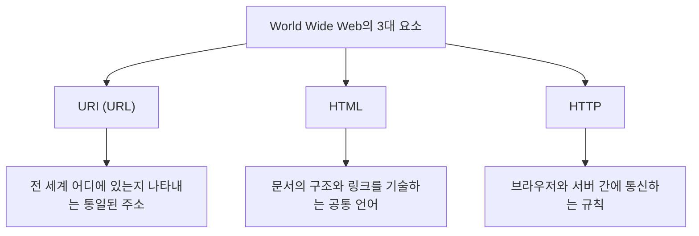

## 서장: 모든 것이 연결된 세상을 꿈꾸며

현대 사회에서 우리는 너무나 당연하게 '웹(Web)'을 이용하고 있습니다. 스마트폰을 열어 뉴스를 읽고, 동영상을 시청하며, 멀리 떨어진 친구들과 순식간에 메시지를 주고받습니다. 지구상의 모든 지식과 정보가 끊김 없이 연결되어, 누구나 자유롭게 접근할 수 있는 마법 같은 네트워크. 그것이 바로 '월드 와이드 웹(World Wide Web)'입니다.

하지만 이 세상을 바꾼 거대한 발명이 단 한 명의 천재 프로그래머의 머리에서 탄생했으며, 심지어 **"어떠한 특허도 취득하지 않고, 완전히 무료로 전 세계에 공개되었다"**는 사실을 얼마나 많은 사람들이 깊이 이해하고 있을까요?

그 사나이의 이름은 팀 버너스리(Tim Berners-Lee).

그는 단순히 기술을 발명한 것에 그치지 않았습니다. 그가 진정으로 발명한 것은 "정보는 특정 기업이나 국가가 독점해서는 안 되며, 인류 모두에게 열려 있어야 한다"는 **오픈 웹의 사상** 그 자체였습니다. 만약 그가 웹의 특허를 취득하고 라이선스 비용을 요구했다면, 오늘날의 인터넷은 전혀 다른 모습이었을 것입니다. 대기업만이 정보를 독점하고, 우리는 정보를 얻을 때마다 과금되는 폐쇄적이고 답답한 네트워크 공간이 되었을지도 모릅니다.

본고에서는 팀 버너스리가 어떻게 웹을 발명했는지, 유럽 입자 물리 연구소(CERN)에서의 가혹한 과제, 초기 구상인 'Enquire' 프로젝트, 그리고 세상을 근본적으로 뒤집은 3가지 기술적 혁신(HTTP, HTML, URI)에 대해 깊이 파헤칩니다. 나아가 그가 왜 특허를 포기하고, W3C(World Wide Web Consortium)를 설립하면서까지 오픈 웹의 이상을 지켜내려 했는지, 그 기구하고도 위대한 발자취를 상세히 더듬어 봅니다.

---

## 제1장: 혼돈의 정보 바다와 CERN의 과제

이야기의 시작은 1980년 스위스 제네바 교외, 프랑스와의 국경에 걸친 거대한 지하 실험 시설을 가진 유럽 입자 물리 연구소, 통칭 **CERN(세른)**으로 거슬러 올라갑니다.

CERN은 전 세계에서 수천 명의 최정상급 물리학자와 엔지니어들이 모여, 우주의 기원과 소립자의 수수께끼를 풀기 위한 거대 프로젝트를 밤낮으로 진행하는 지식의 요새입니다. 그러나 당시의 CERN은 심각하고도 치명적인 '정보 관리의 위기'에 직면해 있었습니다.

### 바벨탑이 되어버린 연구소

세계 각국에서 모인 연구자들은 각자 자국에서 가져온 다른 제조사의 컴퓨터, 다른 운영체제(OS), 다른 네트워크 규격, 심지어는 다른 데이터 포맷을 사용하고 있었습니다.
어느 연구실에서는 IBM의 머신이 가동되고, 다른 방에서는 DEC의 VAX가 돌아가며, 또 다른 곳에서는 독자적인 시스템이 움직이고 있었습니다. 한 팀이 훌륭한 실험 데이터를 기록해도, 다른 팀이 그 데이터를 읽기 위해서는 일부러 자기 테이프에 물리적으로 복사하고, 포맷을 변환하여, 호환성 없는 시스템 간에 어떻게든 읽어 들이게 해야 했습니다.

당시의 CERN은 마치 언어가 통하지 않아 건설이 좌절된 '바벨탑'과 같았습니다.

"누가 어떤 프로젝트에 참여하고 있는가?" "그 실험 데이터는 어느 컴퓨터의 어디에 저장되어 있는가?" "소프트웨어의 최신 버전은 누가 가지고 있는가?"

이러한 기본적인 정보를 찾는 데만 연구자들은 막대한 시간을 낭비했습니다. 전화를 걸고, 복도를 돌아다니며, 화이트보드의 메모를 찾았습니다. 최첨단 물리학을 연구하는 시설임에도 불구하고, 정보의 공유 수단은 너무나도 전시대적이고 비효율적이었습니다.

### 'Enquire'의 탄생: 뇌의 네트워크를 모방하다

1980년, 소프트웨어 엔지니어로 CERN에 부임한 젊은 시절의 팀 버너스리는 이 절망적인 정보의 단절에 직면하고 강한 불만을 품었습니다. 그는 태생적으로 사물의 연결고리나 관련성에 강한 흥미를 가지고 있었습니다.

"인간의 뇌는 계층적인 폴더 구조로 사물을 기억하는 것이 아니다. 어떤 개념에서 다른 개념으로, 무작위적이고 그물망 같은 '연결(링크)'을 통해 정보를 기억하고 이끌어낸다. 컴퓨터 상의 정보도 이와 똑같이 유연하게 연결할 수 있지 않을까?"

이 착상에서 그는 개인적인 프로젝트로 **'Enquire(인콰이어)'**라는 프로그램을 개발했습니다. 명칭의 유래는 그가 어린 시절 즐겨 읽었던 빅토리아 시대의 가정용 백과사전 『Enquire Within Upon Everything(모든 것에 대해 내부를 탐구하라)』에서 따왔습니다.

Enquire는 현재의 위키(Wiki) 시스템과 같은 것이었습니다. 시스템 내의 모든 단어나 개념을 다른 문서로 링크할 수 있었고, 정보의 관련성을 네트워크 형태로 저장할 수 있는 획기적인 것이었습니다. 그러나 당시의 Enquire는 어디까지나 단일 시스템 내에서 완결되어 있었으며, CERN 전체에 걸친 서로 다른 컴퓨터들을 연결할 수는 없었습니다. 팀의 임기가 끝남과 동시에 이 프로그램은 점차 잊혀 갔습니다.

하지만 이 'Enquire'야말로 훗날 월드 와이드 웹의 기초가 되는 중요한 DNA를 품고 있었던 것입니다.

---

## 제2장: 세상을 연결하는 3가지 마법——HTTP, HTML, URI

1984년, 팀은 다시 CERN으로 돌아왔습니다. 상황은 이전보다 훨씬 악화되어 있었고, 인터넷의 보급으로 CERN의 네트워크는 전 세계와 연결되기 시작했지만 여전히 정보 시스템은 뿔뿔이 흩어진 상태였습니다.

1989년 3월, 그는 상사인 마이크 센달에게 정보 관리의 근본적인 해결책을 제안하는 역사적인 기획서를 제출합니다. 그 제목은 **『Information Management: A Proposal(정보 관리: 하나의 제안)』**.

이 제안서에 대해 상사 센달은 여백에 이렇게 적었습니다.
**"Vague but exciting..."(모호하지만, 매우 흥미롭다)**

이 짧은 코멘트가 역사의 전환점이 되었습니다. 명확한 프로젝트로서의 예산은 바로 배정되지 않았지만, 팀은 남는 시간을 활용해 이 시스템의 구축을 허락받은 것입니다. 그는 당시 최첨단 워크스테이션이었던 스티브 잡스가 이끄는 NeXT사의 'NeXTcube'를 손에 넣고 개발에 몰두했습니다.

팀이 직면한 최대의 과제는 "전 세계의 어떠한 컴퓨터, 어떠한 OS, 어떠한 네트워크에서라도 일관된 방법으로 정보에 접근할 수 있는 보편적인 시스템"을 만드는 것이었습니다. 이를 실현하기 위해 그는 단일 소프트웨어를 만드는 것이 아니라, 정보의 교환에 관한 '3가지 보편적인 규칙(프로토콜과 규격)'을 설계했습니다. 이것이 오늘날까지 웹의 근간을 이루는 대발명입니다.

### 1. URI (Uniform Resource Identifier)
첫 번째 혁신은 정보의 '주소'를 통일하는 것이었습니다. 전 세계의 어느 컴퓨터, 어느 디렉토리에 있는, 어느 파일인가. 이를 고유하게 특정하기 위한 보편적인 명명 규칙이 URI(현재 일반적으로 URL이라 불리는 것)입니다.
"`http://...`"로 시작하는 이 문자열을 발명함으로써, 전 세계의 모든 정보에 '유일무이한 주소'를 부여하는 것이 가능해졌습니다.

### 2. HTML (HyperText Markup Language)
두 번째는 문서의 구조를 기술하고 다른 문서로의 링크를 삽입하기 위한 언어, HTML입니다.
팀은 CERN의 물리학자들이 쉽게 문서를 작성할 수 있도록, 기존의 마크업 언어(SGML)를 극도로 단순화했습니다. HTML의 최대 발명은 `<a href="...">`라는 태그를 통해 전 세계 어느 서버에 있는 문서로도 '하이퍼링크'를 연결할 수 있게 한 점에 있습니다. 이 링크야말로 웹을 단순한 문서의 집합에서 무한히 확장되는 정보의 망(Web)으로 진화시킨 것입니다.

### 3. HTTP (Hypertext Transfer Protocol)
세 번째는 정보 교환의 규칙, HTTP입니다.
당시 이미 FTP(파일 전송 프로토콜) 등은 존재했지만 복잡하고 시간이 걸렸습니다. 팀이 설계한 HTTP는 "요청(정보를 주세요)"과 "응답(네, 여기 있습니다)"이라는 극히 단순하고 무상태성(상태를 가지지 않는)을 지닌 프로토콜이었습니다. 이 단순함 덕분에 서버에 가해지는 부하가 적고, 순식간에 링크에서 링크로 뛰어다니는 쾌적한 브라우징이 가능해졌습니다.

1990년 말, 팀은 세계 최초의 웹 서버(info.cern.ch)와 세계 최초의 웹 브라우저 'WorldWideWeb(후에 Nexus로 개칭)'을 완성합니다.
인류 역사상 처음으로, 정보가 국경도 컴퓨터의 기종도 뛰어넘어 하이퍼링크를 통해 끊김 없이 연결된 순간이었습니다.

---

## 제3장: 최대의 결단——'특허를 가지지 않는다'는 철학

웹의 기초 기술이 완성되고 CERN 내부 및 일부 학술 기관에서 이용이 확산되면서, 그 압도적인 편리함이 명확해졌습니다. 팀에게는 전 세계로부터 "이 시스템을 사용하고 싶다"는 문의가 쇄도하기 시작했습니다.

여기서 팀 버너스리는 훗날의 세계를 결정짓는 **역사상 가장 위대한 결단**을 내립니다.

만약 그가 이 시점에서 HTML, HTTP, URI 기술에 대해 특허를 취득하고 이용 기업으로부터 라이선스 비용을 징수하는 비즈니스 모델을 세웠다면, 그는 틀림없이 세계 최고의 억만장자가 되었을 것입니다. 당시 IT 업계에서 소프트웨어의 특허화와 독점은 당연한 비즈니스 전략이었습니다. Microsoft, IBM, Apple과 같은 거대 기업들은 앞다투어 독자적인 네트워크 규격을 추진하며 사용자들을 자사의 생태계에 가두려 하고 있었습니다.

하지만 팀은 달랐습니다. 그는 상사와 CERN의 경영진을 설득하여, **1993년 4월 30일, CERN은 "World Wide Web의 기술을 퍼블릭 도메인(공유물)으로 하고, 누구나 특허료 없이 자유롭게 사용할 수 있다"는 역사적인 선언을 발표했습니다.**

왜 그는 특허를 포기했을까요?
그곳에는 팀의 강인한 신념과 '오픈 웹의 철학'이 있었습니다.

1. **보편적인 보급을 위한 절대 조건**
   팀은 "만약 웹에 조금이라도 이용료나 라이선스 제한이 있다면, 전 세계의 중소기업이나 개인, 개발도상국의 사람들은 이용할 수 없고 네트워크는 분단되어 버릴 것"이라고 생각했습니다. 웹의 진정한 가치는 '누구나 참여할 수 있다는 것'에 있으며, 이를 위해서는 완전히 무료이고 개방되어야 한다고 확신했던 것입니다.

2. **중앙집권화의 거부**
   특허를 가진다는 것은 누군가에게 이용 허가 및 불허의 권한(통제권)을 부여한다는 의미입니다. 팀은 웹을 특정 정부나 기업이 지배할 수 있는 중앙집권적인 시스템이 아니라, 누구나 자유롭게 서버를 구축하고 정보를 발신할 수 있는 '분산형 시스템'으로 만들고자 했습니다.

이 결단으로 인해 웹은 폭발적인 성장을 이룩합니다. 특허에 대한 걱정이 없기 때문에 전 세계의 프로그래머들이 앞다투어 브라우저(Mosaic이나 Netscape 등)와 서버 소프트웨어(Apache 등)를 개발했고, 기업들은 차례차례 웹사이트를 개설했습니다. 만약 팀이 특허에 매달렸다면, 웹은 수십 개의 '기업 독자적인 네트워크 서비스' 중 하나로 묻히고, 현재의 글로벌한 인터넷 사회는 도래하지 않았을 것입니다.

---

## 제4장: W3C의 창설과 웹의 미래를 지키는 싸움

웹이 세계적인 붐을 일으키자 새로운 위기가 찾아왔습니다. Netscape나 Microsoft(Internet Explorer) 같은 기업들이 브라우저 전쟁을 일으키며, 자사의 브라우저에서만 볼 수 있는 '독자적으로 확장된 HTML 태그'를 차례로 추가하기 시작한 것입니다.
이대로라면 웹은 다시 '바벨탑'처럼 분단되어, "이 페이지는 특정 브라우저에서만 볼 수 있습니다"라는 상황이 만연하게 됩니다(실제로 90년대 후반에는 그러한 상태에 빠질 뻔했습니다).

웹의 분열을 막기 위해 팀 버너스리는 1994년, 매사추세츠 공과대학교(MIT)로 이적하여 **W3C(World Wide Web Consortium)**를 설립했습니다.

W3C는 웹의 기술 표준을 제정하는 국제적인 비영리 컨소시엄입니다. 팀은 W3C의 디렉터로서 기업 간의 격렬한 대립을 중재하고, "웹의 표준 규격은 특정 기업에 유리한 것이 아니라 개방적이고 로열티 프리(Royalty-Free)여야 한다"는 원칙을 철저히 지켜냈습니다.
W3C의 활동이 없었다면 오늘날의 우리는 Apple 기기에서는 Microsoft의 사이트를 볼 수 없고, Google의 브라우저로는 Amazon에 접속할 수 없는, 악몽처럼 분단된 인터넷을 강제로 사용해야 했을지도 모릅니다.

### 끝나지 않는 오픈 웹을 향한 열정

오늘날 팀 버너스리는 거대 IT 기업에 의한 데이터 독점이나 프라이버시 침해, 가짜 뉴스의 확산 등 현재의 웹이 안고 있는 부정적인 측면에 대해서도 강한 경종을 울리고 있습니다.
그는 "웹은 본래 사람들에게 힘을 부여하기 위한 것이지, 기업이 사용자의 데이터를 착취하기 위한 것이 아니다"라고 주장하며, 현재는 사용자 스스로가 자신의 데이터를 통제할 수 있는 분산형 플랫폼 'Solid'의 개발에 몰두하는 등 지금도 웹의 개선을 향해 계속해서 투쟁하고 있습니다.

---

## 종장: 우리가 이어받은 바통

팀 버너스리의 이야기는 단순한 기술적 발명의 역사가 아닙니다. 그것은 "인류의 지식을 공유하고 사람들을 연결하기 위한 인프라는 이익이나 권력에 의해 독점되어서는 안 된다"는, 숭고하고 아름다운 이상의 이야기입니다.

우리가 매일 무심코 URL을 입력하고, 링크를 클릭하며, 자유롭게 정보를 발신할 수 있는 것은 1990년대 초반 CERN에서 한 사나이가 '특허를 가지지 않겠다'는 믿을 수 없을 만큼 이타적인 결단을 내렸기 때문입니다.

우리는 지금 그가 무료로 개방해 준 거대한 놀이터 위에 서 있습니다. 이 '오픈 웹'이라는 인류 공통의 재산을 일부의 거대한 장벽(Walled Garden) 안에 가두지 않고, 더욱 자유롭고 풍요로운 미래로 이어가는 것. 그것이야말로 팀 버너스리로부터 바통을 이어받은 우리 모두에게 부여된 사명일지도 모릅니다.
