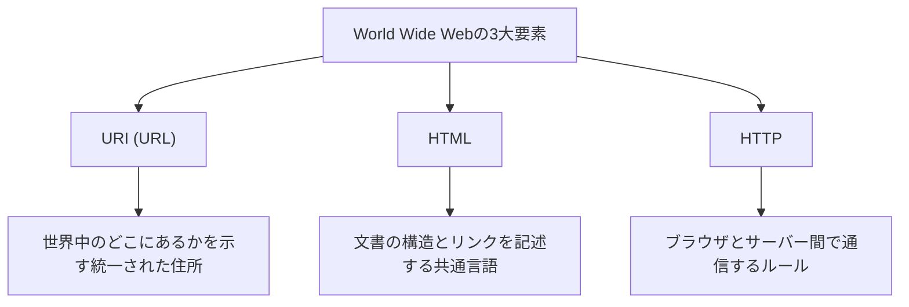

## 序章：すべてが繋がる世界を夢見て

現代社会において、私たちは当たり前のように「Web」を利用しています。スマートフォンを開き、ニュースを読み、動画を視聴し、遠く離れた友人たちと瞬時にメッセージをやり取りする。この地球上のあらゆる知識と情報がシームレスに繋がり、誰でも自由にアクセスできる魔法のようなネットワーク。それが「World Wide Web（ワールド・ワイド・ウェブ）」です。

しかし、この世界を変えた巨大な発明が、たった一人の天才プログラマーの頭脳から生まれ、しかも**「一切の特許を取得せず、完全に無料で世界に公開された」**という事実を、どれだけの人が深く理解しているでしょうか。

その男の名は、ティム・バーナーズ＝リー（Tim Berners-Lee）。

彼は単に技術を発明しただけではありません。彼が真に発明したものは、「情報は特定の企業や国家に独占されるべきではなく、人類すべてに開かれたものであるべきだ」という**オープンWebの思想**そのものでした。もし彼がWebの特許を取得し、ライセンス料を要求していたら、今日のインターネットは全く違う形になっていたでしょう。大企業だけが情報を独占し、私たちは情報を得るたびに課金されるような、閉鎖的で窮屈なネットワーク空間になっていたかもしれません。

本稿では、ティム・バーナーズ＝リーがどのようにしてWebを発明したのか。欧州原子核研究機構（CERN）での過酷な課題、初期の構想である「Enquire」プロジェクト、そして世界を根底から覆した3つの技術的革新（HTTP、HTML、URI）について深く掘り下げます。さらに、彼がなぜ特許を放棄し、W3C（World Wide Web Consortium）を立ち上げてまでオープンWebの理想を守り抜こうとしたのか、その数奇で偉大な足跡を詳細に辿ります。

---

## 第1章：混沌たる情報の海とCERNの課題

物語の始まりは、1980年のスイス・ジュネーヴ郊外。フランスとの国境にまたがる巨大な地下実験施設を持つ欧州原子核研究機構、通称**CERN（セルン）**に遡ります。

CERNは、世界中から数千人ものトップクラスの物理学者やエンジニアが集まり、宇宙の起源や素粒子の謎を解き明かすための巨大プロジェクトを日夜進行させている知の要塞です。しかし、当時のCERNは、深刻かつ致命的な「情報管理の危機」に直面していました。

### バベルの塔と化した研究所

世界各国から集まる研究者たちは、それぞれ自国から持ち込んだ異なるメーカーのコンピュータ、異なるオペレーティングシステム（OS）、異なるネットワーク規格、さらには異なるデータフォーマットを使用していました。
ある研究室ではIBMのマシンが稼働し、別の部屋ではDECのVAXが動き、また別の場所では独自のシステムが動いている。あるチームが素晴らしい実験データを記録しても、別のチームがそのデータを読むためには、わざわざ磁気テープに物理的にコピーし、フォーマットを変換し、互換性のないシステム間でどうにかして読み込ませる必要がありました。

当時のCERNは、まるで言語が通じずに建設が頓挫した「バベルの塔」のようでした。

「誰がどのプロジェクトに関わっているのか？」「あの実験データはどのコンピュータのどこに保存されているのか？」「ソフトウェアの最新バージョンは誰が持っているのか？」

こうした基本的な情報を探すためだけに、研究者たちは膨大な時間を浪費していました。電話をかけ、廊下を歩き回り、ホワイトボードのメモを探す。最先端の物理学を研究する施設でありながら、情報の共有手段はあまりにも前時代的で非効率的だったのです。

### 「Enquire」の誕生：脳のネットワークを模倣する

1980年、ソフトウェアエンジニアとしてCERNに赴任してきた若き日のティム・バーナーズ＝リーは、この絶望的な情報の分断に直面し、強い不満を抱きました。彼は生来、物事の繋がりや関連性に強い興味を持っていました。

「人間の脳は、階層的なフォルダ構造で物事を記憶しているわけではない。ある概念から別の概念へと、ランダムかつ網の目のような『繋がり（リンク）』を通じて情報を記憶し、引き出している。コンピュータ上の情報も、同じように柔軟にリンクさせることができないだろうか？」

この着想から、彼は個人的なプロジェクトとして**「Enquire（エンクワイア）」**というプログラムを開発しました。名称の由来は、彼が幼少期に親しんだビクトリア朝時代の家庭用百科事典『Enquire Within Upon Everything（あらゆることについて内部を調べよ）』からです。

Enquireは、現在のWikiシステムのようなものでした。システム内のあらゆる単語や概念を別の文書へとリンクさせることができ、情報の関連性をネットワーク状に保存できる画期的なものでした。しかし、当時のEnquireはあくまで単一のシステム内で完結しており、CERN全体にまたがる異なるコンピュータ同士を繋ぐことはできませんでした。ティムの任期が終了するとともに、このプログラムは次第に忘れ去られていきました。

しかし、この「Enquire」こそが、後のWorld Wide Webの基礎となる重要なDNAを孕んでいたのです。

---

## 第2章：世界を繋ぐ3つの魔法——HTTP、HTML、URI

1984年、ティムは再びCERNに戻ってきました。状況は以前よりもさらに悪化しており、インターネットの普及により、CERNのネットワークは世界中と繋がり始めていましたが、依然として情報システムはバラバラのままでした。

1989年3月、彼は上司のマイク・センダルに対し、情報管理の抜本的な解決策を提案する歴史的な企画書を提出します。そのタイトルは**『Information Management: A Proposal（情報管理：ひとつの提案）』**。

この提案書に対し、上司のセンダルは余白にこう書き込みました。
**"Vague but exciting..."（漠然としているが、非常に興味深い）**

この短いコメントが、歴史の転換点となりました。明確なプロジェクトとしての予算はすぐにはつきませんでしたが、ティムは空き時間を使ってこのシステムの構築を許可されたのです。彼は、当時の最新鋭のワークステーションであったスティーブ・ジョブズ率いるNeXT社の「NeXTcube」を手に入れ、開発に没頭しました。

ティムが直面した最大の課題は、「世界中のいかなるコンピュータ、いかなるOS、いかなるネットワークからでも、一貫した方法で情報にアクセスできる普遍的なシステム」を作ることでした。これを実現するために、彼は単一のソフトウェアを作るのではなく、情報のやり取りに関する「3つの普遍的なルール（プロトコルと規格）」を設計しました。これが今日までWebの根幹を成す大発明です。

### 1. URI (Uniform Resource Identifier)
最初の革新は、情報の「住所」を統一することでした。世界中のどのコンピュータの、どのディレクトリにある、どのファイルなのか。これを一意に特定するための普遍的な命名規則がURI（現在一般的にURLと呼ばれるもの）です。
「`http://...`」から始まるこの文字列を発明したことで、世界中のあらゆる情報に「唯一無二の住所」を与えることが可能になりました。

### 2. HTML (HyperText Markup Language)
2つ目は、文書の構造を記述し、他の文書へのリンクを埋め込むための言語、HTMLです。
ティムは、CERNの物理学者たちが簡単に文書を作成できるよう、既存のマークアップ言語（SGML）を極めてシンプルに簡略化しました。HTMLの最大の発明は、`<a href="...">` というタグによって、世界中のどのサーバーにある文書へも「ハイパーリンク」を張ることができるようにした点にあります。このリンクこそが、Webを単なる文書の集まりから、無限に広がる情報の網（Web）へと進化させたのです。

### 3. HTTP (Hypertext Transfer Protocol)
3つ目は、情報のやり取りのルール、HTTPです。
当時すでにFTP（ファイル転送プロトコル）などは存在していましたが、複雑で時間がかかりました。ティムが設計したHTTPは、「リクエスト（情報をください）」と「レスポンス（はい、どうぞ）」という極めて単純でステートレス（状態を持たない）なプロトコルでした。このシンプルさゆえに、サーバーへの負荷が少なく、瞬時にリンクからリンクへと飛び回る快適なブラウジングが可能になりました。

1990年末、ティムは世界初のWebサーバー（info.cern.ch）と、世界初のWebブラウザ「WorldWideWeb（後にNexusと改称）」を完成させます。
人類の歴史上初めて、情報が国境もコンピュータの機種も超えて、ハイパーリンクによってシームレスに結びつけられた瞬間でした。

---

## 第3章：最大の決断——「特許を持たない」という哲学

Webの基礎技術が完成し、CERN内部や一部の学術機関で利用が広がるにつれ、その圧倒的な利便性が明らかになってきました。ティムのもとには、世界中から「このシステムを使いたい」という問い合わせが殺到し始めました。

ここで、ティム・バーナーズ＝リーは、後の世界を決定づける**歴史上最も偉大な決断**を下します。

もし彼がこの時点で、HTML、HTTP、URIの技術に対して特許を取得し、利用企業からライセンス料を徴収するビジネスモデルを立ち上げていれば、彼は間違いなく世界一の億万長者になっていたでしょう。当時のIT業界において、ソフトウェアの特許化と囲い込みは当然のビジネス戦略でした。Microsoft、IBM、Appleといった巨大企業はこぞって独自のネットワーク規格を推進し、ユーザーを自社のエコシステムに囲い込もうとしていました。

しかし、ティムは違いました。彼は上司やCERNの経営陣を説得し、**1993年4月30日、CERNは「World Wide Webの技術をパブリックドメイン（公有）とし、誰もが特許料なしで自由に使用できる」とする歴史的な宣言を発表しました。**

なぜ彼は特許を放棄したのでしょうか？
そこには、ティムの強靭な信念と「オープンWebの哲学」がありました。

1. **普遍的な普及への絶対条件**
   ティムは、「もしWebに少しでも利用料やライセンスの制限があれば、世界中の中小企業や個人、発展途上国の人々は利用できず、ネットワークは分断されてしまう」と考えました。Webの真の価値は「あらゆる人が参加できること」にあり、そのためには完全に無料でオープンでなければならないと確信していたのです。

2. **中央集権化の拒絶**
   特許を持つということは、誰かに利用の許可・不許可の権限（コントロール）を与えるということです。ティムは、Webを特定の政府や企業が支配できる中央集権的なシステムではなく、誰もが自由にサーバーを立てて情報を発信できる「分散型システム」にしたいと願っていました。

この決断によって、Webは爆発的な成長を遂げます。特許の心配がないため、世界中のプログラマーが競ってブラウザ（MosaicやNetscapeなど）やサーバーソフトウェア（Apacheなど）を開発し、企業は次々とWebサイトを立ち上げました。もしティムが特許にしがみついていれば、Webは数十ある「企業独自のネットワークサービス」の一つとして埋もれ、現在のグローバルなインターネット社会は到来していなかったでしょう。

---

## 第4章：W3Cの創設とWebの未来を守る戦い

Webが世界的なブームとなると、新たな危機が訪れました。NetscapeやMicrosoft（Internet Explorer）といった企業がブラウザ戦争を引き起こし、自社のブラウザでしか見られない「独自拡張のHTMLタグ」を次々と追加し始めたのです。
このままでは、Webは再び「バベルの塔」のように分断され、「このページは特定のブラウザでしか見られません」という状況が蔓延してしまいます（実際に90年代後半はそのような状態に陥りかけました）。

Webの分裂を阻止するため、ティム・バーナーズ＝リーは1994年、マサチューセッツ工科大学（MIT）に移籍し、**W3C（World Wide Web Consortium）**を設立しました。

W3Cは、Webの技術標準を策定する国際的な非営利コンソーシアムです。ティムはW3Cのディレクターとして、企業間の激しい対立を仲裁し、「Webの標準規格は特定の企業に有利なものではなく、オープンでロイヤリティフリーでなければならない」という原則を徹底的に守り抜きました。
W3Cの活動がなければ、今日の私たちは、AppleのデバイスからはMicrosoftのサイトが見られず、GoogleのブラウザからはAmazonにアクセスできないような、悪夢のような分断されたインターネットを使わされていたかもしれません。

### 終わらないオープンWebへの情熱

今日、ティム・バーナーズ＝リーは、巨大IT企業によるデータの独占や、プライバシーの侵害、フェイクニュースの拡散など、現在のWebが抱える負の側面に対しても強い警鐘を鳴らしています。
彼は「Webは本来、人々に力を与えるためのものであり、企業がユーザーのデータを搾取するためのものではない」と主張し、現在はユーザー自身が自分のデータをコントロールできる分散型プラットフォーム「Solid」の開発に取り組むなど、今なおWebの改良に向けて闘い続けています。

---

## 終章：私たちが受け取ったバトン

ティム・バーナーズ＝リーの物語は、単なる技術的発明の歴史ではありません。それは、「人類の知識を共有し、人々を繋ぐためのインフラは、利益や権力によって独占されるべきではない」という、気高く美しい理想の物語です。

私たちが毎日何気なくURLを叩き、リンクをクリックし、自由に情報を発信できるのは、1990年代初頭のCERNで、一人の男が「特許を持たない」という信じられないような無私の決断を下したからです。

私たちは今、彼が無料で開放してくれた巨大な遊び場の上に立っています。この「オープンWeb」という人類共通の財産を、一部の巨大な壁（ウォールド・ガーデン）の中に閉じ込めることなく、さらに自由で豊かな未来へと繋いでいくこと。それこそが、ティム・バーナーズ＝リーからバトンを受け取った私たち全員に課せられた使命なのかもしれません。
