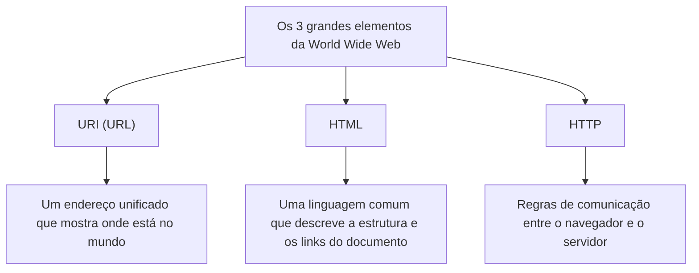

## Prólogo: Sonhando com um mundo onde tudo está conectado

Na sociedade moderna, nós usamos a "Web" como algo natural. Abrimos nossos smartphones, lemos as notícias, assistimos a vídeos e trocamos mensagens instantaneamente com amigos distantes. Uma rede mágica onde todo o conhecimento e informação do planeta estão perfeitamente conectados e livremente acessíveis a qualquer pessoa. Essa é a "World Wide Web".

No entanto, quantas pessoas compreendem profundamente o fato de que esta gigantesca invenção que mudou o mundo nasceu da mente de apenas um programador genial e que foi **"lançada para o mundo de forma totalmente gratuita, sem adquirir nenhuma patente"**?

O nome desse homem é Tim Berners-Lee.

Ele não inventou apenas uma tecnologia. O que ele verdadeiramente inventou foi a própria **filosofia da Web aberta**, de que "a informação não deve ser monopolizada por empresas específicas ou países, mas sim aberta a toda a humanidade". Se ele tivesse patenteado a Web e exigido taxas de licenciamento, a internet hoje seria completamente diferente. Poderia ter se tornado um espaço de rede fechado e restrito, onde apenas grandes empresas monopolizariam a informação e nós seríamos cobrados toda vez que tentássemos acessá-la.

Neste artigo, exploraremos profundamente como Tim Berners-Lee inventou a Web. Seus desafios rigorosos na Organização Europeia para a Pesquisa Nuclear (CERN), sua concepção inicial, o projeto "Enquire", e as três inovações tecnológicas que mudaram o mundo desde a raiz (HTTP, HTML, URI). Além disso, acompanharemos detalhadamente sua notável e grandiosa trajetória, entendendo por que ele abandonou a patente e até fundou o W3C (World Wide Web Consortium) para proteger o ideal de uma Web aberta.

---

## Capítulo 1: O caótico mar de informações e o desafio do CERN

A história começa em 1980, nos arredores de Genebra, Suíça. Voltamos à Organização Europeia para a Pesquisa Nuclear, conhecida como **CERN**, que possui uma gigantesca instalação de experimentos subterrânea abrangendo a fronteira com a França.

O CERN é uma fortaleza do conhecimento onde milhares dos melhores físicos e engenheiros do mundo se reúnem, trabalhando dia e noite em projetos massivos para desvendar as origens do universo e os mistérios das partículas elementares. No entanto, o CERN daquela época enfrentava uma "crise de gestão da informação" grave e fatal.

### O laboratório que se tornou a Torre de Babel

Os pesquisadores reunidos de todo o mundo usavam computadores de fabricantes diferentes, sistemas operacionais (OS) diferentes, padrões de rede diferentes e até formatos de dados diferentes que traziam de seus próprios países.
Em um laboratório, uma máquina IBM estava rodando, em outra sala, um VAX da DEC funcionava e, em outro lugar, um sistema proprietário operava. Mesmo que uma equipe gravasse dados experimentais maravilhosos, para que outra equipe lesse esses dados, eles precisavam copiá-los fisicamente para uma fita magnética, converter o formato e de alguma forma fazer com que fossem lidos entre sistemas incompatíveis.

O CERN naquela época era como a "Torre de Babel", onde a construção foi interrompida porque a linguagem não era compreendida.

"Quem está envolvido em qual projeto?" "Onde e em qual computador aqueles dados do experimento estão salvos?" "Quem tem a versão mais recente do software?"

Apenas para encontrar essas informações básicas, os pesquisadores desperdiçavam uma quantidade enorme de tempo. Fazendo ligações, andando pelos corredores, procurando por anotações em quadros brancos. Apesar de ser uma instalação de pesquisa em física de ponta, os meios de compartilhamento de informações eram extremamente antiquados e ineficientes.

### O nascimento do "Enquire": Imitando a rede do cérebro

Em 1980, o jovem Tim Berners-Lee, que chegou ao CERN como engenheiro de software, deparou-se com essa desesperadora fragmentação de informações e sentiu uma forte insatisfação. Por natureza, ele tinha um grande interesse nas conexões e relações entre as coisas.

"O cérebro humano não memoriza as coisas em uma estrutura hierárquica de pastas. Ele memoriza e recupera informações de um conceito para outro através de 'conexões (links)' aleatórias e em forma de rede. Não poderíamos conectar as informações em um computador de maneira tão flexível?"

A partir dessa ideia, ele desenvolveu um programa chamado **"Enquire"** como um projeto pessoal. A origem do nome veio de uma enciclopédia doméstica da era vitoriana com a qual ele estava familiarizado na infância, "Enquire Within Upon Everything" (Investigue Dentro Sobre Tudo).

O Enquire era semelhante aos sistemas Wiki atuais. Era um sistema inovador que permitia vincular qualquer palavra ou conceito dentro do sistema a outro documento, salvando as relações das informações em forma de rede. No entanto, o Enquire daquela época estava restrito apenas a um único sistema e não podia conectar computadores diferentes em todo o CERN. Com o fim do mandato de Tim, este programa foi gradualmente esquecido.

Contudo, este "Enquire" carregava o DNA crucial que se tornaria a base da futura World Wide Web.

---

## Capítulo 2: As 3 magias que conectam o mundo —— HTTP, HTML, URI

Em 1984, Tim retornou ao CERN. A situação havia piorado ainda mais e, com a popularização da internet, a rede do CERN começava a se conectar com o mundo, mas os sistemas de informação permaneciam fragmentados.

Em março de 1989, ele submeteu ao seu chefe, Mike Sendall, uma proposta histórica propondo uma solução radical para a gestão da informação. O título era **"Information Management: A Proposal" (Gestão da Informação: Uma Proposta)**.

Em resposta a esta proposta, o chefe Sendall escreveu na margem:
**"Vague but exciting..." (Vago, mas muito interessante)**

Este curto comentário tornou-se um ponto de virada na história. Embora o orçamento para um projeto claro não tenha sido alocado imediatamente, Tim recebeu permissão para construir este sistema usando seu tempo livre. Ele conseguiu um "NeXTcube" da empresa NeXT, liderada por Steve Jobs, que era a estação de trabalho mais avançada da época, e mergulhou no desenvolvimento.

O maior desafio que Tim enfrentou foi criar "um sistema universal que permitisse o acesso à informação de forma consistente de qualquer computador, qualquer sistema operacional e qualquer rede no mundo". Para realizar isso, ele não criou um único software, mas projetou "três regras universais (protocolos e padrões)" para a troca de informações. Esta é a grande invenção que forma a base da Web até hoje.

### 1. URI (Uniform Resource Identifier)
A primeira inovação foi unificar os "endereços" das informações. Em qual computador no mundo, em qual diretório, de qual arquivo se trata. A convenção de nomenclatura universal para identificar isso de forma única é a URI (o que agora chamamos geralmente de URL).
Ao inventar essa sequência de caracteres que começa com "`http://...`", tornou-se possível dar um "endereço único" a qualquer informação no mundo.

### 2. HTML (HyperText Markup Language)
O segundo é o HTML, uma linguagem para descrever a estrutura dos documentos e incorporar links para outros documentos.
Tim simplificou drasticamente a linguagem de marcação existente (SGML) para que os físicos do CERN pudessem criar documentos facilmente. A maior invenção do HTML está no fato de que, através da tag `<a href="...">`, tornou possível criar "hiperlinks" para documentos em qualquer servidor no mundo. Este link foi o que evoluiu a Web de uma mera coleção de documentos para uma teia (Web) de informações que se expande infinitamente.

### 3. HTTP (Hypertext Transfer Protocol)
O terceiro é a regra de troca de informações, o HTTP.
Na época, o FTP (Protocolo de Transferência de Arquivos) já existia, mas era complexo e demorado. O HTTP projetado por Tim era um protocolo extremamente simples e "stateless" (sem estado), baseado em "requisição (me dê a informação)" e "resposta (sim, aqui está)". Graças a essa simplicidade, a carga no servidor era baixa e a navegação confortável saltando instantaneamente de link em link tornou-se possível.

No final de 1990, Tim concluiu o primeiro servidor Web do mundo (info.cern.ch) e o primeiro navegador Web do mundo, "WorldWideWeb" (posteriormente renomeado para Nexus).
Pela primeira vez na história da humanidade, foi o momento em que a informação transcendeu fronteiras e modelos de computadores, sendo conectada perfeitamente por meio de hiperlinks.

---

## Capítulo 3: A maior decisão —— A filosofia de "não possuir patentes"

À medida que a tecnologia base da Web foi concluída e o seu uso começou a se espalhar dentro do CERN e em algumas instituições acadêmicas, sua enorme conveniência tornou-se evidente. Tim começou a ser inundado com pedidos de todo o mundo de pessoas querendo "usar este sistema".

Nesse momento, Tim Berners-Lee tomou a **decisão mais grandiosa da história** que determinaria o mundo futuro.

Se ele tivesse patenteado as tecnologias HTML, HTTP e URI naquele momento e lançado um modelo de negócios cobrando taxas de licenciamento das empresas usuárias, ele sem dúvida teria se tornado o bilionário mais rico do mundo. Na indústria de TI da época, patentear e monopolizar softwares era uma estratégia de negócios natural. Empresas gigantes como Microsoft, IBM e Apple promoviam ativamente seus próprios padrões de rede e tentavam prender os usuários aos seus ecossistemas.

No entanto, Tim era diferente. Ele persuadiu seu chefe e a administração do CERN, e **em 30 de abril de 1993, o CERN publicou uma declaração histórica de que "a tecnologia da World Wide Web passaria a ser de domínio público, livre para todos usarem sem taxas de patente".**

Por que ele abandonou a patente?
Por trás disso, havia a forte convicção de Tim e a "filosofia da Web aberta".

1. **A condição absoluta para a adoção universal**
   Tim acreditava: "Se houver a menor restrição de licença ou taxa de uso na Web, as pequenas empresas, indivíduos e pessoas em países em desenvolvimento em todo o mundo não poderão usá-la, e a rede ficará fragmentada". O verdadeiro valor da Web estava em "poder ser acessada por qualquer pessoa", e ele estava convencido de que, para isso, precisava ser completamente gratuita e aberta.

2. **Rejeição da centralização**
   Possuir uma patente significa dar a alguém o poder (controle) para permitir ou negar o seu uso. Tim não queria que a Web fosse um sistema centralizado que pudesse ser controlado por um governo ou empresa específica, mas sim um "sistema descentralizado" onde qualquer pessoa pudesse criar livremente um servidor e publicar informações.

Devido a essa decisão, a Web experimentou um crescimento explosivo. Sem a preocupação com patentes, programadores de todo o mundo competiram para desenvolver navegadores (como Mosaic e Netscape) e softwares de servidor (como Apache), e as empresas lançaram sites web um após o outro. Se Tim tivesse se apegado às patentes, a Web teria sido enterrada como um dos dezenas de "serviços de rede proprietários de empresas", e a atual sociedade global da internet não teria chegado.

---

## Capítulo 4: A criação do W3C e a luta para proteger o futuro da Web

Quando a Web se tornou um boom global, uma nova crise surgiu. Empresas como Netscape e Microsoft (Internet Explorer) iniciaram uma guerra dos navegadores, adicionando constantemente "tags HTML proprietárias" que só podiam ser vistas em seus próprios navegadores.
Neste ritmo, a Web seria novamente fragmentada como a "Torre de Babel", e a situação "esta página só pode ser visualizada num navegador específico" se tornaria predominante (de fato, no final dos anos 90, quase caímos nessa situação).

Para evitar a fragmentação da Web, Tim Berners-Lee transferiu-se para o Massachusetts Institute of Technology (MIT) em 1994 e fundou o **W3C (World Wide Web Consortium)**.

O W3C é um consórcio internacional sem fins lucrativos que desenvolve os padrões técnicos da Web. Como diretor do W3C, Tim mediou conflitos ferozes entre empresas e defendeu rigorosamente o princípio de que "os padrões da Web não devem favorecer nenhuma empresa específica, mas devem ser abertos e livres de royalties".
Sem os esforços do W3C, hoje em dia poderíamos ser forçados a usar uma internet dividida de pesadelo, onde sites da Microsoft não poderiam ser vistos de dispositivos da Apple e a Amazon não poderia ser acessada pelo navegador do Google.

### A paixão sem fim pela Web aberta

Hoje, Tim Berners-Lee soa um forte alarme contra os aspectos negativos da Web atual, como a monopolização de dados por gigantes da TI, invasão de privacidade e disseminação de notícias falsas.
Ele argumenta que "a Web foi originalmente criada para capacitar as pessoas, não para as empresas explorarem os dados dos usuários", e ele continua a lutar pela melhoria da Web, por exemplo, trabalhando no desenvolvimento da "Solid", uma plataforma descentralizada onde os próprios usuários podem controlar seus dados.

---

## Epílogo: O bastão que recebemos

A história de Tim Berners-Lee não é apenas uma história de invenção tecnológica. É a história de um ideal nobre e belo: "A infraestrutura para compartilhar o conhecimento humano e conectar as pessoas não deve ser monopolizada pelo lucro ou pelo poder."

A razão pela qual podemos casualmente digitar um URL todos os dias, clicar num link e publicar informações livremente é porque, no início dos anos 90, no CERN, um homem tomou a decisão incrível e altruísta de "não manter a patente".

Estamos agora de pé no gigantesco parque de diversões que ele abriu de graça para nós. Sem prender esta "Web aberta", uma propriedade comum da humanidade, dentro dos muros de alguns poucos jardins murados, devemos conectá-la a um futuro ainda mais livre e rico. Essa pode ser a missão atribuída a todos nós que recebemos o bastão de Tim Berners-Lee.
