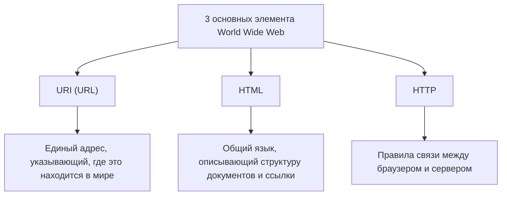

## Пролог: Мечтая о мире, где всё связано

В современном обществе мы воспринимаем "Web" как нечто само собой разумеющееся. Открываем смартфоны, читаем новости, смотрим видео и мгновенно обмениваемся сообщениями с друзьями, находящимися далеко. Магическая сеть, в которой бесшовно связаны и свободно доступны каждому все знания и информация на этой планете. Это и есть «World Wide Web» (Всемирная паутина).

Однако многие ли глубоко понимают тот факт, что это огромное изобретение, изменившее мир, родилось в уме всего лишь одного гениального программиста и, более того, **«было совершенно бесплатно предоставлено миру без получения каких-либо патентов»**?

Имя этого человека — Тим Бернерс-Ли (Tim Berners-Lee).

Он не просто изобрел технологию. То, что он действительно изобрел, — это сама **идеология открытого Web**, которая гласит: «Информация не должна монополизироваться отдельными корпорациями или государствами, она должна быть открыта для всего человечества». Если бы он запатентовал Web и требовал лицензионные отчисления, сегодняшний интернет имел бы совершенно иную форму. Вероятно, это было бы закрытое, тесное сетевое пространство, где только крупные корпорации монополизировали бы информацию, а мы платили бы за каждое получение данных.

В этой статье мы подробно рассмотрим, как Тим Бернерс-Ли изобрел Web. Мы углубимся в сложные задачи в Европейской организации по ядерным исследованиям (CERN), раннюю концепцию проекта «Enquire» и три технологические инновации (HTTP, HTML, URI), которые в корне перевернули мир. Кроме того, мы детально проследим его удивительный и великий путь: почему он отказался от патентов и даже основал W3C (World Wide Web Consortium), чтобы защитить идеалы открытого Web.

---

## Глава 1: Хаотичное море информации и проблемы CERN

История начинается в 1980 году в пригороде Женевы, Швейцария. Она переносит нас в Европейскую организацию по ядерным исследованиям, известную как **CERN**, обладающую огромным подземным экспериментальным комплексом, пересекающим границу с Францией.

CERN — это бастион знаний, где собираются тысячи первоклассных физиков и инженеров со всего мира, чтобы днем и ночью развивать огромные проекты для разгадки происхождения Вселенной и тайн элементарных частиц. Однако в то время CERN столкнулся с серьезным и фатальным «кризисом управления информацией».

### Исследовательский институт, превратившийся в Вавилонскую башню

Исследователи, собравшиеся из разных стран мира, использовали компьютеры разных производителей, привезенные из своих стран, разные операционные системы (ОС), разные сетевые стандарты и даже разные форматы данных.
В одной лаборатории работали машины IBM, в другой — DEC VAX, а в третьей — какие-то собственные системы. Если одна команда записывала потрясающие экспериментальные данные, то другой команде, чтобы прочитать их, приходилось физически копировать на магнитную ленту, конвертировать форматы и как-то пытаться прочитать на несовместимых системах.

Тогдашний CERN был похож на «Вавилонскую башню», строительство которой остановилось из-за того, что люди не понимали языки друг друга.

«Кто в каком проекте участвует?» «Где именно на каком компьютере хранятся те экспериментальные данные?» «У кого находится последняя версия программного обеспечения?»

Исследователи тратили огромное количество времени только на поиск такой базовой информации. Они звонили по телефону, бродили по коридорам и искали заметки на маркерных досках. Несмотря на то, что это был центр передовых физических исследований, средства обмена информацией были слишком архаичными и неэффективными.

### Рождение «Enquire»: Имитация сети мозга

В 1980 году молодой Тим Бернерс-Ли, прибывший в CERN в качестве инженера-программиста, столкнулся с этой безнадежной фрагментацией информации и почувствовал сильное недовольство. От природы он всегда испытывал глубокий интерес к связям и взаимосвязям между вещами.

«Человеческий мозг не запоминает вещи в иерархической структуре папок. Он запоминает и извлекает информацию через случайные, паутинообразные «связи» (ссылки) от одного понятия к другому. Разве нельзя так же гибко связывать информацию на компьютерах?»

Опираясь на эту идею, он в качестве личного проекта разработал программу под названием **«Enquire»**. Название произошло от викторианской домашней энциклопедии «Enquire Within Upon Everything» («Узнай всё внутри»), которую он любил в детстве.

Enquire была похожа на современную систему Wiki. Это была революционная система, которая позволяла связывать любое слово или понятие в системе с другим документом и сохранять взаимосвязи информации в виде сети. Однако в то время Enquire ограничивалась рамками единой системы и не могла связать между собой различные компьютеры по всему CERN. Когда срок пребывания Тима подошел к концу, об этой программе постепенно забыли.

Тем не менее, именно этот «Enquire» нес в себе важную ДНК, которая впоследствии стала основой World Wide Web.

---

## Глава 2: Три магии, связывающие мир —— HTTP, HTML, URI

В 1984 году Тим снова вернулся в CERN. Ситуация стала еще хуже, чем раньше. С распространением интернета сеть CERN начала соединяться со всем миром, но информационные системы по-прежнему оставались разрозненными.

В марте 1989 года он представил своему начальнику Майку Сенделлу историческое предложение, предлагающее радикальное решение проблемы управления информацией. Его название было **«Information Management: A Proposal» (Управление информацией: предложение)**.

На полях этого предложения его начальник Сенделл написал:
**"Vague but exciting..." (Туманно, но захватывающе...)**

Этот короткий комментарий стал поворотным моментом в истории. Бюджет на конкретный проект был выделен не сразу, но Тиму разрешили создавать эту систему в свободное время. Он приобрел рабочую станцию «NeXTcube» от компании NeXT, возглавляемой Стивом Джобсом (самую передовую на тот момент), и погрузился в разработку.

Самой большой задачей, с которой столкнулся Тим, было создание «универсальной системы, которая позволяла бы последовательно получать доступ к информации с любого компьютера, любой ОС, любой сети в мире». Чтобы реализовать это, он не стал создавать единое программное обеспечение, а разработал «три универсальных правила (протокола и стандарта)» обмена информацией. Это и есть великое изобретение, которое до сегодняшнего дня составляет основу Web.

### 1. URI (Uniform Resource Identifier)
Первой инновацией стала унификация «адресов» информации. На каком компьютере в мире, в какой директории, какой это файл. Универсальное правило именования для однозначного определения этого — URI (в настоящее время обычно называемое URL).
Изобретя эту строку, начинающуюся с «`http://...`», стало возможно присвоить «единственный и неповторимый адрес» любой информации в мире.

### 2. HTML (HyperText Markup Language)
Второе — это HTML, язык для описания структуры документа и встраивания ссылок на другие документы.
Тим чрезвычайно упростил существующий язык разметки (SGML), чтобы физики CERN могли легко создавать документы. Величайшее изобретение HTML заключается в том, что благодаря тегу `<a href="...">` стало возможным делать «гиперссылки» на документы, находящиеся на любом сервере в мире. Именно эти ссылки превратили Web из простого набора документов в бесконечно расширяющуюся паутину (Web) информации.

### 3. HTTP (Hypertext Transfer Protocol)
Третье — это HTTP, правило обмена информацией.
В то время уже существовали такие вещи, как FTP (протокол передачи файлов), но они были сложными и требовали много времени. Разработанный Тимом HTTP был чрезвычайно простым и не сохраняющим состояние (stateless) протоколом: «запрос (дайте информацию)» и «ответ (да, пожалуйста)». Благодаря этой простоте нагрузка на сервер была небольшой, что обеспечило комфортный браузинг с мгновенными переходами от ссылки к ссылке.

В конце 1990 года Тим завершил создание первого в мире веб-сервера (info.cern.ch) и первого в мире веб-браузера «WorldWideWeb» (позже переименованного в Nexus).
Впервые в истории человечества наступил момент, когда информация бесшовно связывалась с помощью гиперссылок, преодолевая национальные границы и модели компьютеров.

---

## Глава 3: Величайшее решение —— философия «Отказа от патентов»

По мере того, как базовые технологии Web были завершены, и его использование стало распространяться внутри CERN и в некоторых академических институтах, его подавляющее удобство стало очевидным. Тима начали заваливать запросами со всего мира: «Мы хотим использовать эту систему».

Здесь Тим Бернерс-Ли принял **самое великое решение в истории**, определившее будущее мира.

Если бы в этот момент он запатентовал технологии HTML, HTTP и URI и создал бы бизнес-модель по сбору лицензионных отчислений с использующих их компаний, он, несомненно, стал бы самым богатым миллиардером в мире. В тогдашней IT-индустрии патентование программного обеспечения и его ограждение были естественной бизнес-стратегией. Огромные корпорации, такие как Microsoft, IBM и Apple, все вместе продвигали собственные сетевые стандарты, пытаясь запереть пользователей в своих экосистемах.

Но Тим был другим. Он убедил свое начальство и руководство CERN, и **30 апреля 1993 года CERN опубликовал историческую декларацию, в которой говорилось, что «технология World Wide Web переводится в общественное достояние (public domain) и каждый может свободно использовать ее без патентных отчислений».**

Почему он отказался от патентов?
За этим стояли непоколебимые убеждения Тима и «философия открытого Web».

1. **Абсолютное условие для повсеместного распространения**
   Тим считал: «Если в Web будут хоть какие-то ограничения в виде платы за использование или лицензий, малые и средние предприятия, частные лица и люди в развивающихся странах по всему миру не смогут им пользоваться, и сеть будет разделена». Истинная ценность Web заключается в том, что «каждый может в нем участвовать», и он был убежден, что для этого он должен быть абсолютно бесплатным и открытым.

2. **Отказ от централизации**
   Обладание патентом означает предоставление кому-то власти (контроля) разрешать или запрещать использование. Тим хотел, чтобы Web был не централизованной системой, которую может контролировать определенное правительство или корпорация, а «децентрализованной системой», где каждый может свободно поднять сервер и распространять информацию.

Благодаря этому решению Web пережил взрывной рост. Поскольку не нужно было беспокоиться о патентах, программисты по всему миру наперебой разрабатывали браузеры (такие как Mosaic и Netscape) и серверное программное обеспечение (такое как Apache), а компании одна за другой запускали веб-сайты. Если бы Тим держался за патенты, Web затерялся бы как одна из десятков «проприетарных корпоративных сетевых сервисов», и нынешнее глобальное интернет-общество не наступило бы.

---

## Глава 4: Создание W3C и борьба за будущее Web

Когда Web стал мировым бумом, наступил новый кризис. Компании, такие как Netscape и Microsoft (Internet Explorer), развязали войну браузеров, начав одну за другой добавлять «собственные расширенные HTML-теги», которые можно было просматривать только в их браузерах.
Если бы так продолжалось, Web снова был бы разделен, как «Вавилонская башня», и повсеместно возникла бы ситуация: «Эту страницу можно просмотреть только в определенном браузере» (на самом деле, в конце 90-х годов дело чуть не дошло до такого состояния).

Чтобы предотвратить раскол Web, Тим Бернерс-Ли в 1994 году перешел в Массачусетский технологический институт (MIT) и основал **W3C (World Wide Web Consortium)**.

W3C — это международный некоммерческий консорциум, разрабатывающий технические стандарты Web. Тим, в качестве директора W3C, выступал посредником в жестоких конфликтах между корпорациями и твердо отстаивал принцип: «Веб-стандарты не должны давать преимущество определенной компании, они должны быть открытыми и без роялти».
Если бы не деятельность W3C, сегодня мы, возможно, были бы вынуждены пользоваться кошмарным фрагментированным интернетом, где невозможно просмотреть сайты Microsoft с устройств Apple или получить доступ к Amazon из браузера Google.

### Бесконечная страсть к открытому Web

Сегодня Тим Бернерс-Ли также бьет серьезную тревогу по поводу негативных аспектов современного Web, таких как монополизация данных гигантскими IT-корпорациями, вторжение в частную жизнь и распространение фейковых новостей.
Он утверждает: «Изначально Web предназначался для того, чтобы давать власть людям, а не для того, чтобы корпорации эксплуатировали данные пользователей». В настоящее время он продолжает борьбу за улучшение Web, например, работая над децентрализованной платформой «Solid», где сами пользователи могут контролировать свои данные.

---

## Эпилог: Эстафета, которую мы приняли

История Тима Бернерса-Ли — это не просто история технологического изобретения. Это благородная и прекрасная история идеала о том, что «инфраструктура для обмена знаниями человечества и объединения людей не должна монополизироваться ради прибыли или власти».

То, что мы каждый день непринужденно вводим URL, кликаем по ссылкам и свободно публикуем информацию, стало возможным потому, что один человек принял невероятное бескорыстное решение «не патентовать» в CERN в начале 1990-х годов.

Сейчас мы стоим на огромной игровой площадке, которую он бесплатно открыл для нас. Наша задача — не запирать это общее достояние человечества — «открытый Web» — за некоторыми гигантскими стенами (огороженными садами), а передать его дальше в еще более свободное и богатое будущее. Возможно, именно это и есть та миссия, которая возложена на всех нас, принявших эстафету от Тима Бернерса-Ли.
