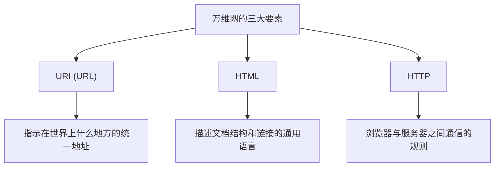

## 序章：梦想一个万物互联的世界

在现代社会，我们理所当然地使用着“Web（万维网）”。打开智能手机，阅读新闻，观看视频，与远方的朋友瞬间互发消息。地球上的所有知识和信息无缝连接，任何人都能够自由访问，这是一个如魔法般的网络。这就是“World Wide Web（万维网）”。

然而，这个改变了世界的伟大发明，诞生于一位天才程序员的大脑中，并且**“没有申请任何专利，完全免费向世界公开”**，有多少人深刻理解这一事实呢？

那个男人的名字，叫蒂姆·伯纳斯-李（Tim Berners-Lee）。

他不仅发明了技术。他真正发明的是一种**开放 Web 思想**，即“信息不应被特定企业或国家垄断，而应向全人类开放”。如果他为 Web 申请了专利并收取授权费，今天的互联网将是完全不同的模样。可能只会是大型企业垄断信息，我们在每次获取信息时都会被收费，变成一个封闭且令人窒息的网络空间。

本文将深入探讨蒂姆·伯纳斯-李是如何发明 Web 的。我们将回顾他在欧洲核子研究组织（CERN）面临的严峻挑战、早期构想“Enquire”项目，以及彻底改变世界的 3 项技术创新（HTTP、HTML、URI）。此外，我们还将详细追溯他为何放弃专利，甚至不惜创立 W3C（万维网联盟）也要誓死捍卫开放 Web 理想的曲折而伟大的足迹。

---

## 第1章：混沌的信息海洋与 CERN 的挑战

故事要从 1980 年瑞士日内瓦郊外说起。我们回溯到横跨法国边境、拥有巨大地下实验设施的欧洲核子研究组织，简称 **CERN（欧洲核子研究中心）**。

CERN 是一座智慧的堡垒，汇聚了来自世界各地的数千名顶尖物理学家和工程师，日以继夜地推进旨在揭开宇宙起源和基本粒子之谜的庞大项目。然而，当时的 CERN 正面临着一场严重且致命的“信息管理危机”。

### 沦为巴别塔的研究所

来自世界各国的研究人员，各自使用着从本国带来的不同制造商的计算机、不同的操作系统（OS）、不同的网络标准，甚至是不同的数据格式。
某个实验室运行着 IBM 的机器，另一个房间里运转着 DEC 的 VAX，而在其他地方又运行着独立的系统。即便一个团队记录下了绝佳的实验数据，为了让另一个团队读取这些数据，他们也不得不将数据物理地复制到磁带上，转换格式，并想方设法在不兼容的系统之间读取。

当时的 CERN，就像是因为语言不通而被迫停工的“巴别塔”。

“谁参与了哪个项目？”“那个实验数据保存在哪台电脑的什么地方？”“谁拥有最新版本的软件？”

仅仅为了寻找这些基本信息，研究人员就浪费了大量的时间。打电话，在走廊里四处打听，寻找白板上的便条。明明是研究最前沿物理学的设施，其信息共享手段却显得过于落后和低效。

### “Enquire”的诞生：模仿大脑网络

1980 年，作为软件工程师来到 CERN 赴任的年轻的蒂姆·伯纳斯-李，面对这种令人绝望的信息割裂，感到了强烈的不满。他生来就对事物之间的联系和相关性有着浓厚的兴趣。

“人类的大脑，并不是用层级化的文件夹结构来记忆事物的。而是从一个概念到另一个概念，通过随机且如同网状般的‘联系（链接）’来记忆和提取信息。计算机上的信息，难道就不能同样灵活地链接起来吗？”

基于这一灵感，他作为一个个人项目，开发了一款名为 **“Enquire（恩克怀尔）”** 的程序。这个名字来源于他童年时代熟悉的维多利亚时代的家庭百科全书《Enquire Within Upon Everything（凡事向内探求）》。

Enquire 就像是现在的 Wiki 系统。它可以将系统内的任何单词或概念链接到其他文档，是一种能够以网络状保存信息关联性的划时代产物。然而，当时的 Enquire 仅仅局限于单一系统内部，无法将 CERN 内部不同的计算机连接起来。随着蒂姆任期的结束，这个程序也逐渐被遗忘了。

然而，正是这个“Enquire”，孕育了后来成为 World Wide Web 基础的重要 DNA。

---

## 第2章：连接世界的3个魔法——HTTP、HTML、URI

1984 年，蒂姆再次回到了 CERN。情况比以前更加恶化了，随着互联网的普及，CERN 的网络开始与世界各地连接，但信息系统依然是一盘散沙。

1989 年 3 月，他向上司迈克·森达尔（Mike Sendall）提交了一份历史性的策划书，提出了一项解决信息管理问题的根本方案。标题是 **《Information Management: A Proposal（信息管理：一项提议）》**。

对于这份提案，上司森达尔在空白处写下了这样的话：
**"Vague but exciting..."（模糊，但令人兴奋）**

这句简短的评论，成为了历史的转折点。虽然没有立刻获得作为正式项目的预算，但蒂姆获准利用空闲时间来构建这个系统。他弄到了当时最先进的工作站——由史蒂夫·乔布斯领导的 NeXT 公司生产的“NeXTcube”，并全身心投入到了开发之中。

蒂姆面临的最大挑战是，创造一个“能够从世界上任何计算机、任何操作系统、任何网络中，以一致的方式访问信息的普遍系统”。为了实现这一目标，他并没有只开发一款单一的软件，而是设计了 3 条关于信息交互的“普遍规则（协议和标准）”。这就是至今仍构成 Web 根基的伟大发明。

### 1. URI (Uniform Resource Identifier)
第一项创新是统一信息的“地址”。世界上哪台计算机、哪个目录下的、哪个文件。为了唯一地识别这些信息，蒂姆发明了普遍的命名规则，即 URI（现在通常被称为 URL）。
通过发明这种以“`http://...`”开头的字符串，为世界上所有信息赋予了“独一无二的地址”成为了可能。

### 2. HTML (HyperText Markup Language)
第二项是 HTML，一种用于描述文档结构并嵌入指向其他文档的链接的语言。
为了让 CERN 的物理学家们能够轻松地创建文档，蒂姆将现有的标记语言（SGML）极其简单地进行了简化。HTML 最大的发明在于，通过 `<a href="...">` 标签，它使得为世界上任何服务器上的文档添加“超链接”成为可能。正是这些链接，使 Web 从单纯的文档集合，进化成了无限延伸的信息网（Web）。

### 3. HTTP (Hypertext Transfer Protocol)
第三项是信息交互的规则，即 HTTP。
当时虽然已经存在 FTP（文件传输协议）等协议，但它们既复杂又耗时。蒂姆设计的 HTTP 是一个极其简单且无状态（stateless）的协议，即“请求（请给我信息）”和“响应（好的，给你）”。正因为其简单性，服务器的负载较低，从而实现了能够在瞬间从一个链接跳转到另一个链接的流畅浏览体验。

1990 年底，蒂姆完成了世界上第一台 Web 服务器（info.cern.ch）和世界上第一个 Web 浏览器“WorldWideWeb（后来改名为 Nexus）”。
在人类历史上，信息第一次跨越了国界和计算机型号的限制，通过超链接无缝地连接在了一起。

---

## 第3章：最伟大的决定——“不持有专利”的哲学

随着 Web 基础技术的完成并在 CERN 内部以及一些学术机构中推广，其压倒性的便利性逐渐显现。来自世界各地询问“想要使用这个系统”的请求开始蜂拥而至。

此时，蒂姆·伯纳斯-李做出了一个决定了未来世界走向的、**历史上最伟大的决定**。

如果他当时就为 HTML、HTTP、URI 技术申请专利，并建立向使用企业收取授权费的商业模式，他毫无疑问会成为世界上最富有的人。在当时的 IT 行业，软件的专利化和封闭圈禁是理所当然的商业策略。微软、IBM、苹果等巨头企业都在争相推行各自独立的网络标准，试图将用户圈禁在自家的生态系统中。

然而，蒂姆与众不同。他说服了上司和 CERN 的管理层，在 **1993 年 4 月 30 日，CERN 发表了历史性的声明：“将 World Wide Web 的技术放入公有领域（Public Domain），任何人都可以免专利费自由使用。”**

他为什么放弃专利呢？
这其中蕴含着蒂姆坚定的信念和“开放 Web 的哲学”。

1. **普及世界的绝对条件**
   蒂姆认为，“如果 Web 有哪怕一丁点的使用费或许可证限制，世界各地的中小企业、个人以及发展中国家的人们就无法使用，网络就会被割裂”。他坚信 Web 的真正价值在于“所有人都能参与”，为了实现这一点，它必须是完全免费和开放的。

2. **拒绝中心化**
   拥有专利，意味着赋予某人允许或禁止使用的权力（控制权）。蒂姆希望 Web 成为一个任何人都能够自由搭建服务器并发布信息的“去中心化系统”，而不是一个被特定政府或企业控制的中心化系统。

正是这个决定，促成了 Web 的爆炸式增长。因为没有专利的顾虑，世界各地的程序员竞相开发浏览器（如 Mosaic 和 Netscape）和服务器软件（如 Apache），企业也纷纷建立起自己的网站。如果蒂姆死守专利，Web 可能只会成为众多“企业专属网络服务”中被埋没的一个，我们今天全球化的互联网社会也就不会到来。

---

## 第4章：创立 W3C 与捍卫 Web 未来的战斗

当 Web 掀起全球热潮时，新的危机降临了。Netscape 和微软（Internet Explorer）等企业引发了浏览器大战，开始不断添加只有在自家浏览器上才能正常显示的“专有扩展 HTML 标签”。
如果不加以制止，Web 将再次像“巴别塔”一样分崩离析，“本页面仅限特定浏览器浏览”的情况将会蔓延（实际上在 90 年代后期确实险些陷入那种状态）。

为了阻止 Web 的分裂，蒂姆·伯纳斯-李于 1994 年转往麻省理工学院（MIT），并创立了 **W3C（World Wide Web Consortium，万维网联盟）**。

W3C 是一个制定 Web 技术标准的国际性非营利联盟。蒂姆作为 W3C 的负责人，从中斡旋企业间的激烈冲突，并彻底捍卫了“Web 的标准不应偏袒任何特定企业，必须是开放且免版税的”这一原则。
如果没有 W3C 的努力，今天的我们可能正被迫使用着一个宛如噩梦般支离破碎的互联网：无法从苹果的设备浏览微软的网站，也无法从谷歌的浏览器访问亚马逊。

### 对开放 Web 永不磨灭的热情

如今，面对当今 Web 所暴露出的巨型 IT 企业垄断数据、侵犯隐私、虚假新闻泛滥等负面问题，蒂姆·伯纳斯-李也敲响了强烈的警钟。
他主张“Web 本应是为了赋予人们力量，而不是让企业榨取用户数据”，目前他正致力于开发能让用户自行控制个人数据的去中心化平台“Solid”等项目，至今仍在为了改良 Web 而不断奋斗。

---

## 终章：我们接过的接力棒

蒂姆·伯纳斯-李的故事，不仅仅是一段单纯的技术发明史。它更是一个关于“分享人类知识、连接人们的基础设施不应被利益和权力垄断”的高尚而美丽的理想故事。

我们现在每天之所以能不假思索地输入 URL、点击链接、自由地发布信息，都是因为在 1990 年代初的 CERN，有一个男人做出了“不持有专利”这样令人难以置信的无私决定。

如今，我们就站在他为我们免费开放的巨大游乐场上。不将这份名为“开放 Web”的人类共同财产关进少数人的“围墙花园（Walled Garden）”中，而是将其传承至更加自由、富饶的未来，这或许正是从蒂姆·伯纳斯-李手中接过接力棒的我们所有人，必须肩负的使命。
