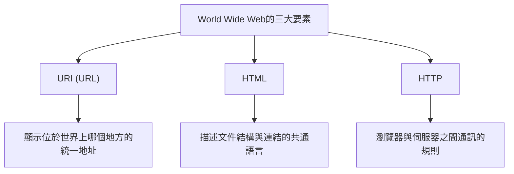

## 序章：夢想一個萬物相連的世界

在現代社會中，我們理所當然地使用著「Web」（全球資訊網）。打開智慧型手機、閱讀新聞、觀看影片，並與遠方的朋友們瞬間交流訊息。這是一個如同魔法般的網路，地球上所有的知識與資訊在此無縫連結，任何人都能自由存取。這就是「World Wide Web（全球資訊網）」。

然而，這項改變世界的巨大發明，僅僅誕生於一位天才程式設計師的大腦中，而且**「他沒有取得任何專利，完全免費地向世界公開」**，到底有多少人深刻理解這個事實呢？

那個男人的名字是提姆·柏內茲-李（Tim Berners-Lee）。

他不僅僅發明了技術。他真正發明的是**「開放 Web 的思想」**本身——「資訊不應被特定企業或國家壟斷，而應該向全人類開放」。如果他為 Web 申請了專利並要求授權費，今天的網際網路將會是完全不同的樣貌。可能只有大企業壟斷資訊，我們每次獲取資訊時都會被收費，網路空間將變成封閉且令人窒息的模樣。

在本文中，我們將深入探討提姆·柏內茲-李是如何發明 Web 的。包括他在歐洲核子研究組織（CERN）所面臨的嚴苛挑戰、早期的「Enquire」專案構想，以及徹底改變世界的三大技術創新（HTTP、HTML、URI）。此外，我們還將詳細追溯他為何放棄專利，甚至創立 W3C（World Wide Web Consortium）以守護開放 Web 理想的傳奇而偉大的足跡。

---

## 第1章：混沌的資訊之海與 CERN 的挑戰

故事的開端，要追溯到 1980 年瑞士日內瓦郊外。這是一座橫跨法國邊境、擁有巨大地下實驗設施的歐洲核子研究組織，簡稱**CERN**。

CERN 是一座知識的堡壘，聚集了來自世界各地的數千名頂尖物理學家與工程師，日以繼夜地進行著解開宇宙起源與基本粒子之謎的巨大專案。然而，當時的 CERN 卻面臨著嚴重且致命的「資訊管理危機」。

### 淪為巴別塔的研究所

來自世界各國的研究人員，各自使用著從本國帶來的不同廠牌電腦、不同的作業系統（OS）、不同的網路標準，甚至是不同的資料格式。
在這個實驗室裡運行著 IBM 的機器，而在另一個房間裡則是 DEC 的 VAX，在另一個地方又運行著另一套獨立的系統。當一個團隊記錄下極具價值的實驗數據時，另一個團隊若想讀取這些數據，就必須特地將其物理性地複製到磁帶上，轉換格式，並想方設法在互不相容的系統間進行讀取。

當時的 CERN，簡直就像是因語言不通而導致建設停滯的「巴別塔」。

「誰參與了哪個專案？」「那份實驗數據保存在哪台電腦的什麼地方？」「誰擁有最新版本的軟體？」

僅僅為了尋找這些基本資訊，研究人員就浪費了大量的時間。打電話、在走廊上四處奔走、尋找白板上的筆記。雖然是研究最尖端物理學的設施，但資訊共享的手段卻過於落後且效率低落。

### 「Enquire」的誕生：模仿大腦網路

1980 年，年輕的提姆·柏內茲-李作為軟體工程師來到 CERN 赴任，面對這令人絕望的資訊割裂，他感到強烈的不滿。他天生就對事物的連結與關聯性抱有濃厚的興趣。

「人類的大腦並不是以階層式的資料夾結構來記憶事物的。而是透過隨機且如網狀般的『連結（Link）』，從一個概念跳躍到另一個概念，以此來記憶和提取資訊。電腦上的資訊，難道不能同樣靈活地連結起來嗎？」

基於這個構想，他作為個人專案開發了一個名為**「Enquire」**的程式。這個名字的由來，是他童年時期熟悉的一本維多利亞時代的家庭百科全書《Enquire Within Upon Everything》（萬事內求）。

Enquire 就像是現在的 Wiki 系統。它可以將系統內的任何單字或概念連結到另一份文件，以網路狀保存資訊的關聯性，這在當時是一項劃時代的創舉。然而，當時的 Enquire 僅侷限於單一系統內，無法將 CERN 內部跨越不同電腦的系統連結起來。隨著提姆的任期結束，這個程式也逐漸被遺忘。

不過，正是這個「Enquire」，孕育了後來成為 World Wide Web 基礎的重要 DNA。

---

## 第2章：連結世界的三大魔法——HTTP、HTML、URI

1984 年，提姆再次回到了 CERN。情況比以前更加惡化，隨著網際網路的普及，CERN 的網路開始與世界各地連結，但資訊系統依然是四分五裂的狀態。

1989 年 3 月，他向主管麥克·森德爾（Mike Sendall）提交了一份具備歷史意義的企劃書，提出了資訊管理的根本解決方案。標題是**《Information Management: A Proposal》（資訊管理：一項提案）**。

針對這份提案，主管森德爾在空白處寫下了這樣的評語：
**"Vague but exciting..."（模糊但令人興奮……）**

這句簡短的評論，成為了歷史的轉捩點。雖然沒有立即獲得明確專案的預算，但提姆獲准利用空閒時間來建構這個系統。他取得了當時最先進的工作站——由史蒂夫·賈伯斯領導的 NeXT 公司所生產的「NeXTcube」，並全心投入開發。

提姆面臨的最大挑戰，是要創造一個「無論是世界上的哪台電腦、哪種 OS、哪種網路，都能以一致的方式存取資訊的通用系統」。為了實現這一目標，他並沒有開發單一的軟體，而是設計了關於資訊交換的「三個通用規則（協定與標準）」。這就是至今仍構成 Web 基礎的偉大發明。

### 1. URI (Uniform Resource Identifier)
第一項創新是統一資訊的「地址」。世界上哪台電腦的哪個目錄中的哪個檔案。為了唯一地識別這一點，通用的命名規則就是 URI（現在通常被稱為 URL）。
發明了以「`http://...`」開頭的這串字元，使得為世界上所有的資訊賦予「獨一無二的地址」成為可能。

### 2. HTML (HyperText Markup Language)
第二項是用來描述文件結構並嵌入對其他文件連結的語言：HTML。
為了讓 CERN 的物理學家們能夠輕鬆地建立文件，提姆將既有的標記語言（SGML）極大地簡化了。HTML 最大的發明在於，透過 `<a href="...">` 標籤，可以建立指向世界上任何伺服器上文件的「超連結」。正是這個連結，讓 Web 從單純的文件集合，進化成了無限延伸的資訊網（Web）。

### 3. HTTP (Hypertext Transfer Protocol)
第三項是資訊交換的規則：HTTP。
當時雖然已經存在 FTP（檔案傳輸協定）等，但它們既複雜又耗時。提姆設計的 HTTP 是一個極為單純且無狀態（stateless）的協定，僅包含「請求（請給我資訊）」和「回應（好的，給您）」。正是因為這種簡單性，對伺服器的負擔很小，從而實現了在連結間瞬間跳躍的流暢瀏覽體驗。

1990 年底，提姆完成了世界上的第一台 Web 伺服器（info.cern.ch）以及世界上第一個 Web 瀏覽器「WorldWideWeb（後來改名為 Nexus）」。
這是人類歷史上第一次，資訊跨越了國界與電腦機種的限制，透過超連結無縫地結合在一起的瞬間。

---

## 第3章：最大的決斷——「不持有專利」的哲學

隨著 Web 基礎技術的完成，並開始在 CERN 內部及部分學術機構推廣，其壓倒性的便利性變得顯而易見。提姆開始收到來自世界各地如雪片般飛來的詢問：「我想使用這個系統」。

在這裡，提姆·柏內茲-李做出了決定未來世界走向的**歷史上最偉大決斷**。

如果在那個時候，他為 HTML、HTTP、URI 技術申請了專利，並建立起向使用企業收取授權費的商業模式，他毫無疑問會成為世界首富。在當時的 IT 業界，將軟體專利化並進行圈地是理所當然的商業策略。Microsoft、IBM、Apple 等巨頭企業都在積極推動自家的網路標準，試圖將使用者圈入自己的生態系統中。

但是，提姆不同。他説服了主管和 CERN 的經營層，**1993 年 4 月 30 日，CERN 發表了歷史性的宣言，宣布「將 World Wide Web 技術置於公有領域（Public Domain），任何人都可以免除專利費自由使用」。**

為什麼他要放棄專利呢？
那裡有提姆堅韌的信念與「開放 Web 的哲學」。

1. **普及為絕對條件**
   提姆認為：「如果 Web 有哪怕一點點的使用費或授權限制，世界上所有的中小企業、個人，以及發展中國家的人們就無法使用，網路將會被割裂。」他深信，Web 的真正價值在於「任何人都能參與」，為此它必須是完全免費且開放的。

2. **拒絕中心化**
   擁有專利意味著賦予某人許可或不許可使用的權力（控制權）。提姆希望 Web 成為一個任何人都能自由架設伺服器並發布資訊的「去中心化系統」，而不是一個可以被特定政府或企業控制的中心化系統。

這個決定讓 Web 獲得了爆炸性的成長。因為不必擔心專利問題，世界各地的程式設計師競相開發瀏覽器（如 Mosaic 和 Netscape）及伺服器軟體（如 Apache），企業也紛紛架設網站。如果提姆死守著專利，Web 可能只會被埋沒為幾十個「企業專屬網路服務」之一，現在這個全球化的網際網路社會也就不會到來。

---

## 第4章：W3C 的創立與守護 Web 未來的戰鬥

當 Web 成為全球熱潮時，新的危機也隨之而來。Netscape 和 Microsoft（Internet Explorer）等企業引發了瀏覽器大戰，開始不斷添加只有在自家瀏覽器上才能看到的「獨家擴充 HTML 標籤」。
如果任由這種情況發展下去，Web 將再次像「巴別塔」一樣分裂，導致「這個頁面只能在特定瀏覽器上觀看」的情況蔓延（實際上在 90 年代後半期，確實幾乎陷入了這種狀態）。

為阻止 Web 的分裂，提姆·柏內茲-李在 1994 年轉往麻省理工學院（MIT），並創立了 **W3C（World Wide Web Consortium）**。

W3C 是一個制定 Web 技術標準的國際非營利聯盟。作為 W3C 的總監，提姆調解了企業間激烈的衝突，並徹底堅守「Web 的標準不應偏袒特定企業，而必須是開放且免版稅的」這一原則。
如果沒有 W3C 的活動，今天的我們可能會被迫使用一個如噩夢般分裂的網際網路——從 Apple 裝置無法瀏覽 Microsoft 的網站，從 Google 瀏覽器無法存取 Amazon。

### 永不熄滅的開放 Web 熱情

時至今日，提姆·柏內茲-李依然對當前 Web 面臨的負面問題發出強烈警告，包括大型 IT 企業壟斷數據、隱私侵害，以及假新聞的擴散等。
他主張「Web 本來是為了賦予人們力量的，而不是讓企業剝削使用者數據的」，現在他正致力於開發一個讓使用者自己控制數據的去中心化平台「Solid」，至今仍在為了改良 Web 而繼續奮鬥。

---

## 終章：我們接過的接力棒

提姆·柏內茲-李的故事，不僅僅是一部單純的技術發明史。它講述了一個高貴而美麗的理想：「用來分享人類知識、連結人們的基礎設施，不應被利益和權力所壟斷」。

我們每天能夠不假思索地輸入 URL、點擊連結、自由發布資訊，都是因為在 1990 年代初的 CERN，一個男人做出了「不持有專利」這個令人難以置信的無私決定。

我們現在正站在他免費為我們開放的巨大遊樂場上。如何不將這項被稱為「開放 Web」的全人類共同財產關在少數高牆花園（Walled Garden）內，而是將其延續到更加自由豐富的未來。這或許正是我們所有人從提姆·柏內茲-李手中接過接力棒後，所肩負的使命。
