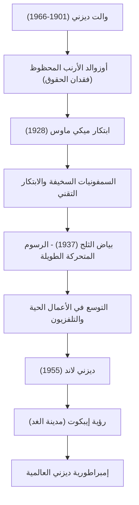

لم يكن والت ديزني (Walter Elias Disney) مجرد رسام رسوم متحركة أو منتج أفلام فحسب، بل هو "صانع أحلام" يمثل القرن العشرين. اسمه اليوم علامة تجارية يعرفها الجميع في جميع أنحاء العالم، ولكن وراء ذلك كانت هناك إخفاقات لا تعد ولا تحصى وروح لا تقهر للتغلب عليها. في هذا المقال، سنستكشف حياته وفلسفته في كيفية رفع مستوى الرسوم المتحركة من مجال غير ناضج إلى فن، وتأسيس شكل جديد من الترفيه يُعرف بالمتنزهات الترفيهية.

## "ميكي ماوس" الذي وُلد من رحم الإحباط

وُلد والت في شيكاغو عام 1901، وكان مفتونًا بالرسم منذ صغره. وعلى الرغم من أنه أسس شركة لإنتاج الرسوم المتحركة في كانساس سيتي في شبابه، إلا أنها فشلت كعمل تجاري وأفلس. انطلق إلى هوليوود وهو لا يملك شيئًا تقريبًا، وأسس "استوديوهات الإخوة ديزني" (Disney Brothers Studio) مع شقيقه روي.

بعد أن تعرض لضربة موجعة عندما سلبت منه شركة التوزيع حقوق شخصيته الناجحة المبكرة "أوزوالد الأرنب المحظوظ"، وُلد "ميكي ماوس" في قاع اليأس. كان فيلم "ستيمبوت ويلي" الذي صدر عام 1928 أول فيلم رسوم متحركة ناطق في العالم متزامنًا تمامًا مع الصوت والصورة، وأصبح ميكي نجمًا عالميًا في غمضة عين. إن موهبته في تحويل الأزمات إلى أكبر الفرص كانت تتجلى منذ ذلك الحين.

## الارتقاء بالرسوم المتحركة إلى "فن": تحدي بياض الثلج

كان طموح والت التالي هو إنتاج فيلم رسوم متحركة طويل. في ذلك الوقت، سخر منه النقاد وزملاؤه قائلين "لن يشاهد البالغون الرسوم المتحركة لأكثر من ساعة" و "سوف يفسدون عيونهم"، وأطلق على المشروع اسم "حماقة ديزني". ومع ذلك، لم يسمح بأي تنازلات واستمر في الإنتاج باستثمار كل ثروته.

حقق فيلم "بياض الثلج" الذي صدر عام 1937 نجاحًا غير مسبوق. أثبتت الصور العميقة التي التقطتها كاميرا متعددة المستويات المبتكرة، والتعبير العاطفي الدقيق للشخصيات، أن الرسوم المتحركة ليست مجرد ترفيه للأطفال، بل هي "فن" حقيقي يمس قلوب الناس.

## أرض الأحلام التي "لن تكتمل أبداً": ديزني لاند

بعد أن بلغ القمة في عالم الأفلام، تحولت أنظار والت إلى الفضاء المادي. إن رؤية المتنزه الترفيهي التي بدأت بالرغبة في "إنشاء مكان يمكن للآباء والأطفال الاستمتاع فيه معًا" قد آتت ثمارها بافتتاح "ديزني لاند" في أنهايم، كاليفورنيا في عام 1955.

غيّرت ديزني لاند مفهوم مدينة الملاهي من جذوره. مساحة نظيفة تمامًا لا توجد فيها قطعة قمامة واحدة، ومناطق ذات طابع غامر تبدو وكأنها مجموعات تصوير سينمائي، ومفهوم "طاقم العمل" (Cast) الذي يمتع "الضيوف" (Guests). ترك والت مقولته الشهيرة: "ديزني لاند لن تكتمل أبدًا. ستستمر في النمو طالما كان هناك خيال في العالم". ولا تزال هذه الفلسفة حية وتنبض بالحياة في حدائق ديزني حول العالم حتى اليوم.

## مخطط ارتباط الإنجازات والرؤية

دعونا نراجع كيف تطورت الإنجازات التي تركها من خلال المخطط التالي.

## التأثير على الأجيال القادمة وفلسفة والت

توفي والت ديزني في عام 1966، لكن الفلسفة التي تركها وراءه، "حرف C الأربعة" (Curiosity الفضول، Confidence الثقة، Courage الشجاعة، Constancy الثبات)، لا تزال تلهم المبدعين وقادة الأعمال حتى اليوم.

كان يؤمن بقوة التكنولوجيا أكثر من أي شخص آخر. كان رائدًا في دمج أحدث التقنيات باستمرار في مجال الترفيه، مثل الأفلام الناطقة، والأفلام الملونة، والكاميرات متعددة المستويات، وحتى تقنية "أوديو-أنيماترونكس" (شخصيات متحركة باستخدام الروبوتات). لم تقتصر رؤيته لـ "إيبكوت" (مدينة المستقبل التجريبية) على مجرد مدينة ملاهي، بل امتدت لتشمل التخطيط الحضري من أجل حياة أفضل للبشرية.

إن حياة والت ديزني هي تجسيد لمقولة: "إذا كان بإمكانك الحلم به، فيمكنك تحقيقه" (If you can dream it, you can do it). وسيستمر السحر الذي ولّدته مخيلته في إضاءة قلوبنا عبر الأجيال.
