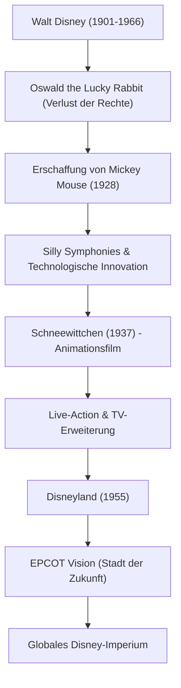

Walt Disney (Walter Elias Disney) ist nicht nur ein Trickfilmzeichner oder Filmproduzent, sondern der „Schöpfer von Träumen“, der das 20. Jahrhundert repräsentiert. Sein Name ist heute eine weltweit bekannte Marke, doch dahinter verbergen sich unzählige Rückschläge und ein unbeugsamer Geist, diese zu überwinden. Dieser Artikel beleuchtet sein Leben und seine Philosophie, wie er die noch unreife Animationsbranche zu einer Kunstform erhob und mit dem Themenpark eine neue Form der Unterhaltung schuf.

## „Mickey Mouse“, geboren aus dem Scheitern

Der 1901 in Chicago geborene Walt war schon als Kind vom Zeichnen fasziniert. In seiner Jugend gründete er in Kansas City eine Animationsproduktionsfirma, scheiterte jedoch geschäftlich und erlebte den Bankrott. Fast mittellos ging er nach Hollywood und gründete mit seinem Bruder Roy das „Disney Brothers Studio“.

Nach dem herben Rückschlag, als ihm die Rechte an seinem ersten Erfolg „Oswald the Lucky Rabbit“ von einer Vertriebsgesellschaft entzogen wurden, erschuf er in tiefster Verzweiflung „Mickey Mouse“. Der 1928 veröffentlichte Film „Steamboat Willie“ war der erste Ton-Animationsfilm der Welt, der Bild und Ton perfekt synchronisierte, und machte Mickey augenblicklich zu einem Weltstar. Sein Talent, Krisen in größte Chancen zu verwandeln, zeigte sich bereits zu dieser Zeit.

## Animation wird zur „Kunst“: Die Herausforderung von Schneewittchen

Walts nächstes großes Ziel war die Produktion eines abendfüllenden Animationsfilms. Damals wurde das Projekt von Kritikern und Kollegen verspottet, die sagten: „Kein Erwachsener schaut sich eine Stunde lang einen Animationsfilm an“ oder „Das ruiniert die Augen.“ Es wurde als „Disneys Torheit“ bezeichnet. Er ging jedoch keine Kompromisse ein, investierte sein gesamtes Vermögen und setzte die Produktion fort.

Das 1937 veröffentlichte „Schneewittchen“ wurde zu einem beispiellosen Hit. Die tiefgründigen Bilder, die durch die innovative Multiplan-Kamera ermöglicht wurden, und die detaillierten emotionalen Ausdrücke der Charaktere bewiesen, dass Animation nicht nur ein Zeitvertreib für Kinder war, sondern eine wahre „Kunst“, die die Herzen der Menschen berührt.

## Das „niemals vollendete“ Traumland: Disneyland

Nachdem er den Gipfel in der Filmwelt erreicht hatte, richtete Walt seinen Blick auf die reale Welt. Aus dem Wunsch heraus, „einen Ort zu schaffen, an dem Eltern und Kinder gemeinsam Spaß haben können“, entstand das Konzept des Themenparks, das 1955 mit der Eröffnung von „Disneyland“ in Anaheim, Kalifornien, verwirklicht wurde.

Disneyland hat das Konzept eines Vergnügungsparks grundlegend verändert. Ein makellos sauberer Raum ohne jeglichen Müll, immersive Themenbereiche, die wie Filmkulissen wirken, und das Konzept der „Cast-Member“, die die „Gäste“ unterhalten. Walt hinterließ die Worte: „Disneyland wird niemals vollendet sein. Es wird weiter wachsen, solange es Vorstellungskraft in der Welt gibt.“ Diese Philosophie wird bis heute in den Disney-Parks weltweit weitergetragen.

## Korrelationsdiagramm von Errungenschaften und Visionen

Lassen Sie uns anhand des folgenden Diagramms zurückblicken, wie sich seine Errungenschaften entwickelt haben.

## Einfluss auf die Nachwelt und Walts Philosophie

Walt Disney verstarb 1966, aber seine Philosophie der „Four C's“ (Curiosity, Confidence, Courage, Constancy: Neugier, Selbstvertrauen, Mut, Beständigkeit) inspiriert Schöpfer und Wirtschaftsführer auch heute noch maßgeblich.

Er glaubte mehr als jeder andere an die Macht der Technologie. Von Tonfilmen und Farbfilmen über die Multiplan-Kamera bis hin zur Audio-Animatronics (bewegliche Puppen mittels Robotik) war er stets ein Pionier bei der Integration neuester Technologien in die Unterhaltungsbranche. Seine Vision von „EPCOT (Experimental Prototype Community of Tomorrow)“ ging über einen bloßen Vergnügungspark hinaus und erstreckte sich auf die Stadtplanung für ein besseres Leben der Menschheit.

Das Leben von Walt Disney ist die Verkörperung seiner Worte: „Wenn du es dir vorstellen kannst, kannst du es auch tun (If you can dream it, you can do it).“ Die Magie, die seine Vorstellungskraft erschaffen hat, wird unsere Herzen über Generationen hinweg weiter erhellen.
