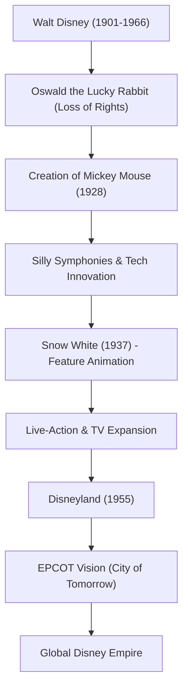

Walt Disney is a "creator of dreams" representative of the 20th century, a figure who transcends the boundaries of a mere animator or film producer. While his name is now a globally recognized brand, behind it lay countless setbacks and the indomitable spirit to overcome them. In this article, we delve into his life and philosophy, exploring how he elevated the immature field of animation into an art form and established the theme park as a new form of entertainment.

## "Mickey Mouse" Born from Setback

Born in Chicago in 1901, Walt was obsessed with drawing from a young age. Although he launched an animation production company in Kansas City during his youth, it failed as a business, and he experienced bankruptcy. Heading to Hollywood almost penniless, he founded the "Disney Brothers Studio" alongside his brother Roy.

After suffering the major blow of having the rights to his early hit "Oswald the Lucky Rabbit" taken away by a distributor, it was at the depths of despair that "Mickey Mouse" was born. Released in 1928, *Steamboat Willie* was the world's first synchronized sound cartoon, and Mickey instantly became a global star. His genius for turning a crisis into the biggest opportunity was already evident from this time.

## Elevating Animation to "Art": The Challenge of Snow White

Walt's next ambition was to produce a feature-length animated film. At the time, critics and peers mocked the project as "Disney's Folly," claiming that "adults would never watch an animation for more than an hour" and that "it would hurt their eyes." However, refusing to compromise, he poured all of his wealth into continuing production.

Released in 1937, *Snow White and the Seven Dwarfs* was an unprecedented blockbuster. The film's depth, created with the innovative multiplane camera, and the subtle emotional expressions of the characters proved that animation was not merely a side show for children, but a genuine "art" capable of moving people's hearts.

## The Dreamland "Never Completed": Disneyland

Having reached the pinnacle of the visual world, Walt's eyes turned to physical space. The theme park concept, which began with the desire to "create a place where parents and children can have fun together," culminated in the opening of "Disneyland" in Anaheim, California, in 1955.

Disneyland fundamentally overturned the concept of an amusement park. A spotless environment without a single piece of trash, immersive themed areas like movie sets, and the concept of "cast members" entertaining "guests." Walt left behind the words, "Disneyland will never be completed. It will continue to grow as long as there is imagination left in the world." This philosophy continues to be passed down through Disney parks worldwide today.

## Correlation Chart of Achievements and Vision

Let's look back at how his achievements developed in the diagram below.

## Legacy and Walt's Philosophy

Although Walt Disney passed away in 1966, the philosophy he left behind, the "Four C's (Curiosity, Confidence, Courage, Constancy)," continues to provide immense inspiration to creators and business leaders today.

He believed in the power of technology more than anyone else. From sound and color film to the multiplane camera, and even Audio-Animatronics (moving figures using robotics), he was a pioneer who always fused the latest technology into entertainment. His vision of "EPCOT (Experimental Prototype Community of Tomorrow)" went beyond a mere amusement park and extended to urban planning for humanity to live a better life.

Walt Disney's life embodies the phrase, "If you can dream it, you can do it." The magic created by his imagination will surely continue to illuminate our hearts across generations.
