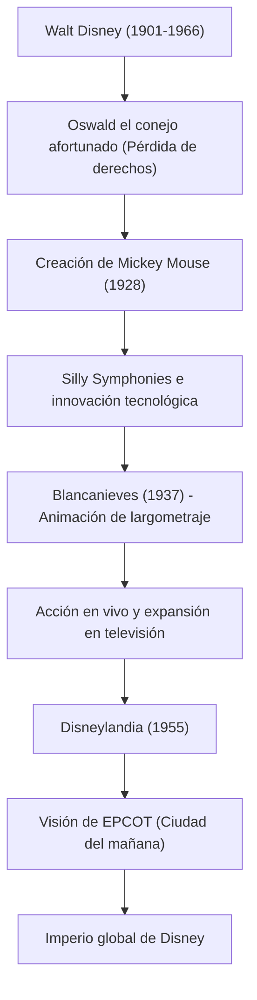

Walt Disney (Walter Elias Disney) no se limitó a ser un mero animador o productor de cine; es un "creador de sueños" que representa el siglo XX. Su nombre es ahora una marca que todos en el mundo conocen, pero detrás de eso hubo innumerables reveses y un espíritu indomable para superarlos. En este artículo, exploraremos su vida y filosofía sobre cómo elevó la inmadura industria de la animación a la categoría de arte y estableció una nueva forma de entretenimiento con los parques temáticos.

## "Mickey Mouse" nacido de la frustración

Nacido en Chicago en 1901, Walt estuvo fascinado por el dibujo desde que era un niño. Aunque fundó una empresa de producción de animación en Kansas City en su juventud, fracasó como negocio y quebró. Casi sin un centavo, se dirigió a Hollywood y fundó los "Disney Brothers Studio" junto con su hermano Roy.

Después de sufrir un duro golpe cuando los derechos de su éxito inicial, "Oswald el conejo afortunado", le fueron arrebatados por la empresa de distribución, fue en el abismo de la desesperación cuando nació "Mickey Mouse". Lanzado en 1928, "Steamboat Willie" fue la primera animación sonora del mundo con imagen y sonido completamente sincronizados, y Mickey se convirtió instantáneamente en una estrella mundial. Su talento para convertir una crisis en la mayor de las oportunidades ya se manifestaba en ese momento.

## Elevando la animación a "Arte": El desafío de Blancanieves

La siguiente ambición de Walt fue producir un largometraje de animación. En ese momento, fue ridiculizado por críticos y colegas quienes decían que "los adultos nunca verían animación durante más de una hora" y que "arruinaría sus ojos", y el proyecto fue llamado la "Locura de Disney". Sin embargo, no permitió ningún compromiso y continuó la producción invirtiendo toda su fortuna.

"Blancanieves", lanzada en 1937, registró un éxito sin precedentes. Las imágenes profundas creadas por la innovadora cámara multiplano y la sutil expresión emocional de los personajes demostraron que la animación no era solo un entretenimiento para niños, sino un verdadero "arte" que conmovía el corazón de la gente.

## La tierra de los sueños "Nunca completada": Disneylandia

El enfoque de Walt, habiendo alcanzado la cima en el mundo de las películas, se centró en el espacio físico. La visión de un parque temático que comenzó con el deseo de "crear un lugar donde padres e hijos puedan disfrutar juntos" dio sus frutos con la apertura de "Disneylandia" en Anaheim, California, en 1955.

Disneylandia cambió fundamentalmente el concepto de parque de atracciones. Un espacio inmaculadamente limpio sin una sola pieza de basura, áreas temáticas inmersivas como escenarios de películas y el concepto de un "elenco" (cast) que entretiene a los "invitados" (guests). Walt dejó las palabras: "Disneylandia nunca se completará. Seguirá creciendo mientras haya imaginación en el mundo". Esta filosofía sigue viva y coleando en los parques de Disney de todo el mundo hoy en día.

## Diagrama de correlación de logros y visión

Repasemos cómo se desarrollaron los logros que dejó utilizando el siguiente diagrama.

## Influencia en las generaciones futuras y la filosofía de Walt

Walt Disney falleció en 1966, pero su filosofía que dejó atrás, las "Cuatro C" (Curiosidad, Confianza, Coraje, Constancia), sigue inspirando a los creadores y líderes empresariales en la actualidad.

Él creía en el poder de la tecnología más que nadie. Fue pionero en la constante integración de las últimas tecnologías en el entretenimiento, como el cine sonoro, el color, la cámara multiplano e incluso la audio-animatrónica (figuras animadas utilizando robótica). Su visión de "EPCOT" (Prototipo Experimental de la Comunidad del Mañana) iba más allá de un mero parque de atracciones y se extendía a la planificación urbana para que la humanidad tuviera una vida mejor.

La vida de Walt Disney es la encarnación misma de las palabras: "Si puedes soñarlo, puedes hacerlo" (If you can dream it, you can do it). La magia nacida de su imaginación continuará iluminando nuestros corazones a través de las generaciones.
