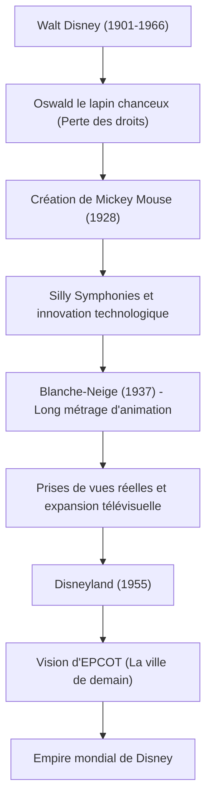

Walt Disney (Walter Elias Disney) est un "créateur de rêves" emblématique du XXe siècle, dont la portée dépasse largement le cadre d'un simple animateur ou producteur de films. Son nom est aujourd'hui une marque connue de tous à travers le monde, mais derrière ce succès se cachent d'innombrables échecs et un esprit indomptable pour les surmonter. Cet article explore sa vie et sa philosophie, et comment il a élevé l'animation, alors un domaine balbutiant, au rang d'art, et établi une nouvelle forme de divertissement avec les parcs à thème.

## "Mickey Mouse" né de l'échec

Né à Chicago en 1901, Walt était passionné par le dessin depuis son plus jeune âge. Bien qu'il ait fondé une société de production d'animation à Kansas City dans sa jeunesse, l'entreprise a échoué et il a connu la faillite. Arrivé à Hollywood presque sans le sou, il a fondé les "Disney Brothers Studio" avec son frère Roy.

Après avoir subi le coup dur de se voir ravir les droits de son premier succès "Oswald le lapin chanceux" par une société de distribution, c'est au fond du désespoir qu'est né "Mickey Mouse". "Steamboat Willie", sorti en 1928, fut la première animation sonore au monde synchronisant parfaitement l'image et le son, et Mickey est instantanément devenu une star mondiale. Son talent pour transformer une crise en sa plus grande opportunité était déjà évident à cette époque.

## L'animation devient un "Art" : Le défi de Blanche-Neige

La prochaine ambition de Walt était de produire un long métrage d'animation. À l'époque, le projet était qualifié de "folie de Disney", moqué par les critiques et ses pairs qui disaient : "Les adultes ne regarderont jamais un dessin animé pendant plus d'une heure" et "Cela abîmera leurs yeux". Cependant, il n'a permis aucun compromis et a investi toute sa fortune pour poursuivre la production.

Sorti en 1937, "Blanche-Neige" a enregistré un succès sans précédent. La profondeur des images créée par la caméra multiplane innovante et l'expression émotionnelle délicate des personnages ont prouvé que l'animation n'était pas seulement un passe-temps pour enfants, mais un véritable "art" capable de toucher le cœur des gens.

## Un pays des rêves "Jamais achevé" : Disneyland

Ayant atteint le sommet dans le monde du cinéma, l'attention de Walt s'est tournée vers l'espace réel. Le concept de parc à thème, né du désir de "créer un endroit où parents et enfants peuvent s'amuser ensemble", s'est concrétisé avec l'ouverture de "Disneyland" à Anaheim, en Californie, en 1955.

Disneyland a fondamentalement bouleversé le concept de parc d'attractions. Un espace propre sans aucun déchet, des zones thématiques immersives semblables à des décors de cinéma, et le concept de "cast members" (membres de la troupe) accueillant les "guests" (invités). Walt a laissé cette citation : "Disneyland ne sera jamais achevé. Il continuera de grandir tant qu'il restera de l'imagination dans le monde." Cette philosophie continue de vivre aujourd'hui dans les parcs Disney du monde entier.

## Schéma de corrélation de ses réalisations et de sa vision

Regardons comment ses réalisations se sont développées grâce au diagramme suivant.

## Influence sur la postérité et philosophie de Walt

Walt Disney est décédé en 1966, mais sa philosophie des "Quatre C" (Curiosity, Confidence, Courage, Constancy : Curiosité, Confiance, Courage, Constance) continue d'inspirer profondément les créateurs et les chefs d'entreprise d'aujourd'hui.

Il croyait plus que quiconque au pouvoir de la technologie. Du son, de la couleur, de la caméra multiplane jusqu'aux animatroniques (poupées animées utilisant la robotique), il fut toujours un pionnier dans l'intégration des dernières technologies au divertissement. Sa vision d'"EPCOT" (Cité Prototype Expérimentale de Demain) ne se limitait pas à un parc d'attractions, mais s'étendait à une planification urbaine pour que l'humanité mène une vie meilleure.

La vie de Walt Disney est l'incarnation de la citation "Si vous pouvez le rêver, vous pouvez le faire" (If you can dream it, you can do it). La magie créée par son imagination continuera sûrement d'illuminer nos cœurs à travers les générations.
