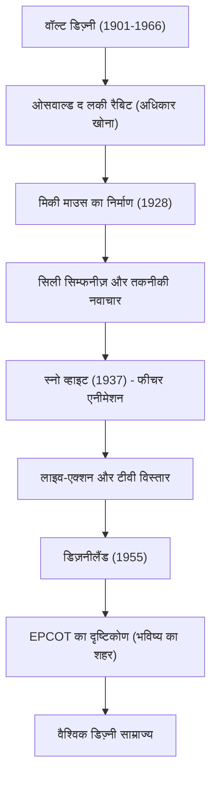

वॉल्ट डिज़्नी (Walter Elias Disney) सिर्फ एक एनिमेटर या फिल्म निर्माता नहीं थे, बल्कि 20वीं सदी के सबसे प्रमुख "सपनों के निर्माता" थे। आज उनका नाम दुनिया भर में एक जाना-माना ब्रांड है, लेकिन इसके पीछे अनगिनत असफलताएं और उन्हें पार करने का अदम्य साहस छिपा है। इस लेख में, हम उनके जीवन और दर्शन पर प्रकाश डालेंगे कि कैसे उन्होंने एनीमेशन जैसे अपरिपक्व क्षेत्र को कला के स्तर तक पहुँचाया और थीम पार्क के रूप में मनोरंजन का एक नया स्वरूप स्थापित किया।

## निराशा से पैदा हुआ "मिकी माउस"

1901 में शिकागो में जन्मे वॉल्ट को बचपन से ही चित्र बनाने का शौक था। अपनी युवावस्था में कैनसस सिटी में एक एनीमेशन प्रोडक्शन कंपनी शुरू करने के बावजूद, व्यापार के रूप में यह विफल रही और वे दिवालिया हो गए। लगभग बिना पैसे के हॉलीवुड की ओर रुख करते हुए, उन्होंने अपने भाई रॉय के साथ मिलकर "डिज़्नी ब्रदर्स स्टूडियो" की स्थापना की।

अपनी शुरुआती सफल रचना, "ओसवाल्ड द लकी रैबिट" के अधिकार वितरक कंपनी द्वारा छीने जाने के बाद हुए भारी नुकसान के बाद, अत्यधिक निराशा के बीच ही "मिकी माउस" का जन्म हुआ। 1928 में रिलीज़ हुई 'स्टीमबोट विली' दुनिया की पहली टॉकी एनीमेशन थी जिसमें चित्र और आवाज़ पूरी तरह से सिंक्रोनाइज़ थे, और मिकी पल भर में दुनिया भर में एक स्टार बन गया। संकट को सबसे बड़े अवसर में बदलने की उनकी प्रतिभा उसी समय से प्रदर्शित हो गई थी।

## एनीमेशन को "कला" में बदलना: स्नो व्हाइट की चुनौती

वॉल्ट की अगली महत्वाकांक्षा एक फीचर-लेंथ एनीमेशन फिल्म बनाने की थी। उस समय, आलोचकों और साथियों ने यह कहकर उनका मज़ाक उड़ाया था कि "वयस्क एक घंटे से अधिक समय तक एनीमेशन नहीं देखेंगे" और "यह उनकी आँखों को खराब कर देगा", और इस प्रोजेक्ट को "डिज़्नी की मूर्खता" कहा गया था। हालांकि, उन्होंने कोई समझौता नहीं किया और अपनी सारी संपत्ति निवेश करके उत्पादन जारी रखा।

1937 में रिलीज़ हुई 'स्नो व्हाइट' ने एक अभूतपूर्व सफलता दर्ज की। एक अभिनव मल्टीप्लेन कैमरे द्वारा बनाए गए गहरे दृश्यों और पात्रों की सूक्ष्म भावनात्मक अभिव्यक्ति ने यह साबित कर दिया कि एनीमेशन सिर्फ बच्चों के मनोरंजन के लिए नहीं है, बल्कि एक वास्तविक "कला" है जो लोगों के दिलों को छूती है।

## "कभी पूरा न होने वाला" सपनों का देश: डिज़नीलैंड

फिल्मों की दुनिया में शिखर पर पहुंचने के बाद वॉल्ट की नज़र वास्तविक स्थान की ओर मुड़ गई। एक थीम पार्क की अवधारणा, जो "माता-पिता और बच्चों को एक साथ आनंद लेने के लिए एक जगह बनाने" की इच्छा से शुरू हुई थी, 1955 में कैलिफोर्निया के अनाहेम में "डिज़नीलैंड" के उद्घाटन के रूप में फलीभूत हुई।

डिज़नीलैंड ने मनोरंजन पार्क की अवधारणा को मौलिक रूप से बदल दिया। एक बेदाग साफ जगह जहां कूड़े का एक भी टुकड़ा नहीं था, फिल्म के सेट जैसे इमर्सिव थीम वाले क्षेत्र, और "गेस्ट" (मेहमानों) का मनोरंजन करने वाले "कास्ट" (कलाकारों) की अवधारणा। वॉल्ट ने कहा था, "डिज़नीलैंड कभी पूरा नहीं होगा। जब तक दुनिया में कल्पना है, यह बढ़ता रहेगा।" यह दर्शन आज भी दुनिया भर के डिज़्नी पार्कों में जीवित है।

## उपलब्धियों और दृष्टिकोण का सहसंबंध आरेख

आइए निम्नलिखित आरेख के माध्यम से देखें कि उनके द्वारा छोड़ी गई उपलब्धियां कैसे विकसित हुईं।

## भविष्य की पीढ़ियों पर प्रभाव और वॉल्ट का दर्शन

1966 में वॉल्ट डिज़्नी का निधन हो गया, लेकिन उनका दर्शन जिसे उन्होंने "चार सी" (Curiosity-जिज्ञासा, Confidence-आत्मविश्वास, Courage-साहस, Constancy-स्थिरता) के रूप में पीछे छोड़ दिया, आज भी रचनाकारों और व्यापारिक नेताओं को बहुत प्रेरित करता है।

वह किसी भी अन्य व्यक्ति से अधिक प्रौद्योगिकी की शक्ति में विश्वास करते थे। वह टॉकीज़, रंगीन फिल्मों, मल्टीप्लेन कैमरों, और यहां तक कि ऑडियो-एनिमेट्रॉनिक्स (रोबोटिक्स का उपयोग करके चलते-फिरते पुतले) जैसी नवीनतम तकनीकों को मनोरंजन में शामिल करने में अग्रणी थे। "EPCOT" (प्रायोगिक भविष्य का शहर) का उनका दृष्टिकोण केवल एक मनोरंजन पार्क तक सीमित नहीं था, बल्कि मानवता को बेहतर जीवन जीने के लिए शहरी नियोजन तक फैला हुआ था।

वॉल्ट डिज़्नी का जीवन इस कथन का प्रत्यक्ष प्रमाण है: "यदि आप इसका सपना देख सकते हैं, तो आप इसे कर सकते हैं" (If you can dream it, you can do it)। उनकी कल्पना से पैदा हुआ जादू पीढ़ियों से परे हमारे दिलों को रोशन करता रहेगा।
