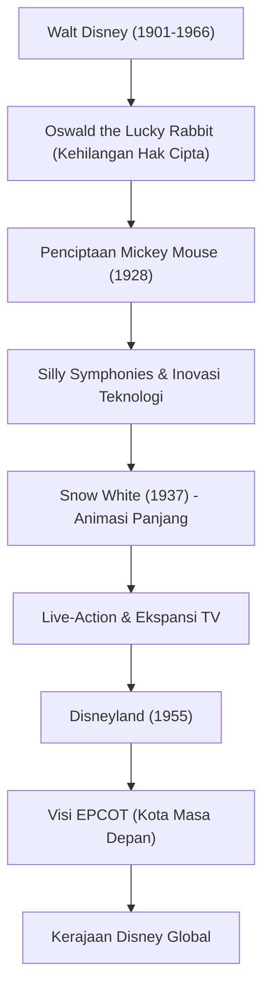

Walt Disney (Walter Elias Disney) bukan hanya sekadar animator atau produser film, melainkan "Pencipta Mimpi" perwakilan abad ke-20. Namanya kini menjadi merek yang dikenal semua orang di seluruh dunia, tetapi di balik itu terdapat kegagalan yang tak terhitung jumlahnya serta semangat pantang menyerah untuk mengatasinya. Artikel ini mengeksplorasi kehidupan dan filosofinya, bagaimana ia mengangkat animasi yang dulunya bidang belum matang menjadi sebuah seni, dan bagaimana ia membangun bentuk hiburan baru bernama taman hiburan.

## "Mickey Mouse" yang Lahir dari Kegagalan

Lahir di Chicago pada tahun 1901, Walt sangat menyukai menggambar sejak kecil. Pada masa mudanya, ia mendirikan perusahaan produksi animasi di Kansas City, namun usahanya gagal dan ia mengalami kebangkrutan. Dalam keadaan hampir tanpa uang, ia pergi ke Hollywood dan mendirikan "Disney Brothers Studio" bersama kakaknya, Roy.

Setelah mengalami pukulan besar akibat direbutnya hak cipta karya sukses pertamanya, "Oswald the Lucky Rabbit", oleh perusahaan distributor, "Mickey Mouse" diciptakan di tengah keputusasaan. "Steamboat Willie" yang dirilis pada tahun 1928 adalah animasi suara pertama di dunia yang menyinkronkan gambar dan suara secara sempurna, menjadikan Mickey bintang global dalam sekejap. Bakatnya dalam mengubah krisis menjadi peluang terbesar telah terlihat sejak saat itu.

## Mengubah Animasi Menjadi "Seni": Tantangan Snow White

Ambisi Walt selanjutnya adalah memproduksi film animasi panjang. Pada saat itu, para kritikus dan rekan seprofesi mencemooh proyek ini dengan mengatakan, "Tidak mungkin orang dewasa mau menonton animasi selama lebih dari satu jam" atau "Itu akan merusak mata." Proyek ini bahkan disebut sebagai "Kebodohan Disney". Namun, ia tidak berkompromi sedikit pun dan terus melanjutkan produksi dengan menginvestasikan seluruh kekayaannya.

Dirilis pada tahun 1937, "Snow White" mencatat kesuksesan besar yang belum pernah terjadi sebelumnya. Visual yang mendalam berkat kamera multiplane yang inovatif, serta ekspresi emosi karakter yang detail, membuktikan bahwa animasi bukan sekadar hiburan anak-anak, melainkan "seni" sejati yang mampu menyentuh hati banyak orang.

## Negeri Impian yang "Tidak Akan Pernah Selesai": Disneyland

Setelah mencapai puncak di dunia film, perhatian Walt beralih ke dunia nyata. Berawal dari keinginan "ingin membuat tempat di mana orang tua dan anak-anak bisa bersenang-senang bersama", konsep taman hiburan ini terwujud dengan dibukanya "Disneyland" di Anaheim, California, pada tahun 1955.

Disneyland mengubah konsep taman hiburan dari akarnya. Ruang bersih tanpa sedikit pun sampah, area bertema imersif layaknya set film, serta konsep "Cast" yang melayani "Guest". Walt meninggalkan pesan, "Disneyland tidak akan pernah selesai. Ia akan terus berkembang selama masih ada imajinasi di dunia." Filosofi ini terus diwariskan ke seluruh taman Disney di dunia hingga saat ini.

## Diagram Korelasi Pencapaian dan Visi

Mari kita lihat kembali bagaimana pencapaiannya berkembang melalui diagram berikut.

## Pengaruh pada Generasi Mendatang dan Filosofi Walt

Walt Disney meninggal dunia pada tahun 1966, namun filosofi "Empat C" (Curiosity, Confidence, Courage, Constancy: Rasa Ingin Tahu, Kepercayaan Diri, Keberanian, Keteguhan) yang ia tinggalkan masih terus memberikan inspirasi besar bagi para kreator dan pemimpin bisnis.

Ia lebih percaya pada kekuatan teknologi daripada siapa pun. Mulai dari film bersuara, film berwarna, kamera multiplane, hingga audio-animatronics (boneka bergerak menggunakan robotika), ia adalah pelopor yang selalu menggabungkan teknologi terbaru ke dalam hiburan. Visi "EPCOT (Experimental Prototype Community of Tomorrow)" yang digambarkannya tidak sekadar taman hiburan, melainkan mencakup perencanaan kota agar umat manusia dapat hidup lebih baik.

Kehidupan Walt Disney adalah perwujudan dari kata-katanya, "Jika Anda bisa memimpikannya, Anda bisa melakukannya (If you can dream it, you can do it)." Keajaiban yang diciptakan oleh imajinasinya akan terus menerangi hati kita melintasi berbagai generasi.
