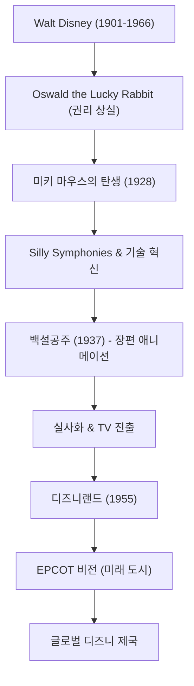

월트 디즈니(Walter Elias Disney)는 단순한 애니메이터나 영화 프로듀서라는 틀에 얽매이지 않는 20세기를 대표하는 '꿈의 창조자'입니다. 그의 이름은 이제 전 세계 누구나 아는 브랜드가 되었지만, 그 이면에는 수많은 좌절과 이를 극복하려는 불굴의 정신이 있었습니다. 이 글에서는 그가 어떻게 애니메이션이라는 미성숙한 분야를 예술로 승화시키고, 테마파크라는 새로운 엔터테인먼트의 형태를 확립했는지 그의 생애와 철학을 살펴봅니다.

## 좌절에서 태어난 '미키 마우스'

1901년 시카고에서 태어난 월트는 어릴 적부터 그림 그리는 것에 푹 빠져 있었습니다. 청년 시절 캔자스시티에서 애니메이션 제작사를 차렸지만 비즈니스로는 실패하여 파산을 경험합니다. 거의 무일푼 상태로 할리우드로 향한 그는 형 로이와 함께 '디즈니 브라더스 스튜디오'를 설립했습니다.

초기 히트작 '오스월드 더 럭키 래빗'의 권리를 배급사에 빼앗기는 큰 타격을 입은 후, 실의의 밑바닥에서 탄생한 것이 바로 '미키 마우스'입니다. 1928년에 개봉한 '증기선 윌리'는 영상과 소리를 완벽하게 동기화한 세계 최초의 토키 애니메이션이었으며, 미키는 순식간에 세계적인 스타가 되었습니다. 위기를 가장 큰 기회로 바꾸는 그의 재능은 이때부터 이미 발휘되고 있었습니다.

## 애니메이션을 '예술'로: 백설공주의 도전

월트의 다음 야망은 장편 애니메이션 영화 제작이었습니다. 당시 "어른들이 1시간 넘게 애니메이션을 볼 리가 없다", "눈이 나빠진다"며 비평가들과 동종 업계 사람들의 조롱을 받았고, 이 프로젝트는 '디즈니의 어리석은 장난'이라고 불렸습니다. 하지만 그는 어떠한 타협도 허용하지 않고 전 재산을 투자해 제작을 이어나갔습니다.

1937년에 개봉한 '백설공주'는 공전의 대히트를 기록했습니다. 혁신적인 멀티플레인 카메라를 활용한 깊이 있는 영상, 캐릭터들의 섬세한 감정 표현은 애니메이션이 단순한 어린이용 오락이 아니라 사람들의 마음을 움직이는 진정한 '예술'임을 증명한 것입니다.

## "영원히 완성되지 않는" 꿈의 나라: 디즈니랜드

영상 세계에서 정점을 찍은 월트의 시선은 현실 공간으로 향했습니다. "부모와 아이가 함께 즐길 수 있는 장소를 만들고 싶다"는 생각에서 시작된 테마파크 구상은 1955년 캘리포니아주 애너하임에서 '디즈니랜드' 개장으로 결실을 맺습니다.

디즈니랜드는 놀이공원이라는 개념을 근본부터 뒤집었습니다. 쓰레기 하나 떨어져 있지 않은 청결한 공간, 영화 세트장처럼 몰입감 있는 테마 구역, 그리고 '게스트(손님)'를 대접하는 '캐스트(직원)'라는 개념. 월트는 "디즈니랜드는 영원히 완성되지 않는다. 세상에 상상력이 존재하는 한 계속 성장할 것이다"라는 말을 남겼습니다. 이 철학은 현재도 전 세계 디즈니 파크에 맥맥이 이어지고 있습니다.

## 업적과 비전의 상관도

그가 남긴 업적이 어떻게 발전해 왔는지 아래의 도표로 되돌아봅시다.

## 후세에 미친 영향과 월트의 철학

월트 디즈니는 1966년에 세상을 떠났지만, 그가 남긴 철학인 'Four C's (Curiosity, Confidence, Courage, Constancy: 호기심, 자신감, 용기, 끈기)'는 지금도 크리에이터와 비즈니스 리더들에게 지대한 영감을 주고 있습니다.

그는 기술의 힘을 누구보다 믿었습니다. 토키 영화, 컬러 영상, 멀티플레인 카메라, 나아가 오디오 애니매트로닉스(로봇 공학을 이용해 움직이는 인형)까지, 항상 최신 기술을 엔터테인먼트에 융합하는 선구자였습니다. 그가 그린 'EPCOT (실험적 미래 도시)'의 비전은 단순한 유원지에 머물지 않고 인류가 더 나은 삶을 영위하기 위한 도시 계획에까지 이르렀습니다.

월트 디즈니의 생애는 "꿈을 꿀 수 있다면, 실현할 수 있다(If you can dream it, you can do it)"라는 말 그 자체입니다. 그의 상상력이 만들어낸 마법은 앞으로도 세대를 넘어 우리들의 마음을 계속 비춰줄 것입니다.
