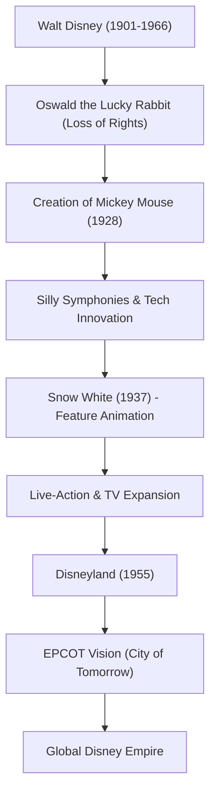

ウォルト・ディズニー（Walter Elias Disney）は、単なるアニメーターや映画プロデューサーという枠に収まらない、20世紀を代表する「夢の創造者」です。彼の名前は今や世界中の誰もが知るブランドですが、その裏には数え切れないほどの挫折と、それを乗り越える不屈の精神がありました。本記事では、彼がどのようにしてアニメーションという未成熟な分野を芸術へと昇華させ、テーマパークという新しいエンターテインメントの形を確立したのか、その生涯と哲学に迫ります。

## 挫折から生まれた「ミッキーマウス」

1901年にシカゴで生まれたウォルトは、幼い頃から絵を描くことに夢中でした。青年期にカンザスシティでアニメーション制作会社を立ち上げるものの、ビジネスとしては失敗し、倒産を経験します。無一文に近い状態でハリウッドへ向かった彼は、兄のロイとともに「ディズニー・ブラザーズ・スタジオ」を設立しました。

初期のヒット作「オズワルド・ザ・ラッキー・ラビット」の権利を配給会社に奪われるという大きな痛手を負った後、失意のどん底で生み出されたのが「ミッキーマウス」です。1928年に公開された『蒸気船ウィリー』は、映像と音を完全に同期させた世界初のトーキー・アニメーションであり、ミッキーは瞬く間に世界的なスターとなりました。ピンチを最大のチャンスに変える彼の才覚は、この時からすでに発揮されていました。

## アニメーションを「芸術」へ：白雪姫の挑戦

ウォルトの次なる野望は、長編アニメーション映画の制作でした。当時、「大人が1時間以上もアニメを見るわけがない」「目を悪くする」と批評家や同業者から嘲笑され、このプロジェクトは「ディズニーの道楽」と呼ばれました。しかし、彼は一切の妥協を許さず、全財産を投じて制作を続行します。

1937年に公開された『白雪姫』は、空前の大ヒットを記録しました。革新的なマルチプレーン・カメラによる奥行きのある映像、キャラクターの細やかな感情表現は、アニメーションが単なる子供向けの余興ではなく、人々の心を動かす本物の「芸術」であることを証明したのです。

## 「永遠に完成しない」夢の国：ディズニーランド

映像の世界で頂点を極めたウォルトの目は、現実空間へと向けられました。「親と子供が一緒に楽しめる場所を作りたい」という思いから始まったテーマパーク構想は、1955年のカリフォルニア州アナハイムでの「ディズニーランド」開園として結実します。

ディズニーランドは、遊園地という概念を根本から覆しました。ゴミ一つ落ちていない清潔な空間、映画のセットのような没入感のあるテーマエリア、そして「ゲスト」をもてなす「キャスト」という概念。ウォルトは「ディズニーランドは永遠に完成しない。世界に想像力がある限り、成長し続けるだろう」という言葉を残しました。この哲学は、現在も世界中のディズニーパークに脈々と受け継がれています。

## 功績とビジョンの相関図

彼の残した功績がどのように発展していったのか、以下の図解で振り返ってみましょう。

## 後世への影響とウォルトの哲学

ウォルト・ディズニーは1966年にこの世を去りましたが、彼の遺した哲学「Four C's（Curiosity, Confidence, Courage, Constancy：好奇心、自信、勇気、継続）」は、今もクリエイターやビジネスリーダーたちに多大なインスピレーションを与え続けています。

彼はテクノロジーの力を誰よりも信じていました。トーキー、カラー映像、マルチプレーン・カメラ、さらにはオーディオ・アニマトロニクス（ロボット工学を用いた動く人形）まで、常に最新技術をエンターテインメントに融合させる先駆者でした。彼の描いた「EPCOT（実験的未来都市）」のビジョンは、単なる遊園地にとどまらず、人類がより良い生活を送るための都市計画にまで及んでいました。

ウォルト・ディズニーの生涯は、「夢を思い描くことができれば、それは実現できる（If you can dream it, you can do it）」という言葉そのものです。彼の想像力が生み出した魔法は、これからも世代を超えて私たちの心を照らし続けることでしょう。
