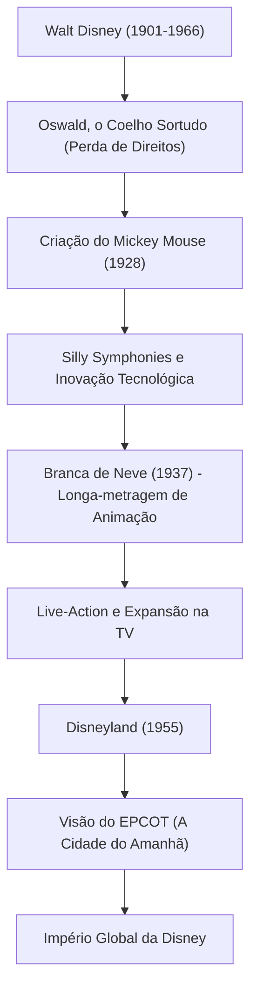

Walt Disney (Walter Elias Disney) é um emblemático "criador de sonhos" do século XX, cuja influência vai muito além de ser um mero animador ou produtor de cinema. Seu nome hoje é uma marca conhecida por todos em todo o mundo, mas por trás desse sucesso há inúmeros fracassos e um espírito indomável para superá-los. Este artigo explora a sua vida e filosofia, e como ele elevou a animação, então um campo imaturo, à arte, e estabeleceu uma nova forma de entretenimento com os parques temáticos.

## "Mickey Mouse" nascido do fracasso

Nascido em Chicago em 1901, Walt era fascinado por desenho desde muito jovem. Embora tenha fundado uma produtora de animação em Kansas City durante a juventude, o negócio fracassou e ele faliu. Chegando a Hollywood quase sem um tostão, ele fundou o "Disney Brothers Studio" junto com seu irmão Roy.

Depois de sofrer o duro golpe de ter os direitos de seu primeiro sucesso, "Oswald, o Coelho Sortudo", tomados por uma empresa de distribuição, foi no fundo do desespero que nasceu o "Mickey Mouse". "Steamboat Willie", lançado em 1928, foi a primeira animação sonora do mundo a sincronizar perfeitamente imagem e som, e Mickey tornou-se instantaneamente uma estrela mundial. O seu talento para transformar uma crise na sua maior oportunidade já era evidente naquela época.

## A animação torna-se "Arte": O desafio da Branca de Neve

A próxima ambição de Walt era produzir um longa-metragem de animação. Na época, os críticos e colegas chamavam o projeto de "loucura da Disney", zombando: "Os adultos nunca vão assistir a um desenho animado por mais de uma hora" e "Isso vai estragar a visão deles". No entanto, ele não permitiu compromissos e investiu toda a sua fortuna para continuar a produção.

Lançado em 1937, "Branca de Neve" registrou um sucesso sem precedentes. A profundidade da imagem criada pela inovadora câmera multiplano e a delicada expressão emocional dos personagens provaram que a animação não era apenas um passatempo para crianças, mas uma verdadeira "arte" capaz de tocar os corações das pessoas.

## Uma terra dos sonhos "Nunca concluída": Disneyland

Tendo alcançado o topo no mundo do cinema, os olhos de Walt voltaram-se para o espaço real. O conceito de parque temático, que começou com o desejo de "criar um lugar onde pais e filhos pudessem se divertir juntos", se concretizou com a abertura da "Disneyland" em Anaheim, Califórnia, em 1955.

A Disneyland revolucionou fundamentalmente o conceito de parques de diversões. Um espaço limpo e sem lixo, áreas temáticas imersivas semelhantes a cenários de filmes e o conceito de "membros do elenco" (cast members) recebendo os "convidados" (guests). Walt deixou a seguinte citação: "A Disneyland nunca estará concluída. Ela continuará a crescer enquanto houver imaginação no mundo." Esta filosofia continua a viver hoje nos parques da Disney em todo o mundo.

## Diagrama de correlação de conquistas e visão

Vamos ver como as suas conquistas se desenvolveram no diagrama a seguir.

## Influência nas gerações futuras e filosofia de Walt

Walt Disney faleceu em 1966, mas a sua filosofia dos "Quatro Cs" (Curiosity, Confidence, Courage, Constancy: Curiosidade, Confiança, Coragem, Constância) continua a inspirar profundamente criadores e líderes de negócios hoje.

Ele acreditava no poder da tecnologia mais do que ninguém. Do som e da cor, à câmera multiplano, e até mesmo aos animatrônicos (bonecos em movimento usando robótica), ele sempre foi um pioneiro na fusão da tecnologia mais recente com o entretenimento. A sua visão do "EPCOT" (Protótipo Experimental da Comunidade do Amanhã) não se limitava a um parque de diversões, mas se estendia ao planejamento urbano para que a humanidade tivesse uma vida melhor.

A vida de Walt Disney é a personificação da frase "Se você pode sonhar, você pode fazer" (If you can dream it, you can do it). A magia criada pela sua imaginação certamente continuará a iluminar os nossos corações através de gerações.
