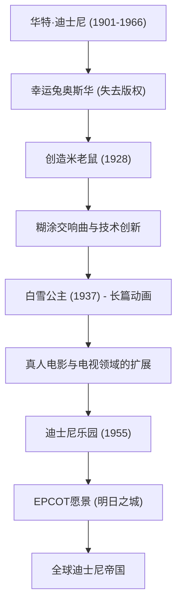

华特·迪士尼（Walter Elias Disney）是一位代表20世纪的“梦想创造者”，他超越了单纯的动画师或电影制作人的范畴。如今，他的名字已成为全世界无人不知的品牌，但在其背后，隐藏着无数的挫折以及克服这些挫折的不屈精神。本文将带您走进他的生平与哲学，探究他如何将动画这一不成熟的领域升华为艺术，并确立了主题公园这种全新的娱乐形式。

## 从挫折中诞生的“米老鼠”

1901年出生于芝加哥的华特，从小就痴迷于画画。青年时期，他在堪萨斯城创立了一家动画制作公司，但作为一门生意却以失败告终，并经历了破产。在几乎身无分文的状态下前往好莱坞后，他与哥哥罗伊共同创立了“迪士尼兄弟工作室”。

在经历了将早期大热作品“幸运兔奥斯华”的版权被发行商夺走的重创后，“米老鼠”在失意的谷底中诞生了。1928年上映的《汽船威利号》是世界上第一部画面与声音完全同步的有声动画，米奇瞬间成为了世界级的明星。他将危机转化为最大机遇的才华，从此时起便已展现得淋漓尽致。

## 将动画升华为“艺术”：白雪公主的挑战

华特的下一个野心是制作长篇动画电影。当时，评论家和同行嘲笑这个项目为“迪士尼的痴心妄想”，声称“成年人不可能看一个多小时的动画”、“会弄坏眼睛”。然而，他不容许任何妥协，投入全部财产继续制作。

1937年上映的《白雪公主》创下了空前的票房纪录。创新性的多平面摄影机带来的具有层次感的画面，以及角色细腻的情感表达，证明了动画不仅是孩子们的消遣，更是能打动人心的真正“艺术”。

## “永远不会完工”的梦想国度：迪士尼乐园

在影像世界登峰造极之后，华特的目光转向了现实空间。源于“想创造一个父母和孩子能一起玩乐的地方”的想法，主题公园的构想最终结出了果实——1955年加利福尼亚州阿纳海姆的“迪士尼乐园”正式开园。

迪士尼乐园从根本上颠覆了游乐园的概念。没有一片垃圾的整洁空间，宛如电影布景般让人身临其境的主题区域，以及由“演职人员”招待“宾客”的概念。华特留下了一句名言：“只要这个世界上还有想象力，迪士尼乐园就永远不会完工。”这种理念，至今仍在世界各地的迪士尼乐园中脉脉相传。

## 成就与愿景的相关图

让我们通过下面的图解，来回顾他所留下的成就是如何发展的。

## 对后世的影响与华特的哲学

华特·迪士尼于1966年与世长辞，但他留下的哲学“4个C（Curiosity, Confidence, Courage, Constancy：好奇心、自信心、勇气、恒心）”，至今仍在为创作者和商业领袖们提供着巨大的灵感。

他比任何人都相信科技的力量。从有声电影、彩色影像、多平面摄影机，甚至到发声机动装置（运用机器人技术的活动人偶），他始终是将最新技术融入娱乐的先驱。他所描绘的“EPCOT（实验性未来城市）”愿景，不仅局限于游乐园，更延伸到了为了让人类过上更美好生活而进行的城市规划。

华特·迪士尼的一生，正是“只要你能梦想，你就能做到（If you can dream it, you can do it）”这句话的真实写照。他用想象力创造出的魔法，必将跨越世代，继续照亮我们的心灵。
