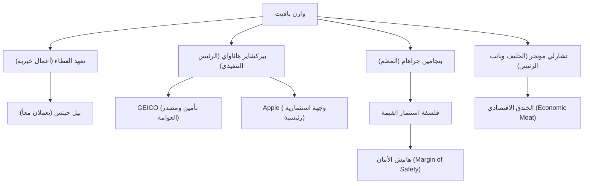

يُعرف وارن بافيت (Warren Buffett) بأنه أنجح مستثمر في العالم. ولا يقتصر تأثيره، وهو الذي يُلقب بـ "حكيم أوماها"، على كونه مليارديراً جمع ثروة طائلة فحسب، بل يمتد ليؤثر بشكل كبير على الناس في جميع أنحاء العالم من خلال فلسفته الاستثمارية، وأخلاقياته، وأعماله الخيرية. في هذا المقال، سنتعمق في كيفية تحوله إلى إله الاستثمار، وحياته، وفلسفته الاستثمارية الفريدة، والإرث الذي سيتركه للأجيال القادمة.

### حس الأعمال منذ الطفولة وأول استثمار

وُلد بافيت في 30 أغسطس 1930 في مدينة أوماها بولاية نبراسكا، وأظهر منذ صغره حساً تجارياً مذهلاً وشغفاً بالأرقام. لقد اكتسب خبرة من خلال شراء العلكة وكوكاكولا من متجر البقالة الخاص بجده، وبيعها من خلال المرور على منازل الجيران، محققاً أرباحاً ثابتة.

ومن المثير للدهشة أنه اشترى أول أسهمه (أسهم ممتازة في شركة سيتيز سيرفيس) عندما كان في الحادية عشرة من عمره. في ذلك الوقت، انخفض سعر السهم مؤقتًا بعد الشراء، ثم باعه عندما ارتفع قليلاً ليحقق ربحًا صغيرًا. ومع ذلك، بعد بيعه، ارتفع سعر السهم عدة مرات، مما جعله يدرك مبكرًا "أهمية الصبر والاحتفاظ بالأسهم لفترة طويلة". أصبحت هذه التجربة المريرة نقطة الانطلاق لأسلوبه الاستثماري في المستقبل.

### اللقاء مع المعلم بنجامين جراهام

ما حدد مسيرة بافيت كمستثمر هو لقاؤه ببنجامين جراهام في جامعة كولومبيا. كان جراهام، المعروف بـ "أبو استثمار القيمة"، يدعو إلى نهج استثماري يركز على الفجوة بين "القيمة الجوهرية (Intrinsic Value)" للشركة و"سعر السوق".

استوعب بافيت بشغف تعاليم جراهام، وقام بتحليل البيانات المالية بدقة، وبنى أساسًا متينًا للاستثمار في الشركات التي تُترك في السوق بسعر أرخص من قيمتها الجوهرية. بعد التخرج، عمل في شركة استثمار جراهام، حيث تعلم جوهر الاستثمار بشكل أعمق.

### بناء وتطور بيركشاير هاثاواي

في ستينيات القرن الماضي، بدأ بافيت في جمع أسهم شركة المنسوجات المتعثرة "بيركشاير هاثاواي"، وسيطر في النهاية على إدارتها. في البداية، حاول إنعاش صناعة المنسوجات، لكنه أدرك لاحقًا أنها صناعة متدهورة وصعبة من الناحية الهيكلية، فنجح ببراعة في تحويل الشركة إلى شركة استثمارية قابضة.

استحوذ على أعمال التأمين (خاصة شركة GEICO)، وأسس نموذج عمل يستخدم "العوامة (الأموال المحتفظ بها حتى يتم دفعها كمطالبات تأمين في المستقبل)" كأموال استثمارية خالية من الفوائد. كانت هذه الآلية هي القوة الدافعة الأكبر التي نمت بيركشاير هاثاواي لتصبح واحدة من أكبر التكتلات في العالم.

### فلسفة استثمارية فريدة: "الخندق الاقتصادي" وقوة الفائدة المركبة

تطورت فلسفة بافيت الاستثمارية تدريجيًا من استثمار القيمة الخالص لجراهام، بتأثير من حليفه القديم تشارلي مونجر. كان هذا التحول إلى سياسة "من الأفضل شراء شركة رائعة بسعر عادل بدلاً من شراء شركة عادلة بسعر رائع".

تكمن في صميم فلسفته العناصر الهامة التالية:

1. **الخندق الاقتصادي (Economic Moat)**: يفضل الشركات التي تتمتع بميزة تنافسية قوية لا يمكن للشركات الأخرى تقليدها بسهولة. يشمل ذلك قوة العلامة التجارية القوية، وتكاليف التبديل العالية، وتأثيرات الشبكة.
2. **الاستثمار في أعمال مفهومة**: لسنوات عديدة، تجنب الاستثمار في شركات التكنولوجيا المعقدة التي لا يستطيع فهمها. يحرص بشدة على البقاء ضمن "دائرة كفاءته". (ومع ذلك، أظهر لاحقًا مرونة من خلال القيام باستثمار واسع النطاق في Apple).
3. **الاحتفاظ طويل الأجل وسحر الفائدة المركبة**: كما يقول، "فترة الاحتفاظ المفضلة لدينا هي 'إلى الأبد'"، فهو يحتفظ بأسهم الشركات الممتازة ذات الإدارة المتميزة لفترة طويلة، ويستفيد إلى أقصى حد من قوة الفائدة المركبة.

### مخطط العلاقات وتدفق الإنجازات المحيطة ببافيت

يوضح الشكل التالي شبكة بافيت وروابط الأعمال والاستثمارات الناتجة عن فلسفته.

### الأعمال الخيرية والتأثير على الأجيال القادمة

قرر بافيت رد الجميل للمجتمع بدلاً من الاحتفاظ بثروته الهائلة لنفسه أو لعائلته. في عام 2006، فاجأ العالم بإعلان تبرعه بمعظم ثروته لجمعيات خيرية، على رأسها مؤسسة بيل وميليندا جيتس.

بالإضافة إلى ذلك، أسس مع بيل جيتس وآخرين "تعهد العطاء (The Giving Pledge)"، ودعا أثرياء العالم للتبرع بأكثر من نصف ثرواتهم للأعمال الخيرية، سواء خلال حياتهم أو بعد وفاتهم. وقد أحدث هذا تأثيرًا كبيرًا على كيفية إعادة توزيع الثروة في الرأسمالية الحديثة.

أسلوب حياته متواضع بشكل مدهش. لا يزال يعيش في منزل في أوماها اشتراه في عام 1958 مقابل 31500 دولار، ويفضل تناول الإفطار في ماكدونالدز كل صباح، ويقود سيارته بنفسه. وهذا يوضح طبيعته الصادقة، حيث لا يهدف إلى تراكم الثروة في حد ذاته، بل يحب بحتة "اللعبة" الفكرية المتمثلة في الاستثمار.

### الخلاصة

ما سيتركه وارن بافيت للأجيال القادمة ليس مجرد أرقام العوائد الساحقة التي جلبتها الفائدة المركبة. بل هو البحث الشامل واتخاذ القرارات العقلانية، والصبر على عدم التشتت بسبب ذعر السوق أو الأرباح قصيرة الأجل، والأخلاقيات العالية المتمثلة في رد الثروة المكتسبة للمجتمع.

ستظل طريقة حياة "حكيم أوماها" وفلسفته العميقة التي لا تتزعزع بوصلة مهمة ليس فقط للمستثمرين المحترفين، ولكن لجميع الأشخاص الذين يعيشون في المجتمع الرأسمالي المعقد اليوم.
