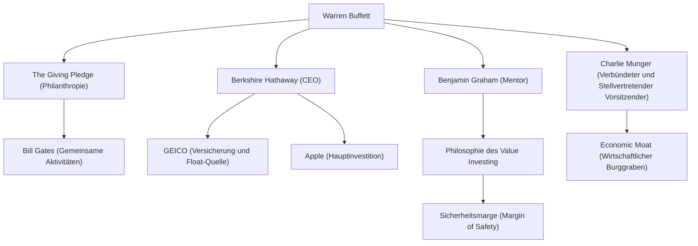

Warren Buffett, bekannt als der erfolgreichste Investor der Welt. Er trägt den Spitznamen "Das Orakel von Omaha" und ist weit mehr als nur ein Milliardär, der ein riesiges Vermögen angehäuft hat; er übt mit seiner Anlagephilosophie, seinem ethischen Kompass und seinen philanthropischen Aktivitäten weiterhin einen massiven Einfluss auf Menschen auf der ganzen Welt aus. In diesem Artikel werden wir tief in sein Leben, seine einzigartige Anlagephilosophie und das Erbe eintauchen, das er künftigen Generationen hinterlässt, um herauszufinden, wie er zum Gott des Investierens wurde.

### Geschäftssinn aus der Kindheit und erste Investition

Geboren am 30. August 1930 in Omaha, Nebraska, zeigte Buffett schon in jungen Jahren einen erstaunlichen Geschäftssinn und eine Faszination für Zahlen. Er kaufte Kaugummi und Coca-Cola im Lebensmittelgeschäft seines Großvaters und verkaufte sie von Tür zu Tür in seiner Nachbarschaft, womit er sich die Erfahrung aneignete, kontinuierlich Gewinne zu erzielen.

Erstaunlicherweise kaufte er im Alter von 11 Jahren seine erste Aktie (Vorzugsaktien von Cities Service). Damals fiel der Aktienkurs nach dem Kauf zunächst, und er verkaufte sie, als der Kurs leicht stieg, um einen kleinen Gewinn zu erzielen. Nachdem er jedoch verkauft hatte, stieg der Aktienkurs rasant um das Mehrfache an, was ihm schon früh die "Bedeutung von Geduld und langfristigem Halten" vor Augen führte. Diese bittere Erfahrung wurde zum Ursprung seines späteren Anlagestils.

### Die Begegnung mit seinem Mentor Benjamin Graham

Entscheidend für Buffetts Karriere als Investor war seine Begegnung mit Benjamin Graham an der Columbia University. Graham, der als "Vater des Value Investing" bezeichnet wird, vertrat einen Anlageansatz, der sich auf die Diskrepanz zwischen dem "inneren Wert" (Intrinsic Value) eines Unternehmens und seinem "Marktpreis" konzentrierte.

Buffett saugte Grahams Lehren begierig auf, lernte, Finanzberichte gründlich zu analysieren, und baute ein solides Fundament auf, um in Unternehmen zu investieren, die auf dem Markt unter ihrem inneren Wert gehandelt wurden. Nach seinem Abschluss arbeitete er in Grahams Investmentfirma, wo er die Essenz des Investierens noch tiefer erlernte.

### Aufbau und Entwicklung von Berkshire Hathaway

In den 1960er Jahren begann Buffett, Aktien des in Schwierigkeiten geratenen Textilunternehmens Berkshire Hathaway aufzukaufen, und übernahm schließlich die Kontrolle über das Management. Anfangs versuchte er, das Textilgeschäft zu sanieren, erkannte aber später, dass es sich um eine sterbende Industrie handelte, die strukturell schwierig war, und wandelte das Unternehmen erfolgreich in eine Investment-Holdinggesellschaft um.

Er etablierte ein Geschäftsmodell, indem er Versicherungsgeschäfte (insbesondere GEICO) erwarb und den daraus resultierenden "Float" (Gelder, die bis zur zukünftigen Auszahlung von Versicherungsansprüchen einbehalten werden) als zinsloses Investitionskapital nutzte. Genau dieser Mechanismus wurde zur größten treibenden Kraft, die Berkshire Hathaway zu einem der größten Konglomerate der Welt wachsen ließ.

### Einzigartige Anlagephilosophie: Der "wirtschaftliche Burggraben" und die Kraft des Zinseszinses

Buffetts Anlagephilosophie entwickelte sich allmählich von Grahams reinem Value Investing unter dem Einfluss seines langjährigen Freundes und Verbündeten Charlie Munger weiter. Es war ein Wechsel zu der Strategie: "Es ist weitaus besser, ein wunderbares Unternehmen zu einem fairen Preis zu kaufen, als ein faires Unternehmen zu einem wunderbaren Preis."

Der Kern seiner Philosophie umfasst die folgenden Schlüsselelemente:

1. **Economic Moat (Wirtschaftlicher Burggraben)**: Er bevorzugt Unternehmen mit einem starken Wettbewerbsvorteil, den andere Unternehmen nicht leicht imitieren können. Dazu gehören eine starke Markenmacht, hohe Wechselkosten und Netzwerkeffekte.
2. **Investieren in verständliche Geschäftsmodelle**: Er mied lange Zeit Investitionen in komplexe Technologieunternehmen, die er nicht verstand. Er legte großen Wert darauf, innerhalb seines "Kompetenzkreises" zu bleiben. (Später zeigte er jedoch Flexibilität, indem er in großem Umfang in Apple investierte.)
3. **Langfristiges Halten und die Magie des Zinseszinses**: Wie er sagt, "Unsere bevorzugte Haltedauer ist 'für immer'". Er hält Aktien von hervorragenden Unternehmen mit exzellentem Management langfristig, um die Kraft des Zinseszinses maximal zu nutzen.

### Beziehungsdiagramm und Leistungsfluss rund um Buffett

Die folgende Grafik zeigt Buffetts Netzwerk und die aus seiner Philosophie hervorgegangenen Geschäfts- und Investitionsbeziehungen.

### Philanthropische Aktivitäten und Einfluss auf zukünftige Generationen

Buffett beschloss, der Gesellschaft etwas zurückzugeben, anstatt sein riesiges Vermögen für sich oder seine Familie zu behalten. Im Jahr 2006 überraschte er die Welt mit der Ankündigung, dass er den Großteil seines Vermögens an wohltätige Organisationen, darunter die Bill & Melinda Gates Foundation, spenden werde.

Darüber hinaus gründete er zusammen mit Bill Gates und anderen "The Giving Pledge", eine Initiative, die die wohlhabendsten Menschen der Welt dazu aufruft, zu Lebzeiten oder nach ihrem Tod mehr als die Hälfte ihres Vermögens für philanthropische Zwecke zu spenden. Dies hat eine bedeutende Diskussion über die Umverteilung von Reichtum im modernen Kapitalismus angestoßen.

Sein Lebensstil ist erstaunlich bescheiden. Er lebt noch immer in dem Haus in Omaha, das er 1958 für 31.500 Dollar kaufte, frühstückt jeden Morgen bei McDonald's und fährt sein Auto selbst. Dies spiegelt seinen aufrichtigen Charakter wider, der nicht den bloßen Zweck der Vermögensanhäufung verfolgt, sondern das intellektuelle "Spiel" des Investierens rein liebt.

### Zusammenfassung

Was Warren Buffett künftigen Generationen hinterlässt, sind nicht nur die Zahlen der überwältigenden Renditen, die der Zinseszins gebracht hat. Es sind seine gründliche Recherche und rationalen Entscheidungen, seine Geduld, sich nicht von Marktpaniken oder kurzfristigen Gewinnen beirren zu lassen, sowie sein hoher ethischer Standard, den erworbenen Reichtum an die Gesellschaft zurückzugeben.

Die Lebensweise und die tiefe, unerschütterliche Philosophie des "Orakels von Omaha" werden nicht nur für professionelle Investoren, sondern für alle Menschen, die in der komplexen kapitalistischen Gesellschaft von heute leben, ein wichtiger Kompass bleiben.
