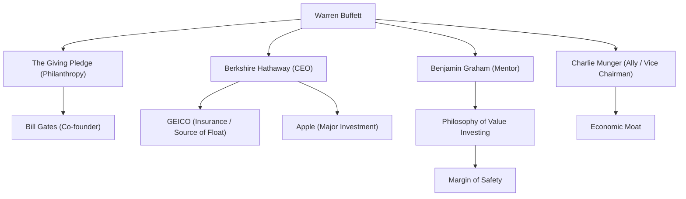

Known as the most successful investor in the world, Warren Buffett. With the nickname "The Oracle of Omaha," he is more than just a billionaire who has amassed immense wealth; he continues to have a profound influence on people all over the world through his investment philosophy, ethical views, and philanthropic activities. In this article, we delve deep into how he became the god of investing, his life, his unique investment philosophy, and his legacy.

### Business Acumen from Childhood and the First Investment

Born on August 30, 1930, in Omaha, Nebraska, Buffett demonstrated phenomenal business sense and an obsession with numbers from a young age. He gained experience in steadily generating profits by buying chewing gum and Coca-Cola from his grandfather's grocery store and selling them door-to-door in his neighborhood.

Amazingly, he bought his first stock (Cities Service preferred stock) at the age of 11. At that time, the stock price temporarily dropped after his purchase, and he sold it for a small profit when it rose slightly afterward. However, because the stock price skyrocketed several times higher after he sold it, he learned early on the "importance of holding patiently for the long term." This bitter experience became the starting point of his later investment style.

### Encounter with Mentor Benjamin Graham

What decisively shaped Buffett's career as an investor was his encounter with Benjamin Graham at Columbia University. Graham, known as the "Father of Value Investing," advocated an investment method that focused on the discrepancy between a company's "Intrinsic Value" and its "market price."

Buffett greedily absorbed Graham's teachings, thoroughly deciphering financial statements and building a solid foundation of investing in companies left in the market at prices cheaper than their intrinsic value. After graduation, he worked at Graham's investment firm, where he learned the essence of investing even more deeply.

### Building and Evolving Berkshire Hathaway

In the 1960s, Buffett bought up shares of a struggling textile company, "Berkshire Hathaway," and eventually took control of management. Initially, he tried to turn the textile business around, but later realized it was a declining industry with severe structural problems, and masterfully transformed the company into an investment holding company.

He established a business model of acquiring insurance businesses (especially GEICO) and utilizing the "float" (funds held until paid out as future insurance claims) obtained from them as interest-free investment funds. This mechanism became the biggest driving force that grew Berkshire Hathaway into one of the world's largest conglomerates.

### Unique Investment Philosophy: "Economic Moat" and the Power of Compound Interest

Buffett's investment philosophy gradually evolved from Graham's pure value investing, influenced by his longtime ally Charlie Munger. It was a shift to the policy of "It's far better to buy a wonderful company at a fair price than a fair company at a wonderful price."

At the core of his philosophy are the following key elements:

1. **Economic Moat**: He prefers companies with strong competitive advantages that are difficult for competitors to easily imitate. Powerful brand strength, high switching costs, and network effects fall under this category.
2. **Invest in Businesses You Understand**: For many years, he avoided investing in complex technology companies that he could not understand. He strictly stays within his "circle of competence." (However, he later made a large-scale investment in Apple, showing a flexible stance.)
3. **Long-Term Holding and the Magic of Compound Interest**: As he says, "Our favorite holding period is forever," he continues to hold stocks of excellent companies with outstanding management teams for a long time, maximizing the power of compound interest.

### Correlation Diagram and Flow of Achievements Surrounding Buffett

The following diagram shows Buffett's network and the connections between the businesses and investments born from his philosophy.

### Philanthropy and Influence on Future Generations

Buffett decided not to hoard his immense wealth individually or within his family, but to return it to society. In 2006, he shocked the world by announcing that he would donate the vast majority of his wealth to charitable organizations, primarily the Bill & Melinda Gates Foundation.

Furthermore, he co-founded "The Giving Pledge" with Bill Gates and others, calling on the world's wealthy to donate more than half of their wealth to philanthropy during their lifetime or upon their death. This has made a significant impact on the way wealth is redistributed in modern capitalism.

His lifestyle is surprisingly modest. He still lives in the Omaha house he bought for $31,500 in 1958, prefers a McDonald's breakfast every morning, and drives his own car. This reflects his sincere personality of genuinely loving the intellectual "game" of investing, rather than aiming for the accumulation of wealth itself.

### Conclusion

What Warren Buffett leaves to future generations is not just the numbers of overwhelming returns brought by compound interest. It is his thorough research and rational decision-making, his patience in not being swayed by market panic or short-term profits, and his high ethical standard of returning acquired wealth to society.

The lifestyle and deeply unwavering philosophy of the "Oracle of Omaha" will continue to be an important compass not only for professional investors but for all people navigating the complex capitalist society of today.
