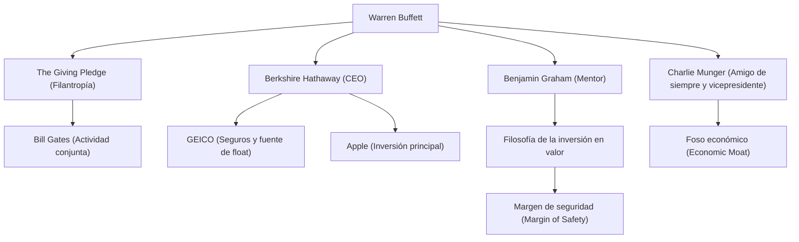

Conocido como el inversor más exitoso del mundo, Warren Buffett, apodado el «Oráculo de Omaha», no se limita a ser un mero multimillonario que ha amasado una inmensa fortuna. Continúa ejerciendo una profunda influencia en personas de todo el mundo a través de su filosofía de inversión, su ética y su filantropía. En este artículo, profundizaremos en su vida, su singular filosofía de inversión y el legado que deja a las generaciones futuras, analizando cómo llegó a convertirse en el dios de las inversiones.

### Sentido de los negocios desde la infancia y su primera inversión

Nacido el 30 de agosto de 1930 en Omaha, Nebraska, Buffett demostró desde muy joven un asombroso sentido de los negocios y una obsesión por los números. Compraba chicles y Coca-Cola en la tienda de ultramarinos de su abuelo, e iba de puerta en puerta por el vecindario vendiéndolos, acumulando experiencia en la generación constante de beneficios.

Sorprendentemente, compró sus primeras acciones (acciones preferentes de Cities Service) a los 11 años. En esa ocasión, el precio de las acciones cayó temporalmente tras la compra, y luego las vendió cuando subieron ligeramente, obteniendo un pequeño beneficio. Sin embargo, como el precio de las acciones se disparó multiplicándose varias veces después de que las vendiera, comprendió enseguida la «importancia de la paciencia y de mantener a largo plazo». Esta amarga experiencia se convirtió en el punto de partida de su posterior estilo de inversión.

### El encuentro con su mentor Benjamin Graham

Lo que determinó la carrera de Buffett como inversor fue su encuentro con Benjamin Graham en la Universidad de Columbia. Graham, conocido como el «padre de la inversión en valor», abogaba por un método de inversión que se centraba en la discrepancia entre el «valor intrínseco» (Intrinsic Value) de una empresa y su «precio de mercado».

Buffett absorbió con avidez las enseñanzas de Graham, leyendo minuciosamente los estados financieros y sentando las bases sólidas de invertir en empresas que el mercado dejaba de lado a precios inferiores a su valor intrínseco. Tras graduarse, trabajó en la sociedad de inversión de Graham, donde aprendió aún más sobre la esencia de la inversión.

### La construcción y evolución de Berkshire Hathaway

En la década de 1960, Buffett comenzó a comprar acciones de Berkshire Hathaway, una empresa textil en dificultades, y finalmente se hizo con el control de la misma. Aunque en un principio intentó revitalizar el negocio textil, más tarde se dio cuenta de que se trataba de una industria en declive y estructuralmente difícil, por lo que transformó brillantemente la empresa en un holding de inversiones.

Adquirió negocios de seguros (especialmente GEICO) y estableció un modelo de negocio que utilizaba el «float» (fondos retenidos hasta que se pagan como futuras indemnizaciones del seguro) obtenido de ellos como capital de inversión sin intereses. Este mecanismo fue el mayor motor que hizo crecer a Berkshire Hathaway hasta convertirse en uno de los mayores conglomerados del mundo.

### Una filosofía de inversión única: El «foso económico» y el poder del interés compuesto

La filosofía de inversión de Buffett evolucionó gradualmente desde la pura inversión en valor de Graham bajo la influencia de su amigo de muchos años, Charlie Munger. Fue un cambio hacia la política de que «es mejor comprar una empresa maravillosa a un precio justo que una empresa justa a un precio maravilloso».

El núcleo de su filosofía contiene los siguientes elementos clave:

1. **Foso económico (Economic Moat)**: Prefiere las empresas con una fuerte ventaja competitiva que otras empresas no puedan imitar fácilmente. Esto incluye una fuerte presencia de marca, altos costes de cambio y efectos de red.
2. **Invertir en negocios que pueda entender**: Durante muchos años ha evitado invertir en empresas tecnológicas complejas que no comprende. Es muy estricto a la hora de mantenerse dentro de su «círculo de competencia». (No obstante, más tarde realizó una inversión a gran escala en Apple, mostrando también una actitud flexible).
3. **Mantener a largo plazo y la magia del interés compuesto**: Como él mismo dice, «nuestro periodo de tenencia favorito es para siempre»; mantiene acciones de empresas excelentes con equipos directivos sobresalientes durante un largo periodo de tiempo, maximizando el poder del interés compuesto.

### Diagrama de relaciones en torno a Buffett y flujo de sus logros

El siguiente diagrama muestra la red de contactos de Buffett y las conexiones empresariales y de inversión surgidas de su filosofía.

### Filantropía y su impacto en la posteridad

Buffett decidió no acaparar su inmensa riqueza para sí mismo o para su familia, sino devolverla a la sociedad. En 2006, sorprendió al mundo anunciando que donaría la mayor parte de su fortuna a organizaciones benéficas, empezando por la Fundación Bill y Melinda Gates.

Además, junto con Bill Gates y otros, fundó «The Giving Pledge», pidiendo a las personas más ricas del mundo que donaran más de la mitad de su riqueza a causas filantrópicas, ya sea en vida o tras su muerte. Esto ha tenido un gran impacto en el modo en que se redistribuye la riqueza en el capitalismo moderno.

Su estilo de vida es sorprendentemente frugal. Todavía vive en la casa de Omaha que compró en 1958 por 31.500 dólares, disfruta desayunando en McDonald's cada mañana y conduce su propio coche. Esto refleja su sincera humanidad al amar puramente el «juego» intelectual de la inversión, en lugar de aspirar a la mera acumulación de riqueza.

### Conclusión

Lo que Warren Buffett lega a las generaciones futuras no son solo las cifras de los abrumadores rendimientos producidos por el interés compuesto. También incluye su exhaustiva investigación y toma de decisiones racional, la paciencia para no dejarse llevar por el pánico del mercado o los beneficios a corto plazo, y una gran ética que le lleva a devolver la riqueza adquirida a la sociedad.

El modo de vida del «Oráculo de Omaha» y su filosofía profunda e inquebrantable seguirán siendo una brújula importante no solo para los inversores profesionales, sino para todos aquellos que viven en la compleja sociedad capitalista actual.
