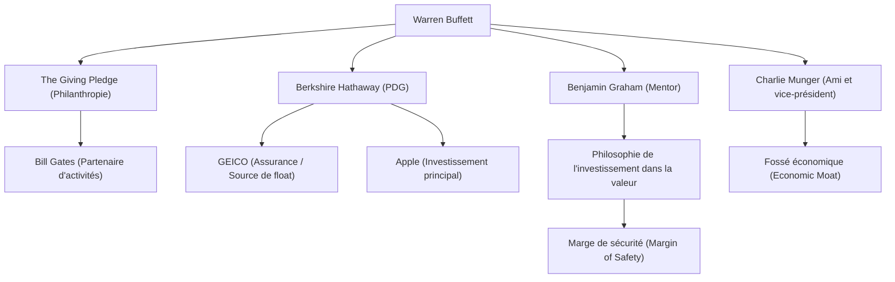

Warren Buffett est connu comme l'investisseur le plus prospère au monde. Surnommé « l'Oracle d'Omaha », il dépasse largement le cadre du simple milliardaire ayant amassé une immense fortune, et continue d'exercer une influence majeure sur les gens du monde entier par sa philosophie d'investissement, son éthique et ses activités philanthropiques. Cet article explore en profondeur comment il est devenu le dieu de l'investissement, sa vie, sa philosophie d'investissement unique, ainsi que l'héritage qu'il laisse aux générations futures.

### Un sens des affaires précoce et le premier investissement

Né le 30 août 1930 à Omaha, dans le Nebraska, Buffett a fait preuve d'un sens aigu des affaires et d'une fascination pour les chiffres dès son plus jeune âge. Il achetait des chewing-gums et du Coca-Cola dans l'épicerie de son grand-père pour faire du porte-à-porte dans le quartier, accumulant ainsi de l'expérience en réalisant des bénéfices réguliers.

Étonnamment, il a acheté ses premières actions (des actions privilégiées de Cities Service) à l'âge de 11 ans. Après son achat, le cours de l'action a brièvement chuté avant de remonter légèrement, moment qu'il a choisi pour vendre et réaliser un petit profit. Cependant, le cours de l'action a ensuite grimpé en flèche pour atteindre plusieurs fois sa valeur, lui faisant réaliser très tôt l'importance de la patience et de la détention à long terme. Cette expérience amère est devenue le point de départ de son futur style d'investissement.

### La rencontre avec son mentor, Benjamin Graham

Ce qui a été déterminant dans la carrière d'investisseur de Buffett, c'est sa rencontre avec Benjamin Graham à l'Université de Columbia. Surnommé le « père de l'investissement dans la valeur », Graham prônait une méthode d'investissement axée sur l'écart entre la « valeur intrinsèque » (Intrinsic Value) d'une entreprise et son « prix du marché ».

Buffett a avidement absorbé les enseignements de Graham, analysant minutieusement les états financiers et établissant des bases solides pour investir dans des entreprises sous-évaluées par le marché par rapport à leur valeur intrinsèque. Après l'obtention de son diplôme, il a travaillé pour la société d'investissement de Graham, où il a approfondi l'essence même de l'investissement.

### La construction et l'évolution de Berkshire Hathaway

Dans les années 1960, Buffett a commencé à racheter les actions d'une entreprise textile en difficulté, Berkshire Hathaway, pour finalement en prendre le contrôle. Bien qu'il ait initialement tenté de redresser l'activité textile, il a réalisé plus tard qu'il s'agissait d'une industrie sur le déclin aux difficultés structurelles, transformant ainsi brillamment l'entreprise en une société de portefeuille d'investissement.

En acquérant des activités d'assurance (notamment GEICO), il a établi un modèle commercial utilisant le « float » (les fonds détenus avant de devoir payer de futures indemnités) comme capital d'investissement sans intérêt. C'est précisément ce mécanisme qui est devenu le principal moteur de la croissance de Berkshire Hathaway, l'aidant à devenir l'un des plus grands conglomérats au monde.

### Une philosophie d'investissement unique : le « fossé économique » et le pouvoir des intérêts composés

La philosophie d'investissement de Buffett a progressivement évolué depuis l'investissement purement axé sur la valeur de Graham, sous l'influence de son ami de longue date Charlie Munger. Il est passé à la conviction qu'« il vaut mieux acheter une entreprise extraordinaire à un prix ordinaire, qu'une entreprise ordinaire à un prix extraordinaire ».

Au cœur de sa philosophie se trouvent les éléments clés suivants :

1. **Fossé économique (Economic Moat)** : Il préfère les entreprises bénéficiant d'un solide avantage concurrentiel que les autres ne peuvent pas facilement imiter. Un pouvoir de marque puissant, des coûts de substitution élevés et des effets de réseau en sont de bons exemples.
2. **Investir dans des modèles d'affaires compréhensibles** : Pendant de nombreuses années, il a évité d'investir dans des entreprises technologiques complexes qu'il ne comprenait pas, en veillant à rester dans son « cercle de compétence ». (Cependant, il a fait preuve de flexibilité par la suite en investissant massivement dans Apple).
3. **La détention à long terme et la magie des intérêts composés** : Comme il le dit lui-même, « la période de détention idéale est 'pour toujours' ». Il conserve à long terme les actions d'entreprises d'excellence dirigées par d'excellentes équipes de direction, afin de maximiser le pouvoir des intérêts composés.

### Diagramme des relations de Buffett et flux de ses réalisations

Le diagramme ci-dessous illustre le réseau de Buffett et les liens entre ses activités et ses investissements découlant de sa philosophie.

### Philanthropie et impact sur les générations futures

Buffett a décidé de redonner à la société plutôt que d'amasser son immense fortune pour lui-même ou sa famille. En 2006, il a surpris le monde en annonçant qu'il ferait don de la majeure partie de sa richesse à des organisations caritatives, notamment à la Fondation Bill & Melinda Gates.

En outre, il a cofondé « The Giving Pledge » avec Bill Gates et d'autres, appelant les personnes les plus riches du monde à donner plus de la moitié de leur fortune à la philanthropie de leur vivant ou à leur décès. Cela a eu un impact retentissant sur la manière dont les richesses sont redistribuées dans le capitalisme moderne.

Son mode de vie est étonnamment frugal. Il vit toujours dans la maison d'Omaha qu'il a achetée pour 31 500 dollars en 1958, aime prendre son petit-déjeuner chez McDonald's tous les matins et conduit sa propre voiture. Cela démontre son humanité sincère, en aimant purement le « jeu » intellectuel de l'investissement sans chercher à accumuler des richesses pour le simple fait de les accumuler.

### Conclusion

Ce que Warren Buffett laisse à la postérité, ce ne sont pas seulement les chiffres des rendements écrasants générés par les intérêts composés. Ce sont des recherches approfondies, une prise de décision rationnelle, la patience de ne pas se laisser distraire par la panique des marchés ou les profits à court terme, et un grand sens éthique consistant à redistribuer la richesse acquise à la société.

Le mode de vie et la philosophie profonde et inébranlable de « l'Oracle d'Omaha » continueront d'être une boussole essentielle non seulement pour les investisseurs professionnels, mais aussi pour toutes les personnes vivant dans la société capitaliste complexe d'aujourd'hui.
