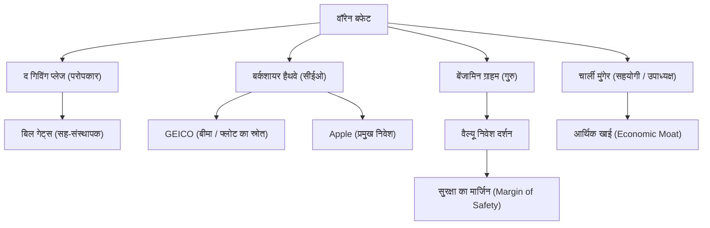

वॉरेन बफेट, जिन्हें दुनिया के सबसे सफल निवेशक के रूप में जाना जाता है। उन्हें "ओमाहा का ऋषि" (Oracle of Omaha) कहा जाता है। वह केवल एक अरबपति नहीं हैं जिन्होंने अपार संपत्ति अर्जित की है, बल्कि उन्होंने अपने निवेश दर्शन, नैतिकता और परोपकार के माध्यम से दुनिया भर के लोगों को बहुत प्रभावित किया है। इस लेख में, हम इस बात पर गहराई से विचार करेंगे कि वह निवेश के देवता कैसे बने, उनके जीवन और अद्वितीय निवेश दर्शन के साथ-साथ वह आने वाली पीढ़ियों के लिए क्या विरासत छोड़ेंगे।

### बचपन से ही व्यावसायिक समझ और पहला निवेश

30 अगस्त 1930 को ओमाहा, नेब्रास्का में जन्मे बफेट ने कम उम्र से ही आश्चर्यजनक व्यावसायिक समझ और संख्याओं के प्रति जुनून दिखाया। उन्होंने अपने दादा की किराने की दुकान से च्युइंग गम और कोका-कोला खरीदा, उन्हें पड़ोस में घर-घर जाकर बेचा, और लगातार मुनाफा कमाने का अनुभव प्राप्त किया।

आश्चर्यजनक रूप से, उन्होंने 11 साल की उम्र में अपना पहला शेयर (Cities Service का पसंदीदा शेयर) खरीदा। इस समय, खरीदने के बाद शेयर की कीमत में अस्थायी रूप से गिरावट आई, और फिर थोड़ा बढ़ने पर इसे बेचकर उन्होंने थोड़ा मुनाफा कमाया। हालांकि, बेचने के बाद शेयर की कीमत कई गुना बढ़ गई, जिससे उन्हें कम उम्र में ही "धैर्यपूर्वक दीर्घकालिक निवेश रखने के महत्व" का एहसास हुआ। यह कड़वा अनुभव बाद में उनके निवेश शैली का मूल बन गया।

### गुरु बेंजामिन ग्राहम से मुलाकात

एक निवेशक के रूप में बफेट के करियर को निर्धारित करने वाली घटना कोलंबिया विश्वविद्यालय में बेंजामिन ग्राहम के साथ उनकी मुलाकात थी। "वैल्यू इन्वेस्टिंग के पिता" कहे जाने वाले ग्राहम ने एक निवेश पद्धति की वकालत की जो कंपनी के "आंतरिक मूल्य (Intrinsic Value)" और "बाजार मूल्य" के बीच के अंतर पर केंद्रित थी।

बफेट ने ग्राहम की शिक्षाओं को उत्सुकता से आत्मसात किया, वित्तीय विवरणों को अच्छी तरह से पढ़ा, और उन कंपनियों में निवेश करने की एक ठोस नींव बनाई जो बाजार में अपने आंतरिक मूल्य से कम कीमत पर बेची जा रही थीं। स्नातक होने के बाद, उन्होंने ग्राहम की निवेश कंपनी में काम किया, जहाँ उन्होंने निवेश के सार को और अधिक गहराई से सीखा।

### बर्कशायर हैथवे का निर्माण और विकास

1960 के दशक में, बफेट ने एक संघर्षरत कपड़ा कंपनी "बर्कशायर हैथवे" (Berkshire Hathaway) के शेयर खरीदे और अंततः नियंत्रण हासिल कर लिया। शुरू में उन्होंने कपड़ा व्यवसाय के पुनर्निर्माण की कोशिश की, लेकिन बाद में उन्हें एहसास हुआ कि यह एक डूबता हुआ उद्योग था और संरचनात्मक रूप से कठिन था, इसलिए उन्होंने शानदार ढंग से कंपनी को एक निवेश होल्डिंग कंपनी में बदल दिया।

उन्होंने एक बीमा व्यवसाय (विशेष रूप से GEICO) का अधिग्रहण किया, और एक ऐसा बिजनेस मॉडल स्थापित किया जो उससे मिलने वाले "फ्लोट" (भविष्य में बीमा के रूप में भुगतान किए जाने तक रखी गई राशि) का उपयोग ब्याज मुक्त निवेश फंड के रूप में करता था। यही प्रणाली बर्कशायर हैथवे को दुनिया के सबसे बड़े समूह (Conglomerate) में से एक बनाने की सबसे बड़ी प्रेरक शक्ति बन गई।

### अद्वितीय निवेश दर्शन: "आर्थिक खाई" और चक्रवृद्धि की शक्ति

बफेट का निवेश दर्शन, ग्राहम के शुद्ध वैल्यू निवेश से, लंबे समय के सहयोगी चार्ली मुंगेर के प्रभाव में धीरे-धीरे विकसित हुआ। यह "एक औसत दर्जे की कंपनी को शानदार कीमत पर खरीदने के बजाय, एक शानदार कंपनी को उचित कीमत पर खरीदने" की नीति में बदलाव था।

उनके दर्शन के मूल में निम्नलिखित महत्वपूर्ण तत्व हैं:

1. **आर्थिक खाई (Economic Moat)**: वह उन कंपनियों को पसंद करते हैं जिनके पास मजबूत प्रतिस्पर्धी लाभ है जिनकी दूसरे आसानी से नकल नहीं कर सकते हैं। मजबूत ब्रांड शक्ति, उच्च स्विचिंग लागत, और नेटवर्क प्रभाव इसके अंतर्गत आते हैं।
2. **उन व्यवसायों में निवेश करना जिन्हें वे समझते हैं**: उन्होंने कई वर्षों तक जटिल प्रौद्योगिकी कंपनियों में निवेश करने से परहेज किया है जिन्हें वह समझ नहीं सकते। वह अपने "क्षमता के दायरे" (Circle of Competence) में रहने के लिए प्रतिबद्ध हैं। (हालांकि, उन्होंने बाद में Apple में बड़े पैमाने पर निवेश किया, जो उनके लचीले दृष्टिकोण को भी दर्शाता है)
3. **दीर्घकालिक निवेश और चक्रवृद्धि का जादू**: जैसा कि वह कहते हैं, "सबसे पसंदीदा होल्डिंग अवधि 'हमेशा' है," वह शानदार प्रबंधन वाली उत्कृष्ट कंपनियों के शेयरों को लंबे समय तक रखते हैं और चक्रवृद्धि (Compound interest) की शक्ति का अधिकतम लाभ उठाते हैं।

### बफेट का संबंध आरेख और उपलब्धियों का प्रवाह

बफेट के नेटवर्क और उनके दर्शन से पैदा हुए व्यवसाय और निवेश के संबंध को नीचे दिए गए आरेख में दिखाया गया है।

### परोपकार और आने वाली पीढ़ियों पर प्रभाव

बफेट ने अपनी अपार संपत्ति को खुद या अपने परिवार तक सीमित रखने के बजाय, इसे समाज को वापस देने का फैसला किया। 2006 में, उन्होंने अपनी संपत्ति का अधिकांश हिस्सा बिल एंड मेलिंडा गेट्स फाउंडेशन और अन्य धर्मार्थ संगठनों को दान करने की घोषणा करके दुनिया को चौंका दिया।

इसके अलावा, बिल गेट्स और अन्य लोगों के साथ मिलकर, उन्होंने "द गिविंग प्लेज" (The Giving Pledge) की स्थापना की, जिसमें दुनिया के धनी लोगों से अपने जीवनकाल के दौरान या अपनी मृत्यु के बाद अपनी संपत्ति का आधे से अधिक हिस्सा दान करने का आग्रह किया गया है। इसने आधुनिक पूंजीवाद में धन के पुनर्वितरण के तरीके पर बड़ा प्रभाव डाला है।

उनकी जीवनशैली आश्चर्यजनक रूप से सरल है। वह अभी भी ओमाहा के उसी घर में रहते हैं जिसे उन्होंने 1958 में 31,500 डॉलर में खरीदा था, उन्हें हर सुबह मैकडॉनल्ड्स का नाश्ता पसंद है और वह अपनी कार खुद चलाते हैं। यह उनकी ईमानदार मानवता को दर्शाता है, जिसका उद्देश्य केवल धन संचय करना नहीं है, बल्कि वह निवेश के बौद्धिक "खेल" को शुद्ध रूप से पसंद करते हैं।

### निष्कर्ष

वॉरेन बफेट भावी पीढ़ियों के लिए जो विरासत छोड़ेंगे, वह केवल चक्रवृद्धि द्वारा लाए गए भारी रिटर्न के आंकड़े नहीं हैं। यह गहन शोध और तर्कसंगत निर्णय लेने, बाजार की दहशत या अल्पकालिक लाभ से गुमराह न होने का धैर्य, और अर्जित धन को समाज को वापस देने की उच्च नैतिकता है।

"ओमाहा के ऋषि" की जीवनशैली और गहरा अटूट दर्शन न केवल पेशेवर निवेशकों के लिए, बल्कि आधुनिक जटिल पूंजीवादी समाज में रहने वाले सभी लोगों के लिए एक महत्वपूर्ण दिशा-सूचक बना रहेगा。
