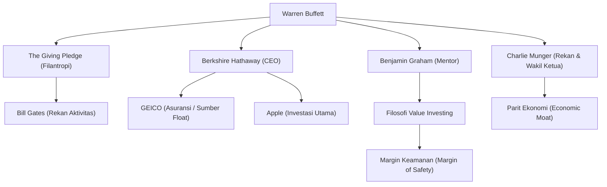

Warren Buffett, dikenal sebagai investor paling sukses di dunia. Dengan julukan "Sage of Omaha", ia tidak hanya sekadar miliarder yang mengumpulkan kekayaan luar biasa, tetapi terus memberikan pengaruh besar kepada orang-orang di seluruh dunia dalam filosofi investasi, etika, dan filantropi. Artikel ini akan menggali lebih dalam bagaimana ia menjadi dewa investasi, kehidupannya dan filosofi investasinya yang unik, serta warisan yang ia tinggalkan untuk generasi mendatang.

### Insting Bisnis Sejak Dini dan Investasi Pertama

Lahir pada 30 Agustus 1930 di Omaha, Nebraska, Buffett sejak usia dini telah menunjukkan insting bisnis dan ketertarikan yang luar biasa pada angka. Ia mendapatkan pengalaman dengan membeli permen karet dan Coca-Cola dari toko bahan makanan kakeknya, lalu menjualnya dari pintu ke pintu di lingkungannya, dan secara konsisten menghasilkan keuntungan.

Hebatnya, ia membeli saham pertamanya (saham preferen Cities Service) pada usia 11 tahun. Pada saat itu, harga saham sempat turun setelah ia membelinya, dan ia menjualnya ketika harga sedikit naik, sehingga ia mendapat keuntungan kecil. Namun, tak lama setelah ia menjualnya, harga saham tersebut melonjak berkali-kali lipat, membuatnya segera menyadari "pentingnya kesabaran dan menahan dalam jangka panjang". Pengalaman pahit ini kemudian menjadi dasar dari gaya investasinya.

### Pertemuan dengan Sang Mentor, Benjamin Graham

Hal yang sangat menentukan karier Buffett sebagai investor adalah pertemuannya dengan Benjamin Graham di Universitas Columbia. Graham, yang dikenal sebagai "Bapak Investasi Nilai (Value Investing)", mengajarkan metode investasi yang berfokus pada kesenjangan antara "Nilai Intrinsik (Intrinsic Value)" dan "Harga Pasar".

Buffett dengan antusias menyerap ajaran Graham, membaca laporan keuangan secara menyeluruh, dan membangun fondasi yang kuat untuk berinvestasi di perusahaan yang terabaikan oleh pasar dan dihargai di bawah nilai intrinsiknya. Setelah lulus, ia bekerja di perusahaan investasi Graham, di mana ia mempelajari esensi investasi dengan lebih mendalam.

### Membangun dan Mengembangkan Berkshire Hathaway

Pada tahun 1960-an, Buffett membeli saham "Berkshire Hathaway", sebuah perusahaan tekstil yang sedang kesulitan, dan akhirnya mengambil alih kendali manajemennya. Awalnya, ia mencoba untuk memulihkan bisnis tekstil tersebut, tetapi kemudian menyadari bahwa ini adalah industri yang sedang menurun dan secara struktural sulit. Ia pun berhasil mengubah perusahaan tersebut menjadi perusahaan induk investasi.

Ia mengakuisisi bisnis asuransi (terutama GEICO) dan membangun model bisnis yang memanfaatkan "Float (dana yang disimpan sebelum dibayarkan sebagai klaim asuransi di masa depan)" sebagai dana investasi tanpa bunga. Mekanisme inilah yang menjadi pendorong terbesar di balik pertumbuhan Berkshire Hathaway menjadi salah satu konglomerat terbesar di dunia.

### Filosofi Investasi Unik: "Parit Ekonomi" dan Kekuatan Bunga Majemuk

Filosofi investasi Buffett berevolusi secara bertahap dari investasi nilai murni ala Graham, dipengaruhi oleh rekan lamanya, Charlie Munger. Ini adalah pergeseran kebijakan menuju "lebih baik membeli perusahaan yang luar biasa dengan harga yang wajar daripada perusahaan yang wajar dengan harga yang luar biasa".

Inti dari filosofinya mencakup elemen-elemen penting berikut:

1. **Economic Moat (Parit Ekonomi)**: Ia menyukai perusahaan dengan keunggulan kompetitif yang kuat yang tidak dapat dengan mudah ditiru oleh perusahaan lain. Kekuatan merek yang kuat, biaya peralihan (switching costs) yang tinggi, dan efek jaringan adalah beberapa contohnya.
2. **Berinvestasi pada Bisnis yang Dipahami**: Ia selama bertahun-tahun menghindari investasi di perusahaan teknologi yang kompleks yang tidak ia pahami. Ia sangat disiplin untuk tetap berada di dalam "Lingkaran Kompetensi" miliknya. (Meskipun, ia kemudian berinvestasi besar-besaran pada Apple, menunjukkan sikap yang fleksibel).
3. **Kepemilikan Jangka Panjang dan Keajaiban Bunga Majemuk**: Seperti yang ia katakan, "Periode kepemilikan yang paling kami sukai adalah 'selamanya'." Ia menahan saham perusahaan unggulan dengan manajemen yang luar biasa dalam jangka panjang, memaksimalkan kekuatan bunga majemuk.

### Diagram Korelasi Seputar Buffett dan Aliran Pencapaiannya

Jaringan Buffett dan hubungan antara bisnis serta investasinya yang lahir dari filosofinya ditunjukkan pada diagram berikut.

### Filantropi dan Pengaruh pada Generasi Mendatang

Buffett memutuskan untuk tidak menyimpan kekayaannya yang sangat besar untuk dirinya sendiri atau keluarganya, melainkan mengembalikannya kepada masyarakat. Pada tahun 2006, ia mengejutkan dunia dengan mengumumkan bahwa ia akan menyumbangkan sebagian besar kekayaannya ke badan amal, termasuk Bill & Melinda Gates Foundation.

Selain itu, bersama dengan Bill Gates dan lainnya, ia mendirikan "The Giving Pledge", yang menyerukan kepada orang-orang terkaya di dunia untuk menyumbangkan lebih dari separuh kekayaan mereka untuk kegiatan amal, baik semasa hidup maupun setelah kematian. Hal ini memberikan dampak besar pada bagaimana redistribusi kekayaan harus dilakukan dalam kapitalisme modern.

Gaya hidupnya sangat sederhana. Saat ini, ia masih tinggal di rumah di Omaha yang dibelinya seharga $31.500 pada tahun 1958, menyukai sarapan di McDonald's setiap pagi, dan mengemudikan mobilnya sendiri. Ini menunjukkan integritas kemanusiaannya, di mana ia murni mencintai "permainan" intelektual investasi, dan bukan akumulasi kekayaan itu sendiri sebagai tujuannya.

### Kesimpulan

Warisan yang ditinggalkan Warren Buffett untuk generasi mendatang bukan hanya angka-angka berupa imbal hasil luar biasa yang dihasilkan oleh bunga majemuk. Itu adalah riset yang menyeluruh dan pengambilan keputusan yang rasional, kesabaran untuk tidak terpengaruh oleh kepanikan pasar atau keuntungan jangka pendek, serta etika yang tinggi untuk mengembalikan kekayaan yang diperolehnya kepada masyarakat.

Cara hidup dan filosofi "Sage of Omaha" yang mendalam serta teguh akan terus menjadi kompas yang penting, tidak hanya bagi investor profesional, tetapi bagi semua orang yang hidup dalam masyarakat kapitalis yang kompleks saat ini.
